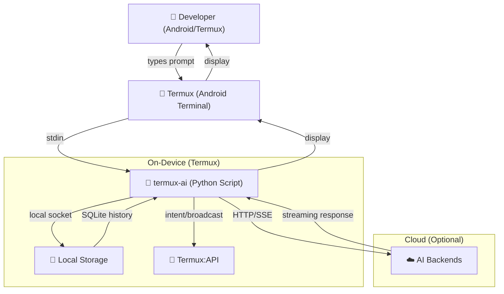

# Business Requirements Document (BRD)

**Project:** Termux AI — AI Pair-Programmer for Android/Termux  
**Version:** 7.1.0  
**Date:** 2025-08-05  
**Status:** Draft  
**Author:** Termux AI Development Team  

---

## 1. Executive Summary

Termux AI is a self-contained AI coding assistant that runs entirely inside **Termux** — a terminal emulator on Android. It gives developers an AI-powered pair-programmer experience on mobile devices, with **no external dependencies**, **no cloud infrastructure**, and **full offline capability** when using a local Ollama model. The application supports multiple AI backends (OpenAI, Anthropic, Groq, OpenRouter, Ollama), a built-in tool system for file editing and command execution, a skills framework for reusable workflows, and Termux:API integration for clipboard, TTS, and sharing.

The product fills a gap: professional-grade AI-assisted development on Android without requiring a laptop or cloud service.

---

## 2. Business Background

### 2.1 Market Context

- Mobile development is growing; 40%+ of developers use mobile devices for at least some coding tasks (2024 Stack Overflow survey).
- Existing AI coding assistants (Copilot, Cursor, Claude Code) are desktop/web-only — they cannot run natively on Android.
- Termux provides a full Linux environment on Android, but lacks an integrated AI assistant.
- Privacy-conscious developers need offline-capable tools that keep code and API keys on-device.

### 2.2 Why Termux AI

| Factor | Detail |
|--------|--------|
| **Mobile-first** | Runs natively on Android via Termux — no SSH, no remote server required |
| **Privacy** | API keys stay on-device; Ollama provides fully offline local models |
| **Zero-dependency** | Stdlib-only Python — no pip install, no virtualenv, no supply-chain risk |
| **Self-contained** | Single-file build (`build.py` merges everything into one `termux-ai` script) |
| **Extensible** | Skills system, tool system, and multi-backend support allow customization |

---

## 3. Problem Statement

Developers who work on Android devices (phones, tablets, Chromebooks) lack a capable AI coding assistant that:

1. **Runs natively** on Android without requiring a desktop OS or remote connection.
2. **Protects code privacy** — code never leaves the device unless the user explicitly sends it to a cloud backend.
3. **Works offline** — at least with a local model (Ollama).
4. **Provides actionable assistance** — not just chat, but actual file editing, command execution, and codebase exploration.
5. **Is easy to install and configure** — single script, no complex setup.

---

## 4. Business Objectives (SMART)

| # | Objective | SMART Criteria |
|---|-----------|---------------|
| O1 | Enable AI-assisted coding on Android | **S**upport all major AI backends; **M**easure by number of active backends (target: 5+); **A**chievable with existing API infrastructure; **R**elevant to mobile dev use case; **T**Q2 2025 |
| O2 | Provide offline AI capability | **S**upport Ollama local models; **M**easure by offline model pull/serve success rate; **A**chievable with Ollama integration; **R**elevant for privacy/air-gapped use cases; **T**Q2 2025 |
| O3 | Ensure zero external dependencies | **S**Stdlib-only Python; **M**Zero pip packages; **A**chievable by design; **R**educes attack surface and installation friction; **T**Ongoing |
| O4 | Deliver secure tool execution | **S**Build/Plan mode with user approval; **M**Zero unauthorized file writes or shell executions without consent; **A**chievable with allowlist sandboxing; **R**elevant for user safety; **T**Q3 2025 |
| O5 | Achieve 95%+ test coverage on security-critical paths | **S**Cover SSRF, injection, sandbox escape, and auth paths; **M**95% line coverage on `tests/test_security.py`; **A**chievable with existing test suite; **R**elevant for trust; **T**Q3 2025 |

---

## 5. Stakeholders & Roles

| Role | Stakeholder | Responsibilities |
|------|------------|-----------------|
| **Product Owner** | Dev Team Lead | Prioritizes features, defines acceptance criteria, owns BRD/FSD |
| **Technical Writer** | Dev Team Lead | Produces PRD, SAD, TSD, user manual |
| **Developer** | Dev Team | Implements features, writes tests, maintains codebase |
| **End Users** | Developers on Android | Primary users; install via `build.py` or `install.sh`; configure backends and use chat/tools/skills |
| **Security Reviewer** | Dev Team / External | Reviews vulnerabilities, validates sandboxing, approves security patches |
| **Community Contributors** | Open-source users | Submit skills, report bugs, propose features via GitHub |

---

## 6. Business Requirements (Capabilities)

### 6.1 Core AI Chat
- **BR-C01**: The system SHALL accept natural-language prompts and return AI-generated responses.
- **BR-C02**: The system SHALL support streaming responses so the user sees output as it is generated.
- **BR-C03**: The system SHALL support multiple AI backends (Ollama, OpenAI, Anthropic, Groq, OpenRouter).
- **BR-C04**: The system SHALL allow switching backends and models at runtime.

### 6.2 Tool System (Build & Plan Modes)
- **BR-C05**: The system SHALL provide a tool set (read_file, write_file, list_files, search_files, run_command, fetch_url, graphify, clone_repo) for AI-assisted file and codebase operations.
- **BR-C06**: The system SHALL enforce Plan mode (read-only) by default, requiring explicit user opt-in for Build mode (write/execute).
- **BR-C07**: The system SHALL require batch user approval before executing any mutating tool call (write_file, run_command, clone_repo).
- **BR-C08**: The system SHALL auto-execute read-only tool calls (read_file, list_files, search_files, fetch_url, graphify) without confirmation.

### 6.3 Chat History & Session Management
- **BR-C09**: The system SHALL persist all conversations in a local SQLite database.
- **BR-C10**: The system SHALL support creating new sessions, continuing previous sessions, searching history, exporting/importing chats, and pinning/saving sessions.
- **BR-C11**: The system SHALL support session auto-resume on restart.

### 6.4 Skills System
- **BR-C12**: The system SHALL support reusable skill modules (markdown files with front-matter) that inject instructions into the AI prompt.
- **BR-C13**: The system SHALL support both "once" (single use) and "session" (persist for the chat) skill modes.
- **BR-C14**: The system SHALL auto-seed bundled example skills (review, commit, python, reverse-engineer, etc.) on first run.

### 6.5 Termux:API Integration
- **BR-C15**: The system SHALL support clipboard copy/paste via Termux:API.
- **BR-C16**: The system SHALL support text-to-speech (TTS) for reading AI responses aloud.
- **BR-C17**: The system SHALL support sharing AI responses to other Android apps.

### 6.6 Ollama Server Management
- **BR-C18**: The system SHALL be able to start, stop, and manage an Ollama server process locally.
- **BR-C19**: The system SHALL support pulling, listing, and switching local Ollama models.

### 6.7 CLI & Configuration
- **BR-C20**: The system SHALL support both interactive REPL mode and one-shot CLI mode (`termux-ai "prompt"`).
- **BR-C21**: The system SHALL support JSON output mode (`-j/--json`) for programmatic integration.
- **BR-C22**: The system SHALL persist configuration (backend, model, API keys, preferences) in a local JSON config file.

### 6.8 Security & Sandboxing
- **BR-C23**: The system SHALL guard against SSRF attacks (block private/loopback IPs in fetch_url).
- **BR-C24**: The system SHALL sandbox file writes to the project directory (prevent path traversal via symlinks).
- **BR-C25**: The system SHALL block shell metacharacters and interpreters in Plan mode run_command.
- **BR-C26**: The system SHALL never execute code from blocked interpreters (python, node, bash, sh, etc.) in Plan mode.

---

## 7. Scope

### 7.1 In Scope

| Area | Details |
|------|---------|
| AI Chat | Streaming, multi-backend, model switching |
| Tools | read_file, write_file, list_files, search_files, run_command, fetch_url, graphify, clone_repo |
| Modes | Plan (read-only) and Build (write/execute with approval) |
| Chat History | SQLite persistence, CRUD, export/import, search, pin |
| Skills | Discover, load, run, toggle, create, edit, seed |
| Termux:API | Clipboard, TTS, share |
| Ollama | Start/stop server, pull/list models |
| CLI | REPL + one-shot + JSON mode |
| Configuration | Backend, model, API keys, preferences via /config and /profile |
| Security | SSRF guard, symlink sandbox, Plan-mode allowlist, batch approval |

### 7.2 Out of Scope

| Area | Reason |
|------|--------|
| GUI / Android app | Termux AI is a terminal application; no GUI layer |
| Multi-user / multi-tenant | Single-user tool; no authentication system |
| Plugin marketplace | Skills are local files; no remote catalog |
| CI/CD integration | No GitHub Actions or webhook triggers |
| Mobile UI notifications | No push notifications or Android UI components |
| Windows/Linux desktop | Targets Termux on Android only |
| Voice input | TTS output only; no speech-to-text |

---

## 8. Success Metrics / KPIs

| Metric | Target | Measurement Method |
|--------|--------|--------------------|
| **Backend connectivity** | All 5 backends functional | Manual test + `test_backend_connection` |
| **Tool execution success rate** | ≥ 95% for read-only tools | Unit test pass rate |
| **Plan-mode security** | Zero unauthorized writes | Penetration test + security test suite |
| **SSRF protection** | 100% block of private IP fetches | Security test suite |
| **Chat history persistence** | 100% save/restore accuracy | Integration test |
| **Skill loading** | All 10 bundled skills loadable | Manual verification |
| **Install time** | < 30 seconds from clone to first run | Timed install test |
| **Offline capability** | Ollama model responds without internet | Air-gapped test |
| **User satisfaction** | ≥ 4/5 on usability survey | Post-release survey |
| **Zero CVE in dependencies** | 0 (stdlib-only) | Dependency audit |

---

## 9. Assumptions & Constraints

### 9.1 Assumptions

| # | Assumption | Impact if False |
|---|-----------|----------------|
| A1 | Users have Termux installed on Android | Product cannot be used |
| A2 | Users have Python 3.10+ available in Termux | App will not run |
| A3 | Users have internet access for cloud backends (OpenAI, Anthropic, etc.) | Cloud backends unavailable; Ollama still works offline |
| A4 | Users have Termux:API installed for clipboard/TTS/share features | Those features degrade gracefully |
| A5 | Users provide their own API keys for cloud backends | Cloud backends default to Ollama |
| A6 | Users have Ollama installed for local model usage | Offline mode unavailable |
| A7 | The project directory is writable by the user | File tools will fail gracefully |

### 9.2 Constraints

| # | Constraint | Type |
|---|-----------|------|
| C1 | Zero external Python dependencies (stdlib only) | Technical |
| C2 | Must run on Android via Termux | Platform |
| C3 | Single-file build output (`termux-ai` script) | Build |
| C4 | No hardcoded API keys or secrets | Security |
| C5 | All file writes must go through user approval in Plan mode | Security |
| C6 | No shell execution in Plan mode (allowlist only) | Security |
| C7 | Config stored as plain JSON (no encryption at rest) | Security trade-off |
| C8 | Maximum 50 iterations per tool-use loop | Safety |

### 9.3 Risks

| Risk | Likelihood | Impact | Mitigation |
|------|-----------|--------|------------|
| API key exposure in config file | Medium | High | No hardcoded keys; keys stored in user-owned JSON; `masked_dict()` hides them |
| SSRF attack via fetch_url | Low | High | DNS rebinding protection, private IP block, `AI_FETCH_ALLOW_PRIVATE` opt-in |
| Symlink escape in file writes | Low | High | `realpath` + `commonpath` sandbox check on every write |
| Plan-mode command injection | Low | High | Allowlist + no-shell execution + arg blocking |
| Ollama server not running | Medium | Medium | Built-in server manager with auto-start prompt |
| Android battery/performance | Medium | Medium | Streaming responses, compact iteration history, configurable timeouts |
| Termux:API not installed | Medium | Low | Graceful degradation; features disabled with informative message |

---

## 10. Milestones

| Phase | Milestone | Target Date | Deliverable |
|-------|-----------|-------------|-------------|
| **Phase 0** | Project setup & codebase | 2025-08-05 | BRD, PRD, SAD, TSD, test cases |
| **Phase 1** | Core chat + backend support | Q3 2025 | Multi-backend streaming chat, CLI/REPL |
| **Phase 2** | Tool system (Plan mode) | Q3 2025 | Read-only tools, batch approval, security guard |
| **Phase 3** | Build mode + Ollama integration | Q4 2025 | Write/execute tools, server manager, offline model |
| **Phase 4** | Skills system + Termux:API | Q4 2025 | Skills framework, clipboard/TTS/share |
| **Phase 5** | Security hardening + release | Q1 2026 | Penetration test, vulnerability remediation, v1.0 release |
| **Phase 6** | Community & documentation | Q1 2026 | User manual, skill catalog, contribution guide |

---

## 11. High-Level System Context

---

## Document Control

| Field | Value |
|-------|-------|
| Version | 1.0 |
| Status | Draft |
| Author | Termux AI Dev Team |
| Approved By | — |
| Next Review | After Phase 1 completion |
| Related Docs | `docs/02-PRD.md`, `docs/03-SAD.md`, `docs/04-TSD.md` |
