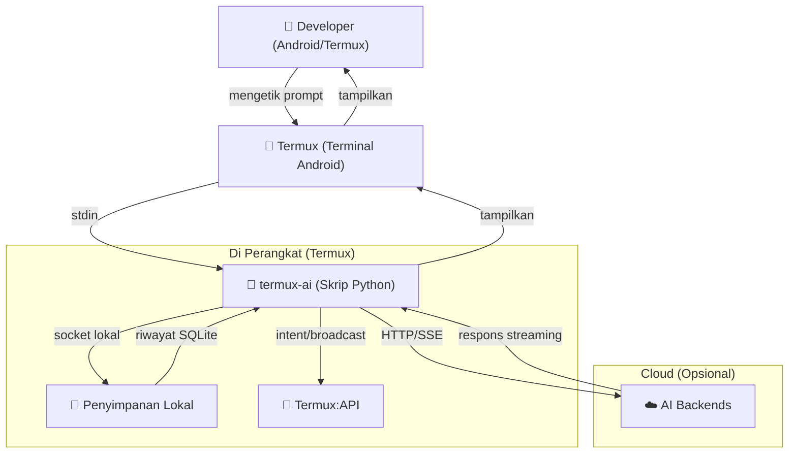

# Business Requirements Document (BRD)

**Proyek:** Termux AI — AI Pair-Programmer untuk Android/Termux
**Versi:** 7.1.0
**Tanggal:** 2025-08-05
**Status:** Draft
**Penulis:** Tim Pengembang Termux AI
**Bahasa:** Indonesia

---

## 1. Ringkasan Eksekutif

Termux AI adalah asisten coding berbasis AI yang berjalan sepenuhnya di dalam **Termux** — emulator terminal di Android. Produk ini memberikan pengalaman *pair-programmer* bertenaga AI di perangkat seluler, **tanpa dependensi eksternal**, **tanpa infrastruktur cloud**, dan **sepenuhnya offline** saat menggunakan model lokal Ollama. Aplikasi mendukung banyak backend AI (OpenAI, Anthropic, Groq, OpenRouter, Ollama), sistem *tool* bawaan untuk mengedit file dan menjalankan perintah, *framework skills* untuk alur kerja yang dapat digunakan ulang, serta integrasi Termux:API untuk clipboard, TTS, dan berbagi.

Produk ini mengisi celah pasar: pengembangan berbantuan AI kelas profesional di Android **tanpa memerlukan laptop atau layanan cloud**.

---

## 2. Latar Belakang Bisnis

### 2.1 Konteks Pasar

- Pengembangan *mobile* terus tumbuh; 40%+ developer menggunakan perangkat seluler untuk sebagian tugas coding (survei Stack Overflow 2024).
- Asisten coding AI yang ada (Copilot, Cursor, Claude Code) hanya untuk desktop/web — tidak dapat berjalan native di Android.
- Termux menyediakan lingkungan Linux lengkap di Android, tetapi belum memiliki asisten AI terintegrasi.
- Developer yang peduli privasi membutuhkan perangkat yang mampu bekerja offline dan menyimpan kode serta API key di perangkat.

### 2.2 Mengapa Termux AI

| Faktor | Detail |
|--------|--------|
| **Mobile-first** | Berjalan native di Android melalui Termux — tanpa SSH, tanpa server remote |
| **Privasi** | API key tetap di perangkat; Ollama menyediakan model lokal sepenuhnya offline |
| **Zero-dependency** | Python stdlib only — tanpa pip install, tanpa virtualenv, tanpa risiko supply-chain |
| **Self-contained** | Build satu file (`build.py` menggabungkan semuanya menjadi satu skrip `termux-ai`) |
| **Ekstensibel** | Sistem *skill*, sistem *tool*, dan dukungan multi-backend memungkinkan kustomisasi |

---

## 3. Pernyataan Masalah

Developer yang bekerja di perangkat Android (ponsel, tablet, Chromebook) tidak memiliki asisten coding AI yang memadai karena:

1. **Tidak berjalan native** di Android — memerlukan OS desktop atau koneksi remote.
2. **Tidak melindungi privasi kode** — kode tidak pernah meninggalkan perangkat kecuali pengguna secara eksplisit mengirimkannya ke backend cloud.
3. **Tidak bisa offline** — setidaknya dengan model lokal (Ollama).
4. **Tidak memberikan bantuan yang dapat ditindaklanjuti** — bukan sekadar chat, tetapi benar-benar mengedit file, menjalankan perintah, dan menjelajahi codebase.
5. **Sulit diinstal dan dikonfigurasi** — membutuhkan setup yang rumit.

---

## 4. Tujuan Bisnis (SMART)

| # | Tujuan | Kriteria SMART |
|---|--------|----------------|
| O1 | Memungkinkan coding berbantuan AI di Android | **S**pesifik: dukung semua backend AI utama; **M**easurable: jumlah backend aktif (target: 5+); **A**chievable: dengan infrastruktur API yang ada; **R**elevan: untuk kasus penggunaan mobile dev; **T**ime-bound: Q2 2025 |
| O2 | Menyediakan kemampuan AI offline | **S**pesifik: dukung model lokal Ollama; **M**easurable: tingkat keberhasilan pull/serve model offline; **A**chievable: dengan integrasi Ollama; **R**elevan: untuk kasus privasi/air-gapped; **T**ime-bound: Q2 2025 |
| O3 | Menjamin nol dependensi eksternal | **S**pesifik: Python stdlib only; **M**easurable: nol paket pip; **A**chievable: secara desain; **R**elevan: mengurangi serangan dan gesekan instalasi; **T**ime-bound: berkelanjutan |
| O4 | Memberikan eksekusi tool yang aman | **S**pesifik: Build/Plan mode dengan persetujuan pengguna; **M**easurable: nol penulisan file atau eksekusi shell tanpa izin; **A**chievable: dengan sandbox allowlist; **R**elevan: untuk keselamatan pengguna; **T**ime-bound: Q3 2025 |
| O5 | Mencapai cakupan test ≥ 95% pada jalur kritis keamanan | **S**pesifik: cakupan SSRF, injection, sandbox escape, dan auth; **M**easurable: 95% line coverage pada `tests/test_security.py`; **A**chievable: dengan suite test yang ada; **R**elevan: untuk kepercayaan; **T**ime-bound: Q3 2025 |

---

## 5. Stakeholders & Peran

| Peran | Stakeholder | Tanggung Jawab |
|-------|------------|----------------|
| **Product Owner** | Pimpinan Tim Dev | Memprioritaskan fitur, mendefinisikan acceptance criteria, memiliki BRD/FSD |
| **Technical Writer** | Pimpinan Tim Dev | Menghasilkan PRD, SAD, TSD, manual pengguna |
| **Developer** | Tim Dev | Mengimplementasikan fitur, menulis test, memelihara codebase |
| **Pengguna Akhir** | Developer di Android | Pengguna utama; menginstal via `build.py` atau `install.sh`; mengonfigurasi backend dan menggunakan chat/tools/skills |
| **Security Reviewer** | Tim Dev / Eksternal | Meninjau kerentanan, memvalidasi sandboxing, menyetujui patch keamanan |
| **Kontributor Komunitas** | Pengguna open-source | Mengirim skill, melaporkan bug, mengusulkan fitur via GitHub |

---

## 6. Kebutuhan Bisnis (Kapabilitas)

### 6.1 Chat AI Inti
- **BR-C01**: Sistem HARUS menerima prompt bahasa alami dan mengembalikan respons yang dihasilkan AI.
- **BR-C02**: Sistem HARUS mendukung respons streaming agar pengguna melihat output saat dihasilkan.
- **BR-C03**: Sistem HARUS mendukung banyak backend AI (Ollama, OpenAI, Anthropic, Groq, OpenRouter).
- **BR-C04**: Sistem HARUS mengizinkan peralihan backend dan model saat runtime.

### 6.2 Sistem Tool (Build & Plan Mode)
- **BR-C05**: Sistem HARUS menyediakan perangkat tool (read_file, write_file, list_files, search_files, run_command, fetch_url, graphify, clone_repo) untuk operasi file dan codebase berbantuan AI.
- **BR-C06**: Sistem HARUS memberlakukan Plan mode (read-only) sebagai default, mewajibkan pengguna memilih Build mode (write/execute) secara eksplisit.
- **BR-C07**: Sistem HARUS memerlukan persetujuan batch pengguna sebelum mengeksekusi tool mutasi apa pun (write_file, run_command, clone_repo).
- **BR-C08**: Sistem HARUS mengeksekusi otomatis tool read-only (read_file, list_files, search_files, fetch_url, graphify) tanpa konfirmasi.

### 6.3 Riwayat Chat & Manajemen Sesi
- **BR-C09**: Sistem HARUS mempersistensikan semua percakapan di database SQLite lokal.
- **BR-C10**: Sistem HARUS mendukung pembuatan sesi baru, melanjutkan sesi sebelumnya, mencari riwayat, ekspor/impor chat, dan menyematkan/menyimpan sesi.
- **BR-C11**: Sistem HARUS mendukung auto-resume sesi saat restart.

### 6.4 Sistem Skills
- **BR-C12**: Sistem HARUS mendukung modul skill yang dapat digunakan ulang (file markdown dengan front-matter) yang menyuntikkan instruksi ke prompt AI.
- **BR-C13**: Sistem HARUS mendukung mode skill "once" (sekali pakai) dan "session" (bertahan untuk chat berjalan).
- **BR-C14**: Sistem HARUS otomatis menyediakan contoh skill bawaan (review, commit, python, reverse-engineer, dll.) pada run pertama.

### 6.5 Integrasi Termux:API
- **BR-C15**: Sistem HARUS mendukung salin/tempel clipboard via Termux:API.
- **BR-C16**: Sistem HARUS mendukung text-to-speech (TTS) untuk membacakan respons AI.
- **BR-C17**: Sistem HARUS mendukung berbagi respons AI ke aplikasi Android lain.

### 6.6 Manajemen Server Ollama
- **BR-C18**: Sistem HARUS mampu memulai, menghentikan, dan mengelola proses server Ollama secara lokal.
- **BR-C19**: Sistem HARUS mendukung pull, list, dan peralihan model Ollama lokal.

### 6.7 CLI & Konfigurasi
- **BR-C20**: Sistem HARUS mendukung mode REPL interaktif dan mode CLI satu kali (`termux-ai "prompt"`).
- **BR-C21**: Sistem HARUS mendukung mode output JSON (`-j/--json`) untuk integrasi programatik.
- **BR-C22**: Sistem HARUS mempersistensikan konfigurasi (backend, model, API key, preferensi) di file konfigurasi JSON lokal.

### 6.8 Keamanan & Sandboxing
- **BR-C23**: Sistem HARUS melindungi dari serangan SSRF (memblokir IP private/loopback di fetch_url).
- **BR-C24**: Sistem HARUS meng-sandbox penulisan file ke direktori proyek (mencegah path traversal via symlink).
- **BR-C25**: Sistem HARUS memblokir metakarakter shell dan interpreter di run_command Plan mode.
- **BR-C26**: Sistem HARUS tidak pernah mengeksekusi kode dari interpreter yang diblokir (python, node, bash, sh, dll.) di Plan mode.

---

## 7. Ruang Lingkup

### 7.1 Dalam Ruang Lingkup (In Scope)

| Area | Detail |
|------|--------|
| Chat AI | Streaming, multi-backend, peralihan model |
| Tools | read_file, write_file, list_files, search_files, run_command, fetch_url, graphify, clone_repo |
| Mode | Plan (read-only) dan Build (write/execute dengan persetujuan) |
| Riwayat Chat | Persistensi SQLite, CRUD, ekspor/impor, pencarian, pin |
| Skills | Discover, load, run, toggle, create, edit, seed |
| Termux:API | Clipboard, TTS, share |
| Ollama | Start/stop server, pull/list model |
| CLI | REPL + one-shot + mode JSON |
| Konfigurasi | Backend, model, API key, preferensi via /config dan /profile |
| Keamanan | SSRF guard, symlink sandbox, allowlist Plan mode, persetujuan batch |

### 7.2 Di Luar Ruang Lingkup (Out of Scope)

| Area | Alasan |
|------|--------|
| GUI / aplikasi Android | Termux AI adalah aplikasi terminal; tanpa lapisan GUI |
| Multi-user / multi-tenant | Tool pengguna tunggal; tanpa sistem autentikasi |
| Marketplace plugin | Skills adalah file lokal; tanpa katalog remote |
| Integrasi CI/CD | Tanpa GitHub Actions atau pemicu webhook |
| Notifikasi UI mobile | Tanpa push notification atau komponen UI Android |
| Windows/Linux desktop | Menargetkan Termux di Android saja |
| Input suara | Hanya output TTS; tanpa speech-to-text |

---

## 8. Metrik Sukses / KPI

| Metrik | Target | Metode Pengukuran |
|--------|--------|--------------------|
| **Konektivitas backend** | Semua 5 backend berfungsi | Test manual + `test_backend_connection` |
| **Tingkat keberhasilan eksekusi tool** | ≥ 95% untuk tool read-only | Tingkat kelulusan unit test |
| **Keamanan Plan mode** | Nol penulisan tanpa izin | Penetration test + suite test keamanan |
| **Proteksi SSRF** | 100% pemblokiran fetch IP private | Suite test keamanan |
| **Persistensi riwayat chat** | Akurasi simpan/restore 100% | Integration test |
| **Pemuatan skill** | Semua 10 skill bawaan dapat dimuat | Verifikasi manual |
| **Waktu instalasi** | < 30 detik dari clone ke run pertama | Test instalasi berjangka |
| **Kemampuan offline** | Model Ollama merespons tanpa internet | Test air-gapped |
| **Kepuasan pengguna** | ≥ 4/5 pada survei kegunaan | Survei pasca-rilis |
| **Nol CVE di dependensi** | 0 (stdlib-only) | Dependency audit |

---

## 9. Asumsi, Kendala, dan Risiko

### 9.1 Asumsi

| # | Asumsi | Dampak Jika Salah |
|---|--------|-------------------|
| A1 | Pengguna memiliki Termux terinstal di Android | Produk tidak dapat digunakan |
| A2 | Pengguna memiliki Python 3.10+ di Termux | Aplikasi tidak berjalan |
| A3 | Pengguna memiliki akses internet untuk backend cloud (OpenAI, Anthropic, dll.) | Backend cloud tidak tersedia; Ollama tetap berfungsi offline |
| A4 | Pengguna menginstal Termux:API untuk fitur clipboard/TTS/share | Fitur tersebut menurun secara elegan (graceful degradation) |
| A5 | Pengguna menyediakan API key sendiri untuk backend cloud | Backend cloud default ke Ollama |
| A6 | Pengguna menginstal Ollama untuk penggunaan model lokal | Mode offline tidak tersedia |
| A7 | Direktori proyek dapat ditulis oleh pengguna | Tool file akan gagal secara elegan |

### 9.2 Kendala

| # | Kendala | Jenis |
|---|---------|-------|
| C1 | Nol dependensi Python eksternal (stdlib only) | Teknis |
| C2 | Harus berjalan di Android via Termux | Platform |
| C3 | Output build satu file (skrip `termux-ai`) | Build |
| C4 | Tanpa API key atau rahasia yang di-hardcode | Keamanan |
| C5 | Semua penulisan file harus melalui persetujuan pengguna di Plan mode | Keamanan |
| C6 | Tanpa eksekusi shell di Plan mode (allowlist only) | Keamanan |
| C7 | Config disimpan sebagai JSON plaintext (tanpa enkripsi at rest) | Trade-off keamanan |
| C8 | Maksimum 50 iterasi per loop tool-use | Keselamatan |

### 9.3 Risiko

| Risiko | Kemungkinan | Dampak | Mitigasi |
|--------|-------------|--------|----------|
| Eksposur API key di file config | Sedang | Tinggi | Tanpa key hardcoded; key disimpan di JSON milik pengguna; `masked_dict()` menyembunyikannya |
| Serangan SSRF via fetch_url | Rendah | Tinggi | Proteksi DNS rebinding, blokir IP private, opt-in `AI_FETCH_ALLOW_PRIVATE` |
| Symlink escape pada penulisan file | Rendah | Tinggi | Pemeriksaan sandbox `realpath` + `commonpath` pada setiap write |
| Command injection di Plan mode | Rendah | Tinggi | Allowlist + eksekusi tanpa shell + pemblokiran arg |
| Server Ollama tidak berjalan | Sedang | Sedang | Server manager bawaan dengan prompt auto-start |
| Baterai/kinerja Android | Sedang | Sedang | Respons streaming, riwayat iterasi compact, timeout yang dapat dikonfigurasi |
| Termux:API tidak terinstal | Sedang | Rendah | Penurunan elegan; fitur dinonaktifkan dengan pesan informatif |

---

## 10. Milestones

| Fase | Milestone | Tanggal Target | Deliverable |
|------|-----------|----------------|-------------|
| **Fase 0** | Setup proyek & codebase | 2025-08-05 | BRD, PRD, SAD, TSD, test cases |
| **Fase 1** | Chat inti + dukungan backend | Q3 2025 | Chat streaming multi-backend, CLI/REPL |
| **Fase 2** | Sistem tool (Plan mode) | Q3 2025 | Tool read-only, persetujuan batch, security guard |
| **Fase 3** | Build mode + integrasi Ollama | Q4 2025 | Tool write/execute, server manager, model offline |
| **Fase 4** | Sistem skills + Termux:API | Q4 2025 | Framework skills, clipboard/TTS/share |
| **Fase 5** | Penguatan keamanan + rilis | Q1 2026 | Penetration test, remediasi kerentanan, rilis v1.0 |
| **Fase 6** | Komunitas & dokumentasi | Q1 2026 | Manual pengguna, katalog skill, panduan kontribusi |

---

## 11. Konteks Sistem Tingkat Tinggi

---

## Kontrol Dokumen

| Field | Nilai |
|-------|-------|
| Versi | 1.0 |
| Status | Draft |
| Penulis | Tim Dev Termux AI |
| Disetujui Oleh | — |
| Tinjauan Berikutnya | Setelah Fase 1 selesai |
| Dokumen Terkait | `docs/02-PRD.md`, `docs/03-SAD.md`, `docs/04-TSD.md`, `docs/05-FSD.md` |
