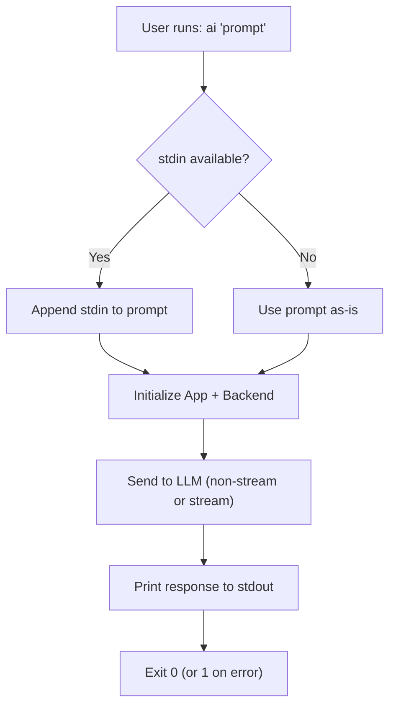
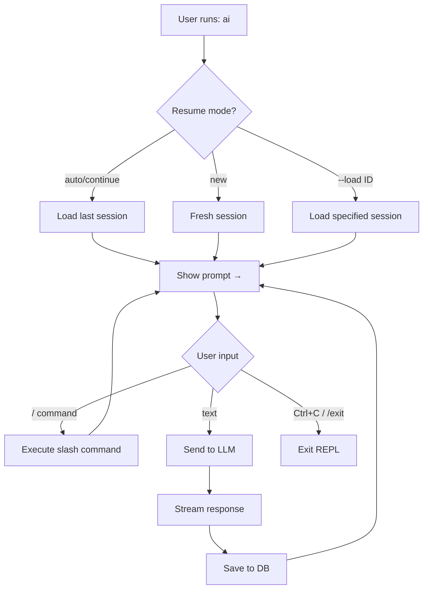
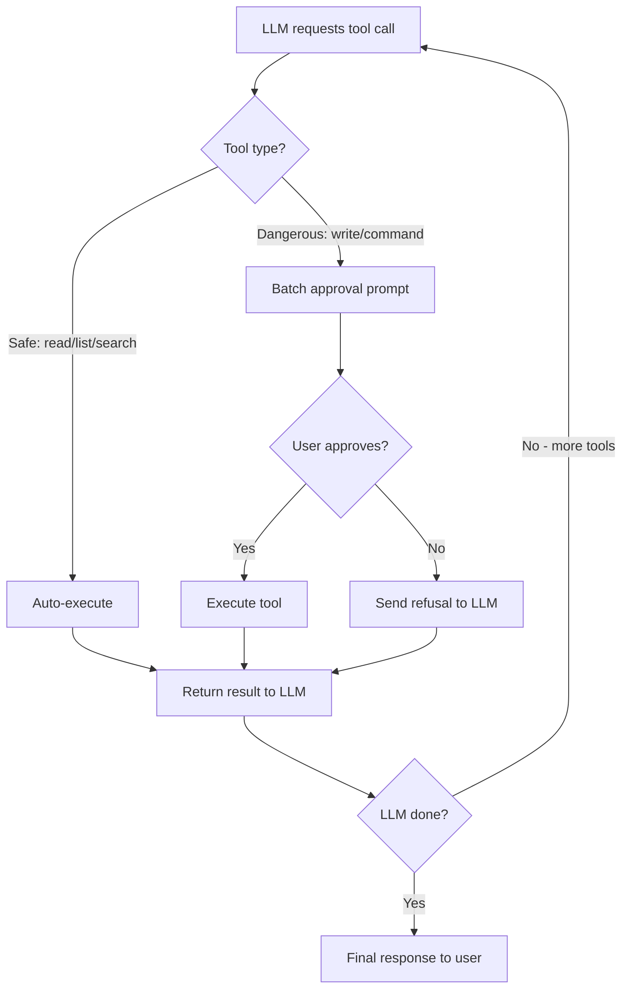
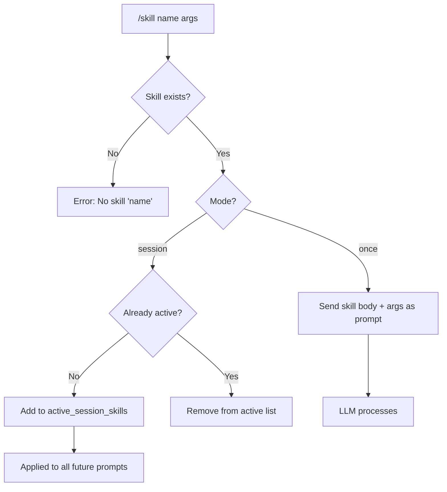

# Product Requirements Document (PRD)
## Termux AI CLI — `termux-ai` v7.0.0

> **Versi:** 1.0 · **Status:** Accepted · **Tanggal:** 2025
> **Sumber kebenaran:** kode sumber `src/*.py` (dimerge oleh `build.py` menjadi `ai`).

---

## 1. Vision

> **"Seorang AI pair-programmer dan asisten terminal yang berjalan langsung di saku Anda — di perangkat Android Anda, dalam shell Termux."**

Termux AI adalah CLI (command-line interface) interaktif berbasis Python murni (zero-dependency, stdlib only) yang menghubungkan pengguna Termux/Android dengan model bahasa besar (LLM). Pengguna dapat mengajukan pertanyaan, menghasilkan perintah shell, menganalisis kode, mengelola file, dan mengotomatiskan tugas — semuanya dari satu terminal.

Nilai inti: **privasi, portabilitas, dan kontrol**. Tidak ada server perantara yang dijalankan pengembang; API key pengguna dikirim langsung ke provider (OpenAI / Anthropic / Ollama lokal). Model lokal via Ollama sepenuhnya offline.

---

## 2. Target Users & Personas

| Persona | Deskripsi | Kebutuhan Utama |
|---------|-----------|----------------|
| **Dev on the Go** | Developer yang bekerja dari HP/tablet Android dengan Termux | Editor kode, bantuan debugging, generate command, baca/analisis repo |
| **Power User Termux** | Pengguna Termux mahir yang mengelola server/scripts via SSH dari Android | Automasi, scripting cepat, manajemen paket `pkg` |
| **AI Enthusiast Lokal** | Ingin menjalankan model LLM secara offline/privasi (Ollama) | Server Ollama lokal, pull/manage model, tanpa biaya API |
| **Pembelajar** | Belajar programming/Linux dari terminal | Penjelasan konsep, contoh kode, tutorial interaktif |

---

## 3. Use Cases / User Stories

### 3.1 One-Shot & Interactive Chat
- **Sebagai** pengguna, **saya ingin** mengajukan satu pertanyaan dari command line (`ai "jelaskan quicksort"`), **sehingga** mendapat jawaban instan tanpa masuk REPL.
- **Sebagai** pengguna, **saya ingin** memulai sesi chat interaktif (`ai`), **sehingga** dapat berdialog multi-turn dengan konteks yang dipertahankan.

### 3.2 Command Generation
- **Sebagai** pengguna, **saya ingin** generate perintah shell (`ai -c "kompres folder ke tar"`), **sehingga** mendapat command yang siap dijalankan setelah konfirmasi.

### 3.3 JSON Output
- **Sebagai** pengguna/script, **saya ingin** output dalam format JSON (`ai -j "daftar 3 buah"`), **sehingga** dapat di-pipe ke program lain.

### 3.4 AI Tools (Build / Plan Mode)
- **Sebagai** developer, **saya ingin** AI dapat membaca/menulis/mencari file dan menjalankan command di direktori saya (Build mode), **sehingga** AI dapat membantu coding secara otonom.
- **Sebagai** developer, **saya ingin** mode read-only aman (Plan mode) yang hanya boleh membaca, **sehingga** AI dapat menganalisis kode tanpa risiko modifikasi.

### 3.5 Session Management
- **Sebagai** pengguna, **saya ingin** menyimpan/memuat/lanjutkan sesi chat, **sehingga** tidak kehilangan konteks percakapan penting.

### 3.6 Multi-Backend
- **Sebagai** pengguna, **saya ingin** beralih antara OpenAI, Anthropic, dan Ollama lokal, **sehingga** dapat memilih provider/model sesuai kebutuhan dan biaya.

### 3.7 Skill System
- **Sebagai** power user, **saya ingin** membuat/mengelola "skills" (prompt template yang reusable), **sehingga** dapat mengulang tugas kompleks dengan satu perintah.

### 3.8 Termux Integration
- **Sebagai** pengguna Termux, **saya ingin** TTS (text-to-speech), clipboard copy/paste, dan share, **sehingga** dapat berinteraksi dengan jawaban AI secara native di Android.

---

## 4. Functional Requirements

> Setiap FR memiliki Acceptance Criteria (AC). Prioritas: **M** = Must, **S** = Should, **C** = Could.

### FR-1: One-Shot Prompt (M)
Pengguna dapat memberikan prompt sebagai argumen posisi dan menerima jawaban.
- **AC1:** `ai "prompt"` mencetak jawaban model ke stdout dan exit 0.
- **AC2:** Output dapat di-pipe (`| ai "explain"`).
- **AC3:** Exit code 1 jika terjadi error backend.

### FR-2: Interactive REPL (M)
Pengguna dapat memulai sesi interaktif tanpa argumen.
- **AC1:** `ai` (dengan TTY) memulai REPL dengan prompt input.
- **AC2:** Multi-turn: konteks percakapan dipertahankan antar pesan.
- **AC3:** `Ctrl+C` / `/exit` mengakhiri sesi dengan bersih.

### FR-3: Command Generation `-c` (S)
Generate perintah shell untuk tugas tertentu.
- **AC1:** `ai -c "task"` menghasilkan satu perintah shell.
- **AC2:** Di TTY: tampilkan command, minta konfirmasi `[y/N]`, jalankan jika disetujui.
- **AC3:** Jika piped (non-TTY): cetak command saja tanpa menjalankan.

### FR-4: JSON Output `-j` (S)
Minta model menjawab dengan JSON murni.
- **AC1:** `ai -j "prompt"` mengirim instruksi khusus untuk output JSON.
- **AC2:** Output adalah JSON valid (atau dilaporkan error).

### FR-5: Multi-Backend Support (M)
Dukung OpenAI-compatible API, Anthropic Messages API, dan Ollama lokal.
- **AC1:** Konfigurasi menyimpan multiple backend profiles (`/profile add`).
- **AC2:** `/backend <name>` mengaktifkan backend; `/model <name>` mengganti model.
- **AC3:** Auto-retry 3x untuk error transient (429, 5xx) dengan backoff.

### FR-6: AI Tools — Build Mode (M)
Mode di mana AI dapat menulis file dan menjalankan command apa pun.
- **AC1:** `/tools` toggle antara Plan (default) dan Build mode.
- **AC2:** Di Build mode, `write_file` dan `run_command` tersedia.
- **AC3:** Setiap tool berbahaya memerlukan persetujuan batch pengguna.
- **AC4:** Safe tools (`read_file`, `list_files`, `search_files`) auto-eksekusi.

### FR-7: AI Tools — Plan Mode (M)
Mode read-only aman tanpa shell.
- **AC1:** Hanya command read-only yang diizinkan (ls, cat, find, grep, dll.).
- **AC2:** Interpreter (python, node, dll.), redirect (`> >>`), `&&/;/||` diblokir.
- **AC3:** git dibatasi pada subcommand read-only (status, log, diff, show, blame).

### FR-8: Streaming Output (M)
Respons model di-stream token-demi-token.
- **AC1:** Teks muncul secara inkremental saat diterima.
- **AC2:** Dapat dinonaktifkan via config (`stream: false`).

### FR-9: Session Persistence (M)
Percakapan disimpan di SQLite lokal dan dapat dilanjutkan.
- **AC1:** `/save [name]` menyimpan & pin sesi.
- **AC2:** `/load <id|name>` memuat sesi tersimpan.
- **AC3:** `--continue` melanjutkan sesi terakhir saat startup.
- **AC4:** `/sessions` mendaftar sesi tersimpan & terbaru.
- **AC5:** `/export [path]` ekspor chat ke Markdown.

### FR-10: Slash Commands (M)
Sistem perintah dengan prefix `/` di dalam REPL.
- **AC1:** Minimal 30+ slash command tersedia (lihat TSD §API).
- **AC2:** Command tidak dikenal menampilkan pesan error/help.

### FR-11: Skill System (S)
Template prompt reusable yang disimpan sebagai file Markdown.
- **AC1:** `/skill new <name>` membuat skill baru di editor.
- **AC2:** `/skill <name>` menjalankan skill (mode `once`).
- **AC3:** `/skill <name>` toggle skill session (mode `session`).
- **AC4:** `/skill seed` membuat skill contoh bawaan.
- **AC5:** `/skill list` menampilkan semua skill; aktif ditandai `*`.

### FR-12: Termux API Integration (S)
Integrasi native dengan Termux:API (TTS, clipboard, share).
- **AC1:** `/speak` membacakan jawaban terakhir via `termux-tts-speak`.
- **AC2:** `/copy` menyalin jawaban ke clipboard; `/paste` menempel ke chat.
- **AC3:** `/share` membagikan jawaban via Android share sheet.
- **AC4:** `/status` menampilkan ketersediaan Termux:API.

### FR-13: Ollama Server Manager (S)
Manajemen server Ollama lokal dari dalam CLI.
- **AC1:** `/server start|stop|status` mengelola server Ollama.
- **AC2:** `/server pull <model>` mengunduh model.
- **AC3:** `/server models` mendaftar model terinstal.
- **AC4:** `/server search <query>` mencari model di registry.

### FR-14: File Attachment (S)
Lampirkan konten file ke prompt secara otomatis.
- **AC1:** Path file dalam prompt dideteksi dan konten dilampirkan.
- **AC2:** Dapat dinonaktifkan via `attach_files: false`.

### FR-15: Token Tracking & Cost Estimation (S)
Lacak penggunaan token dan estimasi biaya.
- **AC1:** `/cost` menampilkan total token per model + estimasi USD.
- **AC2:** Token disimpan per pesan di database.

### FR-16: fetch_url Tool (S)
Ambil konten halaman web untuk konteks AI.
- **AC1:** URL HTTP/HTTPS di-fetch dan dikonversi ke teks.
- **AC2:** SSRF guard: alamat private/lokal diblokir (kecuali `AI_FETCH_ALLOW_PRIVATE=1`).

### FR-17: Context Compaction (S)
Kompres konteks percakapan ketika mendekati batas context window.
- **AC1:** `auto_compact` aktif: konteks lama diringkas saat mendekati limit.
- **AC2:** `/compact` manual: ringkas percakapan saat ini.

### FR-18: Auto-Resume (C)
Lanjutkan sesi terakhir secara otomatis saat startup.
- **AC1:** `auto_resume: true` (default): sesi terakhir dipulihkan.
- **AC2:** `--new` memulai sesi baru; `--continue` memaksa resume.

---

## 5. Non-Functional Requirements

| Kategori | Requirement | Target / Metric |
|----------|-------------|-----------------|
| **Performance** | Startup time (cold) | < 2 detik (tanpa backend warm-up) |
| **Performance** | First-token latency (streaming) | < 3 detik dari provider |
| **Reliability** | Retry pada transient error | 3x retry dengan exponential backoff (`retries: 3`, `retry_delay: 1.0`) |
| **Reliability** | Database integrity | WAL mode, busy_timeout 10s, foreign_keys ON |
| **Security** | Config & DB file permissions | `0o600` (file), `0o700` (dir) |
| **Security** | API key masking | Key tidak pernah ditampilkan plain-text di `/config` |
| **Security** | SSRF protection | `fetch_url` memblokir private/loopback IP |
| **Security** | Plan mode sandbox | Interpreter, redirect, mutate commands diblokir |
| **Usability** | Zero external dependency | Hanya Python 3.8+ stdlib |
| **Usability** | Single-file artifact | `ai` adalah satu file executable (~2000 baris) |
| **Portability** | Platform target | Termux/Android (utama), Linux/macOS (kompatibel) |
| **Maintainability** | Build dari fragment | `python3 build.py` menggabungkan `src/*.py` |
| **Observability** | Debug mode | `AI_DEBUG=1` menampilkan stack trace lengkap |

---

## 6. User Flows (Mermaid)

### Flow 1: One-Shot Prompt

### Flow 2: Interactive REPL

### Flow 3: Tool Execution (Build Mode)

### Flow 4: Skill Execution

---

## 7. Dependencies

| Dependency | Tipe | Deskripsi |
|------------|------|-----------|
| **Python 3.8+** | Runtime | Satu-satunya hard dependency |
| **LLM Provider API** | Eksternal | OpenAI / Anthropic / Ollama (salah satu) |
| **Termux:API** | Opsional | Untuk TTS, clipboard, share (`termux-api` package) |
| **Ollama binary** | Opsional | Untuk local model server (`/server` commands) |
| **tiktoken** | Opsional | Token counting akurat; fallback regex jika tidak ada |
| **readline** | Opsional | Line editing di REPL; fallback jika tidak ada |
| **less** | Opsional | Pager untuk `/expand` |
| **git** | Opsional | Untuk `clone_repo` tool dan Plan-mode git read |

---

## 8. Prioritization (MoSCoW)

| Prioritas | Fitur |
|-----------|-------|
| **Must** | FR-1 One-Shot, FR-2 REPL, FR-5 Multi-Backend, FR-6 Build Mode, FR-7 Plan Mode, FR-8 Streaming, FR-9 Session Persistence, FR-10 Slash Commands |
| **Should** | FR-3 Command Gen, FR-4 JSON, FR-11 Skills, FR-12 Termux API, FR-13 Server Manager, FR-14 Attach, FR-15 Cost, FR-16 fetch_url, FR-17 Compact |
| **Could** | FR-18 Auto-Resume, Extended Thinking, Multi-line input, Fold long blocks |

---

## 9. Release / Phasing

| Fase | Fokus | Status |
|------|-------|--------|
| **v1–v3** | Core chat, OpenAI backend, basic REPL | ✅ Released |
| **v4–v5** | Anthropic backend, tool system, session DB | ✅ Released |
| **v6** | Skills, server manager, Plan/Build mode, SSRF guard | ✅ Released |
| **v7.0 (current)** | Extended thinking, auto-compact, auto-continue, graphify, clone_repo, cost tracking | ✅ Released |
| **Future** | Multi-model routing, MCP support, plugin system | 📋 Proposed |

---

## 10. Open Questions

| # | Pertanyaan | Status |
|---|-----------|--------|
| Q1 | Apakah perlu dukungan streaming SSE untuk Anthropic extended thinking? | [verify] |
| Q2 | Apakah `clone_repo` perlu dukungan private repo dengan token? | Open |
| Q3 | Bagaimana strategi migrasi jika skema DB berubah signifikan di masa depan? | Open — saat ini ALTER TABLE incremental |
| Q4 | Apakah perlu mekanisme rate-limiting sisi klien untuk mencegah spiraling tool loop? | Teratasi sebagian via `max_iterations: 100`, `repeat_limit: 3` |

---

*Setiap klaim teknis di dokumen ini dapat ditelusuri ke kode sumber di `src/*.py`. Klaim yang tidak dapat diverifikasi langsung ditandai `[verify]`.*
