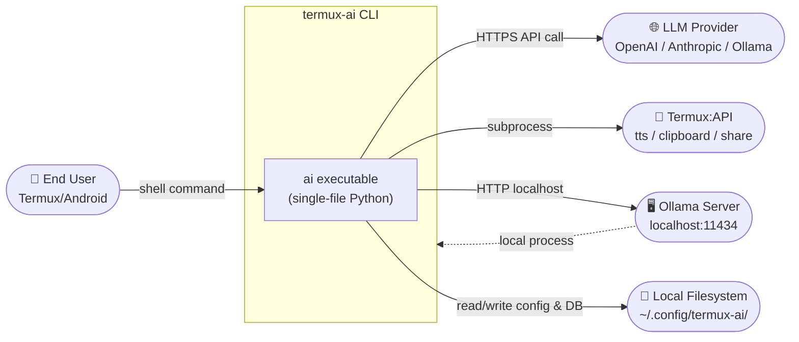
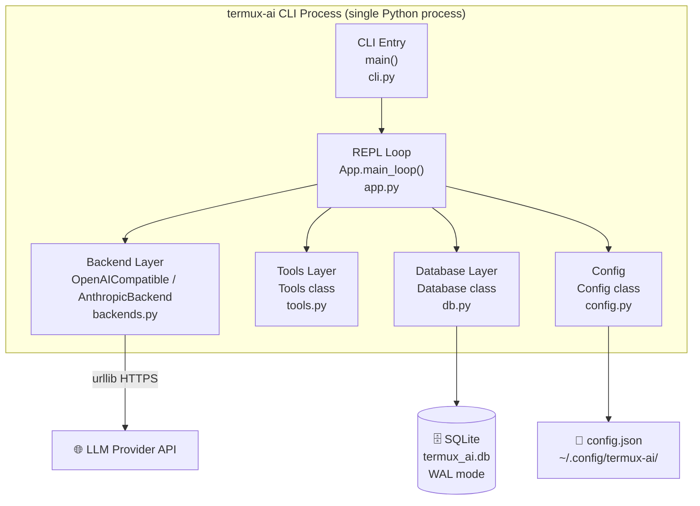
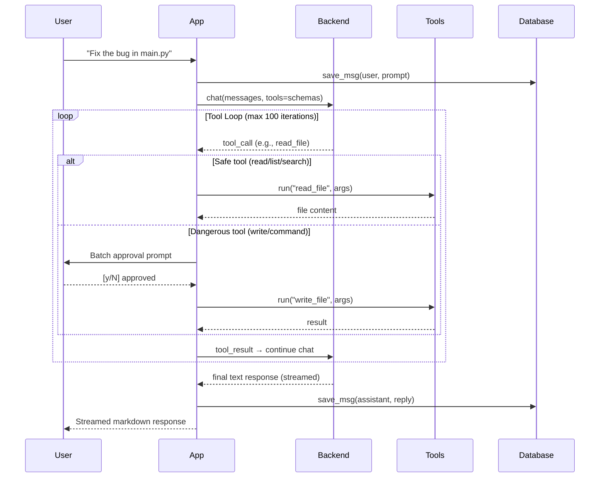
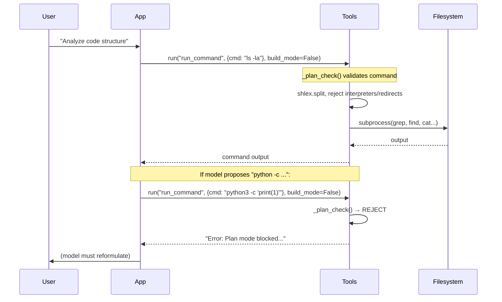
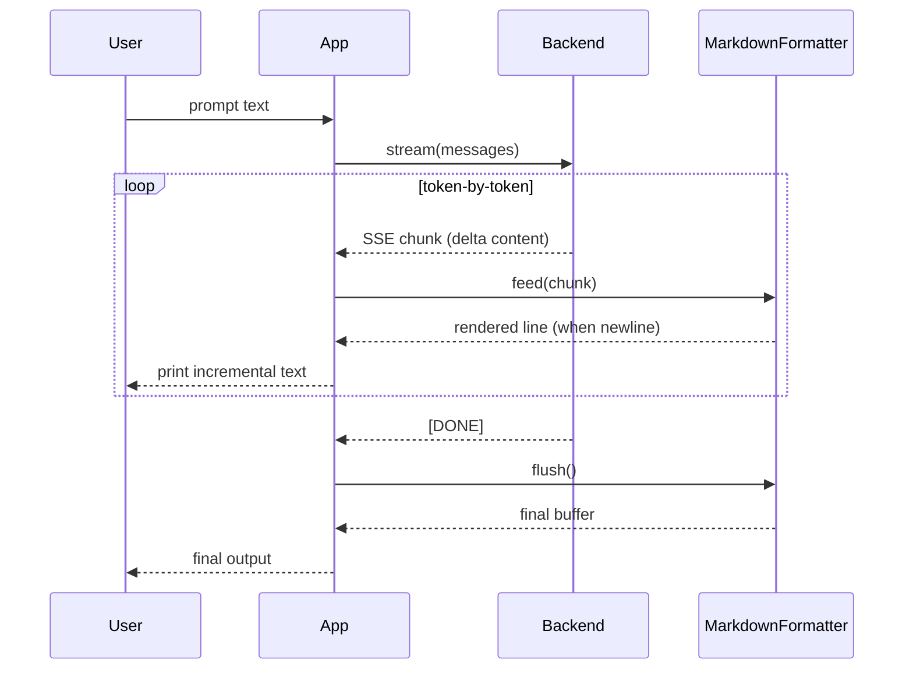
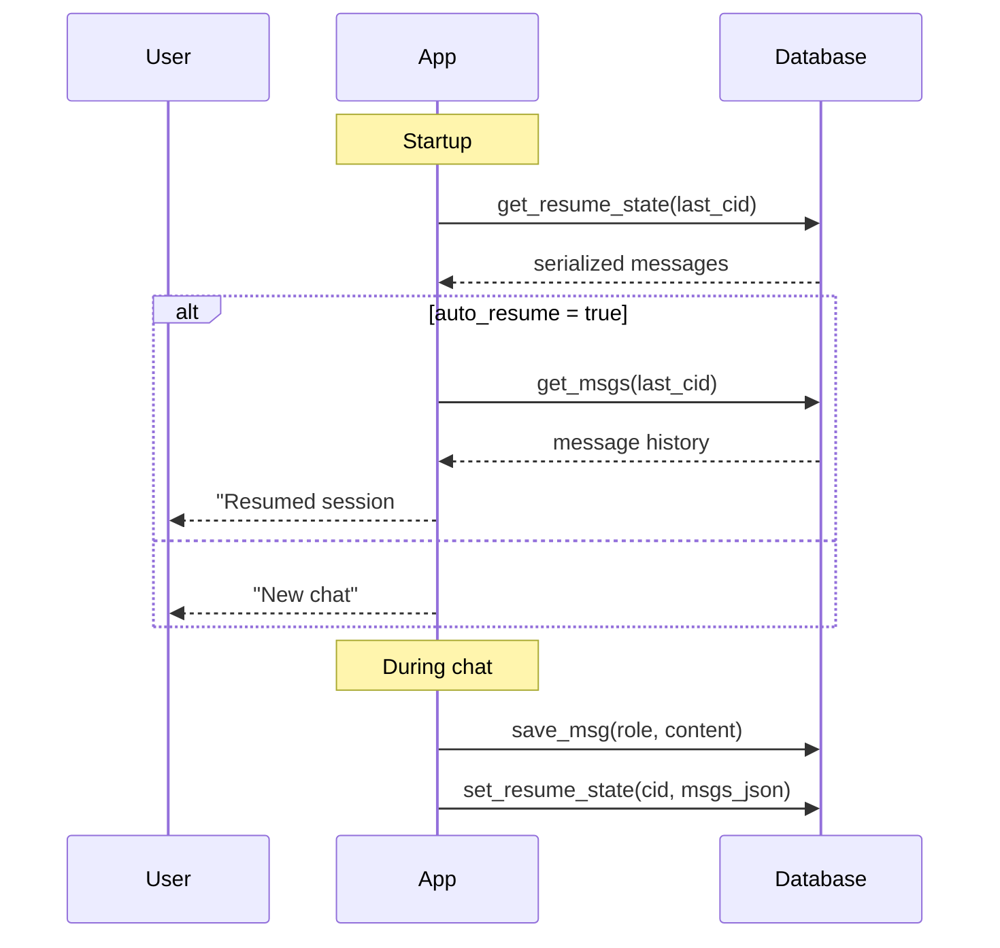
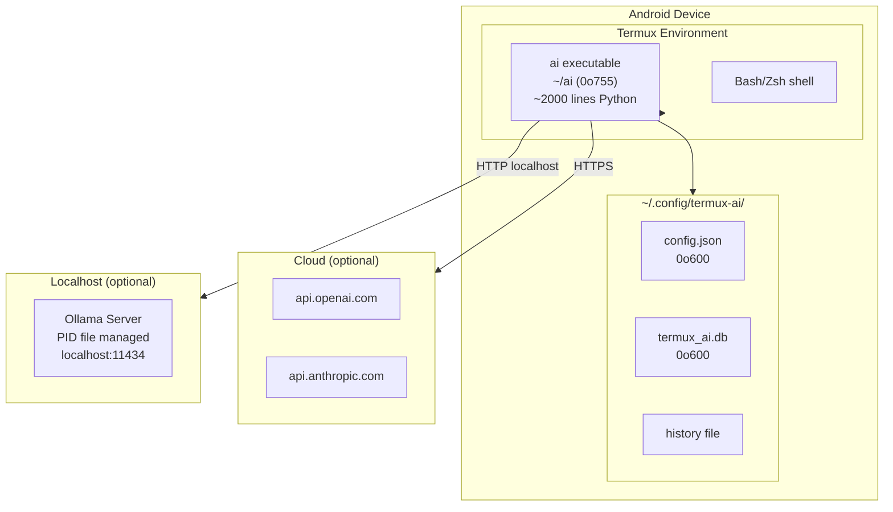

# Software Architecture Document (SAD)
## Termux AI CLI — `termux-ai` v7.0.0

> **Versi:** 1.0 · **Status:** Accepted · **Tanggal:** 2025
> **Sumber kebenaran:** kode sumber `src/*.py`, `build.py`.

---

## 1. Introduction & Scope

### 1.1 Purpose
Dokumen ini mendeskripsikan arsitektur perangkat lunak Termux AI CLI v7.0.0 — sebuah asisten AI terminal zero-dependency untuk Termux/Android. Mencakup konteks sistem, container view, component view, skenario runtime, deployment view, prinsip & pola arsitektur, dan Architecture Decision Records (ADR).

### 1.2 Scope
Satu aplikasi CLI monolitik (single-file artifact `ai`) yang dibangun dari ~14 fragmen sumber Python (`src/*.py`) dan dimerge oleh `build.py`. Aplikasi ini berinteraksi dengan LLM provider API eksternal, SQLite lokal, dan (opsional) Termux:API.

### 1.3 Architectural Drivers

| Tipe | Driver | Dampak Arsitektur |
|------|--------|-------------------|
| Fungsional | Chat multi-turn dengan tools otonom | Tool loop dengan batch-approval |
| Fungsional | Multi-backend (OpenAI/Anthropic/Ollama) | Abstraksi `Backend` dengan 2 implementasi |
| Quality | **Zero dependency** | Python stdlib only; tidak ada `requirements.txt` |
| Quality | **Portabilitas** (Termux-first) | Single-file artifact, no binary deps |
| Quality | **Keamanan** | Plan-mode sandbox, SSRF guard, file-permission hardening |
| Quality | **Maintainability** | Multi-fragment source → single-file build |
| Quality | **Reliability** | Retry logic, WAL DB, auto-compact |

---

## 2. System Context (C4 — Level 1)

---

## 3. Container View (C4 — Level 2)

Aplikasi ini adalah **satu container monolitik** — sebuah proses Python CLI. Tidak ada server, queue, atau cache terpisah. Seluruh state in-process kecuali database persisten.

---

## 4. Component View (C4 — Level 3)

```mermaid
flowchart TB
    subgraph App_Module ["App (app.py + commands.py)"]
        App_Core["App class<br/>init, _chat, _stream_tool_chat<br/>_execute_command, main_loop"]
        Cmd_Handlers["Slash Command Handlers<br/>_cmd_new, _cmd_tools, _cmd_skill, etc.<br/>(45+ handlers in commands.py)"]
    end

    subgraph CLI_Module ["CLI (cli.py)"]
        Main["main()<br/>argparse, routing"]
    end

    subgraph Backend_Module ["Backend (backends.py)"]
        Backend_Base["Backend (base)<br/>chat(), stream()<br/>retry logic 3x"]
        OpenAI_Comp["OpenAICompatible<br/>/v1/chat/completions"]
        Anthropic_B["AnthropicBackend<br/>/v1/messages"]
        GetBackend["get_backend()<br/>factory function"]
    end

    subgraph Tools_Module ["Tools (tools.py)"]
        Tools_Core["Tools class<br/>run(), get_schemas()<br/>_run_impl()"]
        Safe_Tools["SAFE_TOOLS<br/>read_file, list_files, search_files"]
        Plan_Mode["Plan Mode Check<br/>_plan_check(), _run_plan()"]
        FetchURL["_fetch_url()<br/>SSRF guard"]
        Graphify["_graphify()<br/>code-graph scanner"]
        CloneRepo["_clone_repo()<br/>git clone HTTPS only"]
    end

    subgraph Data_Module ["Data Layer"]
        Database["Database<br/>conversations, messages,<br/>resume_state tables"]
        Config_C["Config<br/>DEFAULTS, masked_dict()<br/>system_prompt()"]
        Skills["Skills<br/>discover, parse, seed"]
    end

    subgraph UI_Module ["UI & Utilities"]
        Formatter["MarkdownFormatter<br/>feed(), flush()"]
        Spinner["Spinner<br/>streaming indicator"]
        TermuxAPI_C["TermuxAPI<br/>speak, copy, paste, share"]
        FileReader["FileReader<br/>read(), TEXT_EXTS"]
        ServerMgr["ServerManager<br/>Ollama lifecycle"]
        Constants["_constants.py<br/>paths, colors, est_tok, PRICING"]
    end

    Main --> App_Core
    App_Core --> Cmd_Handlers
    App_Core --> GetBackend
    App_Core --> Tools_Core
    App_Core --> Database
    App_Core --> Config_C
    App_Core --> Skills
    App_Core --> Formatter
    App_Core --> Spinner
    App_Core --> TermuxAPI_C

    GetBackend --> Backend_Base
    Backend_Base -.-> OpenAI_Comp
    Backend_Base -.-> Anthropic_B

    Tools_Core --> Safe_Tools
    Tools_Core --> Plan_Mode
    Tools_Core --> FetchURL
    Tools_Core --> Graphify
    Tools_Core --> CloneRepo
    Tools_Core --> FileReader
```

---

## 5. Key Runtime Scenarios

### 5.1 Interactive Chat with Tool Calls (Build Mode)

### 5.2 Plan Mode — Read-Only Enforcement

### 5.3 Streaming Response Pipeline

### 5.4 Session Persistence & Auto-Resume

---

## 6. Deployment View

### Deployment Characteristics
- **No server process**: CLI berjalan only-on-demand (run → chat → exit).
- **State persists locally**: `~/.config/termux-ai/` menyimpan semua config + DB + history.
- **Ollama**: Jika digunakan, server dijalankan sebagai background process (PID tracked via `PID_FILE`).
- **Distribution**: Single-file install via `curl | sh` (`install.sh`) atau `pip`.
- **Permissions**: Config dir `0o700`, config/DB files `0o600` (`_secure_dir`, `_secure_file`).

---

## 7. Architectural Principles & Patterns

| # | Pattern | Implementasi |
|---|---------|-------------|
| 1 | **Single-File Artifact** | `build.py` menggabungkan 14 fragmen → 1 file `ai`. Rationale: instalasi trivial (curl satu file). |
| 2 | **Fragment-Based Development** | Fragmen `src/*.py` tidak boleh saling import (dilakukan `build.py` check). Global shared via concatenation order. |
| 3 | **Strategy Pattern** | `Backend` base class dengan `OpenAICompatible` dan `AnthropicBackend` implementations. Factory via `get_backend()`. |
| 4 | **Command Pattern** | Slash commands via `_CMD_DISPATCH` dispatch table; handler `_cmd_*` di `commands.py`. |
| 5 | **Tool-Use Loop (Agentic)** | `chat_with_tools`: kirim tools → eksekusi tool_calls → kirim results → ulang hingga model selesai atau `max_iterations`. |
| 6 | **Batch Approval (Human-in-the-loop)** | Tool berbahaya dikumpulkan lalu disetujui sekaligus, bukan satu per satu. |
| 7 | **Defense in Depth (Security)** | Multiple layer: Plan-mode allowlist → SSRF guard → symlink sandbox → file permission hardening. |
| 8 | **Graceful Degradation** | `tiktoken` opsional → regex fallback; `readline` opsional → raw input; Termux:API opsional → skip features. |
| 9 | **Progressive Schema Migration** | `_migrate_schema()`: `ALTER TABLE ADD COLUMN` per-field jika kolom hilang. |
| 10 | **Convention over Configuration** | DEFAULTS dict + deep-merge dari config.json; satu config dir. |

### Technology Choices & Rationale

| Teknologi | Pilihan | Rationale |
|-----------|--------|-----------|
| Bahasa | **Python 3.8+** | Pre-installed di Termux; stdlib kaya; ekosistem AI |
| HTTP Client | **`urllib.request`** (stdlib) | Zero-dependency; tidak butuh `requests` |
| Database | **`sqlite3`** (stdlib) | Zero-dependency; WAL mode untuk concurrency |
| Token Counting | **`tiktoken`** (optional) | Akurat untuk OpenAI; regex fallback (`est_tok`) |
| Build | **`build.py`** (custom script) | Concatenation sederhana; tidak butuh bundler |
| LLM Protocol | **OpenAI-compatible REST** | De-facto standard; Ollama expose `/v1/` |
| LLM Protocol | **Anthropic Messages API** | Native; extended thinking support |

---

## 8. Architecture Decision Records (ADRs)

### ADR-001: Single-File Artifact via Fragment Concatenation

| Field | Detail |
|-------|--------|
| **Status** | Accepted |
| **Context** | Distribusi harus trivial: `curl` satu file, swap binary, done. Editor monolitik ~2000 baris menyakitkan untuk maintenance. |
| **Decision** | Development di `src/*.py` (14 fragmen). `build.py` concatenate dalam dependency order. Fragmen tidak boleh saling import. |
| **Consequences** | ✅ Install/update trivial. ✅ Tidak ada packaging overhead. ⚠️ Fragmen tidak bisa compile standalone penuh (`commands.py` adalah class-body continuation). ⚠️ Tidak ada IDE cross-file intelligence. |
| **Alternatives** | (1) Standard Python package dengan `pip install` — menambah kompleksitas packaging. (2) Monolitik langsung — sulit diedit. |

### ADR-002: Multi-Backend via Abstract `Backend` Class

| Field | Detail |
|-------|--------|
| **Status** | Accepted |
| **Context** | Dukung OpenAI, Anthropic, Ollama dengan API contract berbeda (chat/completions vs messages). |
| **Decision** | Base class `Backend` dengan method `chat()` / `stream()`. Dua implementasi: `OpenAICompatible` (juga untuk Ollama via `/v1/`) dan `AnthropicBackend`. Factory `get_backend(cfg)`. |
| **Consequences** | ✅ Penambahan provider baru = subclass baru. ✅ Ollama gratis karena kompatibel OpenAI. ⚠️ Anthropic punya fitur unik (extended thinking) yang perlu penanganan khusus. |
| **Alternatives** | (1) Provider-specific branches dalam satu fungsi — tidak scalable. (2) Plugin system — over-engineering. |

### ADR-003: SQLite Local-First (No Server Database)

| Field | Detail |
|-------|--------|
| **Status** | Accepted |
| **Context** | Aplikasi CLI perlu menyimpan percakapan, resume state, dan token usage tanpa server database. |
| **Decision** | SQLite dengan WAL mode, busy_timeout 10s, foreign_keys ON. File `~/.config/termux-ai/termux_ai.db` (0o600). |
| **Consequences** | ✅ Zero-dependency. ✅ Atomic writes (WAL). ✅ Schema migration incremental via `_migrate_schema()`. ⚠️ Tidak cocok untuk multi-user/concurrent write tinggi (tidak relevan untuk CLI single-user). |
| **Alternatives** | (1) JSON file — tidak queryable, corrupt-prone. (2) Server DB — kontradiksi dengan zero-dependency. |

### ADR-004: Plan Mode vs Build Mode (Tiered Tool Safety)

| Field | Detail |
|-------|--------|
| **Status** | Accepted |
| **Context** | AI tools berbahaya (write/command) jika dijalankan tanpa kontrol. Tapi read-only analysis bermanfaat dan aman. |
| **Decision** | Default: **Plan mode** (read-only). `/tools` toggle: **Build mode** (write/command dengan batch approval). Plan mode menjalankan command tanpa shell, hanya allowlist program read-only. |
| **Consequences** | ✅ Safe-by-default. ✅ User kontrol eksplisit atas mutasi. ⚠️ Plan mode harus menjaga allowlist up-to-date (interpreter blocklist). |
| **Alternatives** | (1) Semua tools selalu butuh approval — melelahkan. (2) Semua auto-run — berbahaya. |

### ADR-005: Batch Approval for Dangerous Tools

| Field | Detail |
|-------|--------|
| **Status** |  Accepted |
| **Context** | Tool approval satu-per-satu memperlambat alur kerja agentic. |
| **Approach** | Kumpulkan semua tool_calls berbahaya dalam satu turn, tampilkan batch, setujui/ditolak sekaligus. Safe tools auto-execute. |
| **Conmissions** | ✅ UX lebih cepat. ✅ User melihat "big picture" sebelum eksekusi. ⚠️ Risiko approve tanpa baca detail. |
| **Alternatives** | (1) Per-tool approval — lambat. (2) Auto-run semua — tidak aman. |

### ADR-006: SSRF Guard on fetch_url

| Field | Detail |
|-------|--------|
| **Context** | `fetch_url` tool memungkinkan model mem-fetch URL arbitrer. Risiko: SSRF ke internal services (169.254.169.254, localhost). |
| **Decision** | `_is_private_host()` memeriksa IP literal terhadap private/loopback/link-local/reserved/multicast ranges. `localhost` diblokir. Override via `AI_FETCH_ALLOW_PRIVATE=1`. |
| **Consequences** | ✅ Mencegah SSRF klasik. ⚠️ DNS rebinding tidak teratasi penuh (hostname non-IP). [verify] |
| **Alternatives** | (1) Allowlist domain — terlalu restriktif. (2) No guard — berbahaya. |

### ADR-007: Retry Logic for Transient Errors

| Field | Detail |
|-------|--------|
| **Status** | Accepted |
| **Context** | LLM API rentan transient error (429 rate limit, 500/502/503). |
| **Decision** | `Backend` retry 3x (configurable) dengan exponential backoff (`retry_delay: 1.0`). Hanya retry pada 429 dan 5xx. |
| **Consequences** | ✅ Lebih resilient. ⚠️ Menambah latensi pada kegagalan total. |
| **Alternatives** | (1) No retry — UX buruk. (2) Circuit breaker — over-engineering untuk CLI. |

### ADR-006 → ADR-008: Symlink Sandbox for write_file

| Field | Detail |
|-------|--------|
| **Status** | Accepted |
| **Context** | `write_file` di Build mode menulis file. Symlink dalam cwd bisa escape direktori kerja. |
| **Decision** | `os.path.realpath()` resolve symlink → `os.path.commonpath()` pastikan target di dalam `cwd`. Jika tidak, tolak. |
| **Pengerjaan** | `Tools._run_impl()` → `write_file` branch. |
| **Alternatives** | (1) chroot — tidak tersedia di Termux. (2) No guard — risiko menulis ke `/etc/passwd` via symlink. |

### ADR-009: Auto-Compact Context Window

| Field | Detail |
|-------|--------|
| **Context** | Percakapan panjang melampaui context window model (default 32000 token). |
| **Decision** | `auto_compact: true` (default). Saat konteks mendekati `context_window`, pesan lama diringkas (ringkasan + `compact_keep_recent: 8000` pesan terbaru dipertahankan). |
| **Consequences** | ✅ Mencegah context overflow error. ✅ Mengurangi biaya token. ⚠️ Potensial kehilangan detail lama. |
| **Alternatives** | (1) Hard cut-off pesan lama — kehilangan konteks. (2) Tidak lakukan apa-apa — API error. |

---

## 9. Architectural Risks & Trade-offs

| # | Risk | Severity | Mitigation |
|---|------|----------|------------|
| R1 | **Tool loop spiraling** — model terjebak membaca file yang sama berulang | Tinggi | `repeat_limit: 3`, `re_read_limit: 3`, `max_iterations: 100`, konteks capacity ditingkatkan (`max_tool_result: 30000`) |
| R2 | **Single-threaded blocking** — HTTP request blocking memblokir UI | Sedang | Streaming memberikan feedback inkremental; Spinner thread. |
| R3 | **Fragment concatenation fragility** — urutan salah → NameError | Sedang | `build.py` forbidden-import check; git pre-commit hook. |
| R concatenation | **SQLite single-writer** — concurrent CLI instances bisa conflict | Rendah | WAL mode + busy_timeout 10s; single-user by design. |
| R5 | **DNS rebinding pada fetch_url** — hostname resolve ke private IP | Rendah | [verify] Tidak teratasi penuh; dokumentasikan batasan. |
| R6 | **Anthropic extended thinking** fitur backend-specific | Sedang | Flag `extended_thinking` + `thinking_budget`; hanya efektif untuk Anthropic. |
| R7 | **Plan mode allowlist maintenance** — program baru bisa bypass | Sedang | Blocklist interpreter eksplisit; deskripsi tool menjelaskan aturan ke model. |

---

*Setiap klaim teknis di dokumen ini dapat ditelusuri ke kode sumber di `src/*.py` dan `build.py`. Klaim yang tidak dapat diverifikasi langsung ditandai `[verify]`.*
