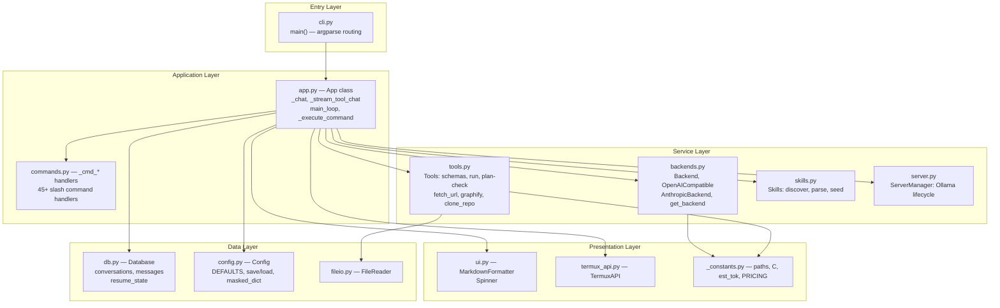
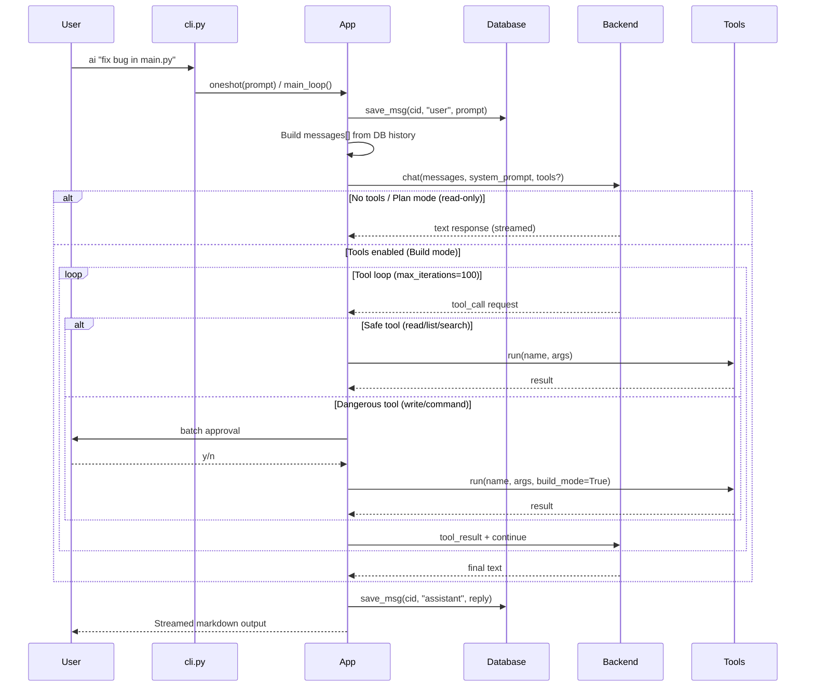
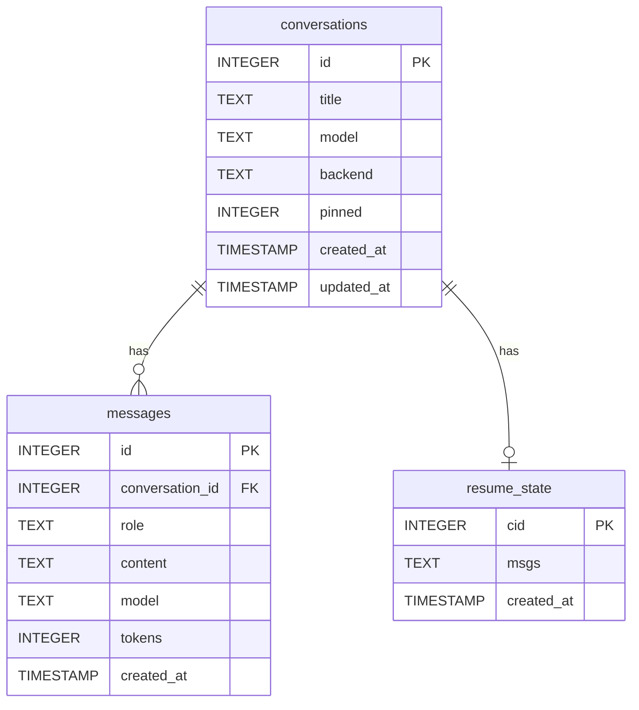
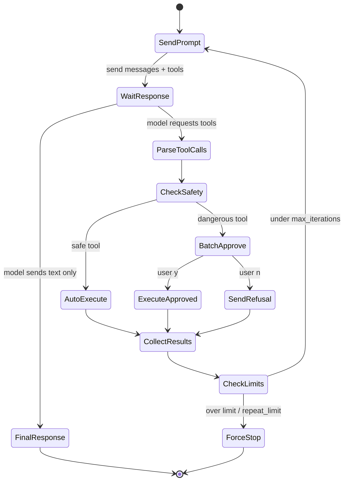
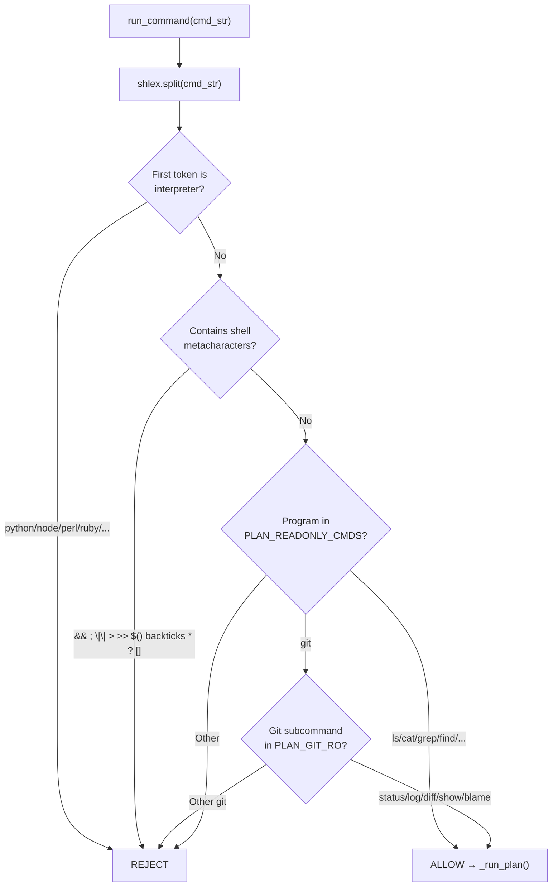
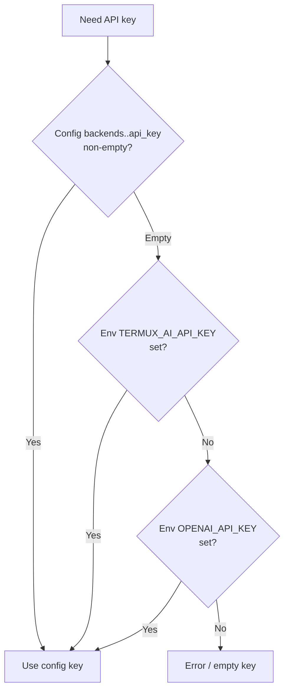

# Technical Specification Document (TSD)
## Termux AI CLI — `termux-ai` v7.0.0

> **Versi:** 1.0 · **Status:** Accepted · **Tanggal:** 2025
> **Sumber kebenaran:** kode sumber `src/*.py`, `build.py`. Nomor baris mengacu pada file fragmen sumber.

---

## 1. Overview & Tech Stack

### 1.1 Ringkasan
Termux AI adalah CLI AI chat zero-dependency untuk Termux/Android. Dibangun dari 14 fragmen Python (`src/*.py`) yang dimerge oleh `build.py` menjadi single-file executable `ai` (~2000 baris). Berinteraksi dengan LLM provider via HTTP dan menyimpan state di SQLite lokal.

### 1.2 Tech Stack

| Komponen | Teknologi | Versi / Detail |
|----------|-----------|----------------|
| Bahasa | Python | 3.8+ (stdlib only) |
| HTTP Client | `urllib.request` | stdlib, zero-dep |
| Database | `sqlite3` | stdlib, WAL mode |
| Token Counter | `tiktoken` (optional) | cl100k_base; regex fallback `est_tok()` |
| Build Tool | `build.py` (custom) | Fragment concatenation |
| LLM Protocol (OpenAI/Ollama) | REST `/v1/chat/completions` | SSE streaming |
| LLM Protocol (Anthropic) | REST `/v1/messages` | Native, extended thinking |
| Shell Integration | `subprocess`, `shlex` | stdlib |
| Version | `__version__` | `"7.0.0"` (`_header.py`) |

### 1.3 Repository Layout

```
.
├── ai                  # AUTO-GENERATED single-file executable (built by build.py)
├── build.py            # Fragment concatenation builder
├── install.sh          # curl | sh installer
├── src/                # Source fragments (development)
│   ├── _header.py      # shebang, docstring, imports, __version__
│   ├── _constants.py   # paths, colors (C), IS_TTY, est_tok, PRICING, parse_value
│   ├── fileio.py       # FileReader class
│   ├── ui.py           # MarkdownFormatter, Spinner
│   ├── termux_api.py   # TermuxAPI (tts, clipboard, share)
│   ├── server.py       # ServerManager (Ollama lifecycle)
│   ├── db.py           # Database class (SQLite)
│   ├── config.py       # Config class (DEFAULTS, masked_dict)
│   ├── tools.py        # Tools class (schemas, run, plan-check, fetch_url, graphify)
│   ├── backends.py     # Backend, OpenAICompatible, AnthropicBackend, get_backend
│   ├── skills.py       # Skills class (discovery, parse, seed)
│   ├── app.py          # App class (core: _chat, _stream_tool_chat, main_loop)
│   ├── commands.py     # App command handlers (_cmd_*) — class-body continuation
│   └── cli.py          # main() + __main__ guard
├── tests/
│   ├── test_security.py # Security test suite (injection, SSRF, sandbox)
│   └── ...
└── README.md
```

### 1.4 Build Order (build.py)

Fragmen digabungkan dalam urutan dependensi ini:

```
_header → _constants → fileio → ui → termux_api → server → db → config →
tools → backends → skills → app → commands → cli
```

**Aturan fragmen:** tidak boleh ada `from termux_ai...`, `from .x import...`, atau `import termux_ai`. Diperiksa oleh regex `FORBIDDEN` di `build.py`. `commands.py` adalah *class-body continuation* — shim `class App: # BUILD-SHIM` di-strip saat merge.

---

## 2. Architecture

### 2.1 Component / Layer Diagram



### 2.2 Main Request Flow (Interactive Chat + Tools)



### 2.3 Design Patterns

| Pattern | Lokasi | Deskripsi |
|---------|--------|-----------|
| Strategy | `Backend` base, `OpenAICompatible`/`AnthropicBackend` | Switchable LLM provider |
| Factory | `get_backend(cfg)` | Membuat instance backend dari config |
| Command Dispatcher | `_CMD_DISPATCH` (app.py) | Map `/command` → handler method |
| Agentic Tool Loop | `_stream_tool_chat` | Iterative tool-call → result → continue |
| Template Method | `Config.system_prompt()` | persona + fixed TOOL_RULES |

---

## 3. Modules / Components

### 3.1 `_constants.py` — Globals & Utilities

| Item | Tipe | Deskripsi |
|------|------|-----------|
| `CONFIG_DIR` | `Path` | `~/.config/termux-ai` |
| `CONFIG_FILE` | `Path` | `CONFIG_DIR / "config.json"` |
| `DB_FILE` | `Path` | `CONFIG_DIR / "termux_ai.db"` |
| `HIST_FILE` | `Path` | History file untuk readline |
| `PID_FILE` | `Path` | Ollama PID tracking |
| `C` | class | ANSI color codes (GREEN, RED, BOLD, DIM, RESET, ...) |
| `IS_TERMUX` | bool | `True` if running in Termux |
| `IS_TTY` | bool | `sys.stdout.isatty()` |
| `HAVE_READLINE` | bool | `True` if readline importable |
| `est_tok(text)` | func | Token estimation: tiktoken cl100k_base or regex fallback (`len/4`) |
| `PRICING` | dict | USD per 1K tokens: `{"gpt-4o": 0.005, "claude-3-opus": 0.015, "llama3.2": 0.0, ...}` |
| `_secure_dir(path)` | func | `os.chmod(path, 0o700)` |
| `_secure_file(path)` | func | `os.chmod(path, 0o600)` |
| `parse_value(s)` | func | Parse string → bool/int/float/str for config |

### 3.2 `cli.py` — Entry Point

**`main()`** — Menggunakan `argparse`:
- `prompt` (posisi, optional) — one-shot prompt
- `-m / --model` — override model untuk run ini
- `-c / --command` — generate shell command untuk task
- `-j / --json` — minta output JSON
- `--continue` — resume sesi terakhir
- `--new` — mulai sesi baru
- `-l / --load ID` — load sesi by ID

**Routing logic:**
1. `App()` init → `_override_model(args.model)`
2. Set resume mode dari flags
3. `_read_stdin()` — tangkap piped input
4. Jika `-c`: `command_gen()` → exit
5. Jika `-j`: `json_oneshot()` → exit
6. Jika prompt/stdin: `oneshot()` → exit
7. Jika tidak ada prompt & TTY: `main_loop()` (REPL)

### 3.3 `app.py` — Core Application (`App` class)

**Key attributes:**
- `self.cid` — conversation ID aktif (atau None)
- `self.backend` — instance Backend aktif
- `self.db` — Database instance
- `self.cfg` — Config instance
- `self.skills` — Skills instance
- `self.active_session_skills` — `list[(name, body)]` skill session aktif
- `self.last_reply` — teks jawaban terakhir (untuk `/copy`, `/speak`, `/share`)

**Key methods:**
| Method | Deskripsi |
|--------|-----------|
| `__init__()` | Init Config, Database, Skills, Backend, resume logic |
| `main_loop()` | REPL: input → dispatch → response → save |
| `_chat(prompt, title)` | Kirim prompt ke backend; handle tools jika enabled |
| `_stream_tool_chat(...)` | Streaming chat dengan tool-use loop |
| `_execute_command(cmd, args)` | Dispatch slash command via `_CMD_DISPATCH` |
| `oneshot(prompt, stdin)` | One-shot mode (no REPL) |
| `command_gen(task, stdin)` | Generate shell command (`-c` flag) |
| `json_oneshot(prompt, stdin)` | JSON output mode (`-j` flag) |
| `_override_model(model)` | Override active model dari CLI flag |
| `_activate(cid, banner)` | Activate conversation by ID |
| `_persist_session()` | Save resume state |
| `_run_setup(arg)` | Guided setup wizard |
| `_self_update()` | `/update` — re-download `ai` binary |

### 3.4 `commands.py` — Slash Command Handlers

Class-body continuation dari `App`. Setiap method `_cmd_*` menerima `self, args` (list token setelah command). Dispatched oleh `_CMD_DISPATCH` table di `app.py`.

### 3.5 `backends.py` — LLM Provider Abstraction

**`Backend` (base class):**
- `chat(messages, system, tools, **kwargs)` → non-streaming response
- `stream(messages, system, tools, **kwargs)` → generator (SSE chunks)
- Retry logic: `max_retries` (default 3), `retry_delay` (default 1.0s), exponential backoff
- Retries only on HTTP 429, 500, 502, 503

**`OpenAICompatible(Backend)`:**
- Endpoint: `{base_url}/chat/completions` (OpenAI-compatible)
- Digunakan untuk: OpenAI API, Ollama (`http://localhost:11434/v1`), provider lain yang kompatibel
- API key resolution: config `api_key` → env `TERMUX_AI_API_KEY` → env `OPENAI_API_KEY`
- Streaming: SSE `data: {...}` → `choices[0].delta.content`

**`AnthropicBackend(Backend)`:**
- Endpoint: `{base_url}/v1/messages`
- Native Anthropic Messages API
- Extended thinking support: `thinking_budget` parameter
- API key: config `api_keys.anthropic` → env `ANTHROPIC_API_KEY`
- Tool format: `input_schema` (Anthropic) vs `parameters` (OpenAI)

**`get_backend(cfg)`:**
- Factory: baca `cfg.active_profile()` → return `OpenAICompatible` atau `AnthropicBackend`

### 3.6 `tools.py` — AI Tool System

**`Tools` class** — static methods:

| Constant / Set | Deskripsi |
|----------------|-----------|
| `SAFE_TOOLS` | `{"read_file", "list_files", "search_files"}` — auto-execute, no approval |
| `IGNORE_DIRS` | `{".git", "node_modules", "__pycache__", "dist", ".venv", ...}` — skip in file ops |
| `PLAN_READONLY_CMDS` | Allowlist untuk Plan mode: `{ls, cat, head, tail, find, grep, wc, file, du, df, stat, git, ...}` |
| `PLAN_GIT_RO` | `{status, log, diff, show, blame}` — git read-only subcommands |
| `TOOLS` | Full tool schemas (OpenAI format) untuk Build mode |
| `PLAN_TOOLS` | Reduced schemas (no write_file, restricted run_command) untuk Plan mode |

**Key methods:**

| Method | Deskripsi |
|--------|-----------|
| `run(name, args, build_mode, max_result=10000)` | Execute tool by name; truncate result at `max_result` |
| `_run_impl(name, args, build_mode)` | Dispatch ke tool implementation |
| `get_schemas(build_mode)` | Return tool schemas (Build or Plan set) |
| `to_anthropic_schema(build_mode)` | Convert OpenAI → Anthropic format |
| `_plan_check(cmd_str)` | Validate command untuk Plan mode (blocklist) |
| `_run_plan(cmd_str)` | Execute read-only command tanpa shell |
| `_run_command_desc(build_mode)` | Generate description untuk model |
| `_fetch_url(url, timeout=10, max_bytes=500000)` | HTTP fetch dengan SSRF guard + HTML→text |
| `_is_private_host(host)` | SSRF check: private/loopback/link-local/reserved/multicast |
| `_allow_private()` | Check env `AI_FETCH_ALLOW_PRIVATE` |
| `_html_to_text(html)` | Crude HTML → readable text |
| `_graphify(path, mode)` | Code-graph scanner (zero-dep, regex-based) |
| `_clone_repo(url, depth, build_mode, timeout)` | git clone HTTPS-only ke temp dir |

### 3.7 `db.py` — Database (`Database` class)

SQLite dengan WAL mode, busy_timeout 10s, foreign_keys ON. Schema migration incremental via `_migrate_schema()`.

### 3.8 `config.py` — Configuration (`Config` class)

JSON config dengan deep-merge dari `DEFAULTS`. File permission `0o600`. One-time migration `_cap_v2`.

### 3.9 `skills.py` — Skill System (`Skills` class)

Discovery flat `.md` files + dir/`SKILL.md`. Front-matter parsing (YAML-like). Seed examples bawaan.

### 3.10 `fileio.py` — File Reader (`FileReader` class)

`read(path, max_chars=20000, start_line, end_line)`. TEXT_EXTS ~30 extensions. Line-range paging (1-based, inclusive).

### 3.11 `ui.py` — Markdown Formatter & Spinner

`MarkdownFormatter`: `feed(chunk)`, `flush()`, line-by-line rendering. Detects code blocks, lists, tables. Folding long lists/tables (`fold_head=8`). `Spinner`: threaded animation untuk streaming.

### 3.12 `termux_api.py` — Termux:API Wrapper

`TermuxAPI` static methods: `speak(text)` (1000 char limit), `copy(text)`, `paste()`, `share(text)`, `status()` → `{tts, clipboard, share}` availability dict.

### 3.13 `server.py` — Ollama Server Manager

`ServerManager` class: `_pid_alive()`, `_installed()`, `_ensure_running()`, `manage(action)`, `pull(model)`, `models()`, `search(query)`, `show(model)`, `rm(model)`.

---

## 4. API / Endpoints Reference

Termux AI bukan server — "API" di sini adalah **slash commands** (CLI interface) dan **AI tool schemas** (function-calling). Berikut enumerasi lengkap.

### 4.1 Slash Commands (REPL Interface)

Semua command diawali `/`. Dispatched oleh `_CMD_DISPATCH` di `app.py`; handler di `commands.py`.

#### Session & Conversation Management

| Command | Args | Deskripsi |
|---------|------|-----------|
| `/new` | — | Mulai chat baru (reset `cid`) |
| `/save` | `[name]` | Simpan & pin sesi saat ini |
| `/unsave` | — | Hapus bookmark (chat tetap di DB) |
| `/load` | `<id\|name>` | Muat sesi tersimpan |
| `/continue` | — | Lanjutkan sesi terakhir |
| `/sessions` | — | Daftar sesi tersimpan & terbaru (● = pinned) |
| `/history` | — | Daftar percakapan terbaru |
| `/search` | `<query>` | Cari percakapan berdasarkan judul/konten |
| `/delete` | `<id>` | Hapus percakapan |
| `/export` | `[path]` | Ekspor chat aktif ke Markdown |
| `/undo` | — | Hapus pasangan pesan terakhir |
| `/clear` | — | Bersihkan layar terminal |

#### Backend & Model Configuration

| Command | Args | Deskripsi |
|---------|------|-----------|
| `/backend` | `<name>` | Beralih backend aktif |
| `/backends` | — | Daftar backend tersedia (* = aktif) |
| `/model` | `[name]` | Tampilkan / set model aktif |
| `/profile` | `set\|add\|list` | Kelola profil backend |
| `/config` | `set\|get\|<none>` | Set/get config; no-arg = tampilkan semua (masked) |

#### AI Tools & Modes

| Command | Args | Deskripsi |
|---------|------|-----------|
| `/tools` | — | Toggle Build (write) / Plan (read-only) mode |
| `/strategy` | — | Toggle strategy-first mode |
| `/think` | — | Toggle extended thinking (Anthropic only) |
| `/skill` | `<sub>` | Kelola skills: `list\|new\|edit\|show\|seed\|auto\|off\|<name>` |
| `/graphify` | `[path] [mode]` | Scan code graph, simpan ke `docs/code-graph.md` |

#### Context & Token Management

| Command | Args | Deskripsi |
|---------|------|-----------|
| `/cost` | — | Tampilkan token usage per model + estimasi USD |
| `/compact` | — | Ringkas konteks percakapan secara manual |
| `/prune` | `[days]` | Hapus percakapan lama (unpinned) |

#### Termux Integration

| Command | Args | Deskripsi |
|---------|------|-----------|
| `/speak` | — | TTS: bacakan jawaban terakhir |
| `/copy` | — | Salin jawaban ke clipboard |
| `/paste` | — | Tempel clipboard ke chat |
| `/share` | — | Bagikan jawaban via Android share sheet |
| `/status` | — | Tampilkan status Termux:API + backend + tools |
| `/expand` | — | Tampilkan jawaban terakhir di pager (`less`) |

#### Display & Input

| Command | Args | Deskripsi |
|---------|------|-----------|
| `/fold` | `on\|off` | Toggle folding long lists/tables |
| `/multi` | — | Toggle multi-line input mode |
| `/system` | `[text]` | Set/tampilkan persona (tool rules selalu di-append) |

#### Server Management

| Command | Args | Deskripsi |
|---------|------|-----------|
| `/server` | `<action>` | `start\|stop\|status\|pull\|models\|search\|show\|rm` |

#### Utility

| Command | Args | Deskripsi |
|---------|------|-----------|
| `/setup` | — | Jalankan setup wizard |
| `/update` | — | Self-update: re-download `ai` binary |
| `/exit` | — | Keluar dari REPL |

### 4.2 CLI Flags (cli.py `main()`)

| Flag | Arg | Deskripsi |
|------|-----|-----------|
| `prompt` (posisi) | `string` | One-shot prompt |
| `-m` / `--model` | `MODEL` | Override model |
| `-c` / `--command` | `TASK` | Generate shell command |
| `-j` / `--json` | — | JSON output mode |
| `--continue` | — | Resume sesi terakhir |
| `--new` | — | Sesi baru |
| `-l` / `--load` | `ID` | Load sesi by ID |

### 4.3 AI Tool Schemas (Function Calling)

Schema diberikan ke model sebagai `tools` parameter. Format OpenAI (`function.parameters`) atau Anthropic (`input_schema`). Dipilih oleh `Tools.get_schemas(build_mode)`.

#### Build Mode Tools (`Tools.TOOLS`)

| Tool | Auto? | Args | Deskripsi |
|------|-------|------|-----------|
| `read_file` | ✅ Safe | `path`, `start?`, `end?` | Baca file (paging 1-based) |
| `write_file` | ❌ Approval | `path`, `content`, `append?` | Tulis/append file (sandbox: cwd only) |
| `list_files` | ✅ Safe | `path?`, `recursive?` | Daftar file (skip IGNORE_DIRS) |
| `run_command` | ❌ Approval | `command` | Jalankan shell command (30s timeout) |
| `search_files` | ✅ Safe | `query`, `path?` | grep -rn (exclude IGNORE_DIRS) |
| `fetch_url` | ❌ Approval | `url` | HTTP fetch + HTML→text (SSRF guard) |
| `clone_repo` | ❌ Approval | `url`, `depth?` | git clone HTTPS-only ke temp dir |
| `graphify` | ✅ Safe | `path?`, `mode?` | Scan code graph (deps/defs/api/models) |

#### Plan Mode Tools (`Tools.PLAN_TOOLS`)

Subset read-only: `read_file`, `list_files`, `search_files`, `run_command` (restricted), `fetch_url`, `graphify`.

- `write_file` dan `clone_repo` **tidak tersedia** di Plan mode.
- `run_command` hanya menjalankan command yang lulus `_plan_check()`.

### 4.4 Tool: run_command (Plan Mode Rules)

| Aspek | Aturan |
|-------|-------|
| **Allowlist** | `ls, cat, head, tail, find, grep, wc, file, du, df, stat, tree, ...` + `git` (read-only subcommands) |
| **Git read-only** | `status, log, diff, show, blame` |
| **Diblokir** | Semua interpreter (`python, node, perl, ruby, php, java, go, lua, awk, sed, sh, bash`), redirect (`> >>`), command substitution (`$()`, backticks), `&& ; \|\|`, globs (`* ? []`), mutating commands (`rm, mv, cp, touch, mkdir, chmod, tee, dd, pip, npm, apt`) |
| **Eksekusi** | Tanpa shell (`subprocess` tanpa `shell=True`); pipes (`\|`) didukung |

---

## 5. Data Model / Schema

### 5.1 SQLite Tables

Database: `~/.config/termux-ai/termux_ai.db` (WAL mode, `0o600`).

#### Table: `conversations`

| Column | Type | Constraints | Deskripsi |
|--------|------|-------------|-----------|
| `id` | INTEGER | PRIMARY KEY AUTOINCREMENT | Conversation ID |
| `title` | TEXT | — | Judul percakapan |
| `model` | TEXT | — | Model yang digunakan |
| `backend` | TEXT | — | Nama backend |
| `pinned` | INTEGER | DEFAULT 0 | 1 = saved/pinned |
| `created_at` | TIMESTAMP | DEFAULT CURRENT_TIMESTAMP | Waktu dibuat |
| `updated_at` | TIMESTAMP | DEFAULT CURRENT_TIMESTAMP | Waktu update terakhir |

#### Table: `messages`

| Column | Type | Constraints | Deskripsi |
|--------|------|-------------|-----------|
| `id` | INTEGER | PRIMARY KEY AUTOINCREMENT | Message ID |
| `conversation_id` | INTEGER | FOREIGN KEY → conversations(id) | Parent conversation |
| `role` | TEXT | — | `user` / `assistant` / `system` |
| `content` | TEXT | — | Isi pesan |
| `model` | TEXT | — | Model yang menghasilkan pesan |
| `tokens` | INTEGER | DEFAULT 0 | Token count |
| `created_at` | TIMESTAMP | DEFAULT CURRENT_TIMESTAMP | Waktu |

#### Table: `resume_state`

| Column | Type | Constraints | Deskripsi |
|--------|------|-------------|-----------|
| `cid` | INTEGER | PRIMARY KEY | Conversation ID |
| `msgs` | TEXT | — | JSON-serialized message list |
| `created_at` | TIMESTAMP | DEFAULT CURRENT_TIMESTAMP | Waktu |

### 5.2 ER Diagram



### 5.3 Migration Strategy

`_migrate_schema()` — Progressive ALTER TABLE:
- Cek kolom yang ada via `PRAGMA table_info(table)`.
- Jika kolom hilang: `ALTER TABLE ... ADD COLUMN ...` dengan default.
- Migration dalam transaction (`BEGIN`/`COMMIT`, `ROLLBACK` on error).
- One-time config migration `_cap_v2`: bump `max_tokens` 4096→8192, `max_tool_result` 10000→30000.

### 5.4 Config Schema (`config.json`)

```json
{
  "backend": "ollama",
  "system_prompt": "...",
  "system_instruction": "",
  "temperature": 0.7,
  "max_tokens": 8192,
  "context_window": 32000,
  "iteration_history_budget": 30000,
  "compact_keep_recent": 8000,
  "stream": true,
  "show_tokens": true,
  "tools_enabled": false,
  "strategy_first": false,
  "skill_autoload": false,
  "extended_thinking": false,
  "thinking_budget": 8000,
  "tts_replies": false,
  "multi_line": false,
  "auto_compact": true,
  "max_file_chars": 20000,
  "max_tool_result": 30000,
  "max_iterations": 100,
  "repeat_limit": 3,
  "re_read_limit": 3,
  "gather_first": true,
  "gather_threshold": 5,
  "continue_every": 10,
  "auto_resume": true,
  "prune_days": 0,
  "auto_continue": true,
  "max_auto_continue": 2,
  "retries": 3,
  "retry_delay": 1.0,
  "fold_long_blocks": true,
  "fold_head": 8,
  "attach_files": true,
  "_cap_v2": true,
  "api_keys": { "anthropic": "" },
  "backends": {
    "ollama": {
      "base_url": "http://localhost:11434/v1",
      "model": "llama3.2",
      "api_key": "ollama"
    }
  }
}
```

---

## 6. Core Business Logic

### 6.1 Tool Loop (Agentic Flow)



**Anti-spiral protections:**
- `max_iterations: 100` — batas total iterasi tool loop.
- `repeat_limit: 3` — jika tool_call sama berulang > 3x, force stop.
- `re_read_limit: 3` — jika file yang sama di-read > 3x, force stop.
- `max_tool_result: 30000` — truncate hasil tool agar tidak flood context.

### 6.2 Plan Mode Command Validation



### 6.3 Context Compaction

Saat total token mendekati `context_window` (default 32000):
1. Hitung token pesan saat ini via `est_tok()`.
2. Jika melebihi threshold: ringkas pesan lama menjadi summary.
3. Pertahankan `compact_keep_recent` (8000) token pesan terbaru.
4. Summary menggantikan pesan lama di context.

### 6.4 Token Estimation & Cost Calculation

- **`est_tok(text)`**: Coba `tiktoken cl100k_base`; jika tidak ada, fallback regex `len(text.split())` / `len(text)//4`.
- **`_match_price(model)`**: Lookup di `PRICING` dict; fuzzy match nama model.
- **`/cost`**: `SUM(tokens) GROUP BY model` → multiply dengan price → tampilkan tabel.

### 6.5 API Key Resolution (OpenAI-compatible)



---

## 7. Integrations

### 7.1 LLM Provider APIs

| Provider | Endpoint | Auth | Streaming |
|----------|----------|------|-----------|
| **OpenAI** | `https://api.openai.com/v1/chat/completions` | Bearer token | SSE `data: {...}` |
| **Anthropic** | `https://api.anthropic.com/v1/messages` | `x-api-key` header | SSE |
| **Ollama** | `http://localhost:11434/v1/chat/completions` | `ollama` (dummy) | SSE (OpenAI-compat) |

**Retry logic:** 3x retry pada HTTP 429, 500, 502, 503 dengan exponential backoff (`retry_delay * 2^attempt`).

### 7.2 Termux:API (subprocess)

| Method | Command | Notes |
|--------|---------|-------|
| `speak(text)` | `termux-tts-speak` | Text capped at 1000 chars |
| `copy(text)` | `termux-clipboard-set` | |
| `paste()` | `termux-clipboard-get` | Returns string |
| `share(text)` | `termux-share` | Android share sheet |

Availability checked via `TermuxAPI.status()` → `{tts: bool, clipboard: bool, share: bool}`.

### 7.3 Ollama CLI (subprocess)

| Action | Command | Notes |
|--------|---------|-------|
| `start` | `ollama serve &` | Background, PID tracked |
| `stop` | Kill PID from PID_FILE | |
| `pull <model>` | `ollama pull <model>` | Download model |
| `models` | `ollama list` | List installed |
| `search <q>` | `ollama search <q>` | Search registry |
| `show <model>` | `ollama show <model>` | Model details |
| `rm <model>` | `ollama rm <model>` | Remove model |

### 7.4 GitHub API (fetch_url enhancement)

Saat `fetch_url` men-fetch `api.github.com`:
- Cek env `GITHUB_TOKEN` atau `GH_TOKEN`.
- Jika ada: tambahkan `Authorization: token <tok>` + `Accept: application/vnd.github+json`.

---

## 8. Security & Auth

### 8.1 Authentication (User → LLM Provider)

| Provider | Mechanism | Storage |
|----------|-----------|---------|
| OpenAI/Ollama-compat | API key (Bearer / Authorization) | `config.json` `backends.<name>.api_key` atau env |
| Anthropic | API key (`x-api-key` header) | `config.json` `api_keys.anthropic` atau env `ANTHROPIC_API_KEY` |

**API key masking:** `Config.masked_dict()` mengganti `api_key` dengan masked value sebelum display.

### 8.2 Permission / RBAC Model

Tidak ada RBAC multi-user — aplikasi single-user by design. Kontrol akses adalah **mode-based**:

| Mode | File Write | Command Execution | Approval |
|------|-----------|-------------------|----------|
| **Plan (default)** | ❌ Blocked | Read-only allowlist only | Not needed (safe) |
| **Build** | ✅ (sandbox: cwd) | Full shell (30s timeout) | Batch approval required |

### 8.3 Security Measures Summary

| Measure | Location | Deskripsi |
|---------|----------|-----------|
| **File permissions** | `_secure_dir`, `_secure_file` | Config dir `0o700`, files `0o600` |
| **Plan mode sandbox** | `Tools._plan_check()` | Blocklist interpreter, redirect, mutate |
| **Symlink sandbox** | `Tools._run_impl()` → `write_file` | `realpath()` + `commonpath()` check vs cwd |
| **SSRF guard** | `Tools._is_private_host()` | Block private/loopback/link-local/reserved/multicast |
| **clone_repo HTTPS-only** | `Tools._clone_repo()` | Block `ssh://`, `git@`, `file://` |
| **API key masking** | `Config.masked_dict()` | Keys masked in `/config` output |
| **Tool approval** | `_stream_tool_chat` | Dangerous tools need user confirmation |
| **Command timeout** | `Tools._run_impl` → `run_command` | 30s hard timeout, SIGKILL on expiry |
| **Anti-spiral** | `_stream_tool_chat` | `max_iterations`, `repeat_limit`, `re_read_limit` |
| **Debug mode** | `_dbg_exc`, env `AI_DEBUG` | Stack trace only when explicitly enabled |

### 8.4 Input Validation

- **Skill names:** `Skills.valid_name()` — lowercase, digits, single hyphens only.
- **Config values:** `parse_value()` — type coercion (bool/int/float/str).
- **URLs (fetch_url):** regex `^https?://` required.
- **File paths:** `os.path.expanduser()` for `~`; `realpath()` for symlink resolution.

### 8.5 Crypto / Secrets Handling

- Tidak ada enkripsi at-rest untuk API keys (disimpan plain-text di `config.json` dengan `0o600`).
- Tidak ada hashing (tidak ada password user).
- HTTPS untuk semua API calls ke provider cloud.

---

## 9. Configuration

### 9.1 Configuration Sources (Priority Order)

1. **CLI flags** (`-m`, `--model`) — override untuk run ini saja.
2. **`config.json`** (`~/.config/termux-ai/config.json`) — persistent user settings.
3. **`Config.DEFAULTS`** — built-in defaults (hardcoded in `config.py`).

### 9.2 Environment Variables

| Var | Default | Deskripsi |
|-----|---------|-----------|
| `AI_DEBUG` | unset | `1` = tampilkan full stack trace pada error |
| `TERMUX_AI_API_KEY` | unset | Fallback API key untuk OpenAI-compat backends |
| `OPENAI_API_KEY` | unset | Fallback API key (OpenAI) |
| `ANTHROPIC_API_KEY` | unset | Fallback API key (Anthropic) |
| `GITHUB_TOKEN` / `GH_TOKEN` | unset | Auth untuk `api.github.com` fetch |
| `AI_FETCH_ALLOW_PRIVATE` | unset | `1` = bypass SSRF guard pada fetch_url |
| `EDITOR` / `VISUAL` | unset | Editor untuk `/skill edit` |
| `TERMUX_AI_BACKEND` | unset | [verify] Override backend |

### 9.3 Config Deep-Merge

`Config._deep_update(base, new)` — recursive merge: dict keys di-merge; non-dict values di-overwrite. Memungkinkan partial config override tanpa kehilangan default nested (mis. `backends.ollama.model`).

### 9.4 Feature Flags

| Flag | Default | Lokasi | Effect |
|------|---------|--------|--------|
| `tools_enabled` | `false` | config | Plan (false) / Build (true) mode |
| `strategy_first` | `false` | config | Model outlines strategy before acting |
| `extended_thinking` | `false` | config | Anthropic extended thinking |
| `skill_autoload` | `false` | config | Skill descriptions added to every prompt |
| `auto_compact` | `true` | config | Auto-compact context near limit |
| `auto_resume` | `true` | config | Resume last session on startup |
| `auto_continue` | `true` | config | Auto-continue interrupted responses |
| `attach_files` | `true` | config | Auto-attach file content to prompts |
| `fold_long_blocks` | `true` | config | Fold long lists/tables in output |
| `stream` | `true` | config | Stream responses token-by-token |
| `multi_line` | `false` | config | Multi-line input mode |
| `tts_replies` | `false` | config | Auto-TTS every reply |

---

## 10. Build / Test / Deploy

### 10.1 Build

```bash
python3 build.py
# Output: ./ai (single-file executable, 0o755)
```

`build.py` melakukan:
1. Baca 14 fragmen dalam urutan `ORDER`.
2. Strip BUILD-SHIM dari `commands.py`.
3. Cek forbidden cross-module imports (`FORBIDDEN` regex).
4. Concatenate dengan fragment header comments.
5. Insert AUTO-GENERATED notice setelah shebang.
6. Tulis `ai`, chmod `0o755`.

**Git pre-commit hook** (`.githooks/pre-commit`): menjalankan `build.py` otomatis dan menolak commit jika `ai` stale.

### 10.2 Test

```bash
python3 -m pytest tests/              # full suite
python3 -m pytest tests/test_security.py  # security tests only
```

**Test framework:** `pytest`. Test suite mencakup:
- `test_security.py` — injection, interpreter blocklist, symlink sandbox, SSRF guard, mutating-flag abuse.
- [verify] Test suite lengkap — perlu konfirmasi file test lainnya.

### 10.3 Install

```bash
# Method 1: curl | sh
curl -fsSL <install-url> | sh

# Method 2: manual
python3 build.py
cp ai ~/bin/  # atau direktori di PATH
```

### 10.4 Deploy / Distribution

- **Artifact:** single file `ai` (~2000 baris, ~0 KB dependencies).
- **Target:** Termux/Android (primary), Linux/macOS (compatible).
- **Self-update:** `/update` command re-downloads `ai` binary.
- **No server deployment** needed — CLI berjalan on-demand.

### 10.5 CI/CD

[verify] Tidak ada konfigurasi CI/CD yang terlihat di repo (mis. `.github/workflows/`). Build dijamin via git pre-commit hook lokal.

---

## 11. Observability

### 11.1 Logging

- **Level:** Tidak ada logging framework (no `logging` module). Output langsung ke stdout/stderr.
- **Debug mode:** `AI_DEBUG=1` env var → `_dbg_exc()` menampilkan full stack trace pada exception.
- **Default:** Error ditampilkan sebagai pesan singkat (tidak ada stack trace).

### 11.2 Token / Cost Tracking

- Setiap pesan assistant menyimpan `tokens` di DB (`messages.tokens`).
- `/cost` menampilkan: total token per model, estimasi USD (dari `PRICING` table), grand total.
- `Database.get_tokens_by_model()` — `SUM(tokens) GROUP BY model`.

### 11.3 Health Checks

- `/status` — tampilkan: Termux:API availability, backend aktif + model, mode (Plan/Build), skills aktif.
- `ServerManager.manage("status")` — status Ollama server (running/stopped).

### 11.4 Error Handling Patterns

| Pattern | Implementasi |
|---------|-------------|
| Retry transient | Backend: 3x retry pada 429/5xx |
| Graceful degradation | tikton fallback, readline fallback, Termux:API optional |
| User-friendly errors | `self.err(msg)` / `self.warn(msg)` / `self.info(msg)` |
| Debug on demand | `AI_DEBUG=1` → `_dbg_exc()` |
| DB transaction safety | `BEGIN`/`COMMIT`/`ROLLBACK` in `_migrate_schema` |

---

## 12. Technical Debt / Known Issues / Risks

| # | Item | Severity | Status | Detail |
|---|------|----------|--------|--------|
| TD1 | **DNS rebinding pada fetch_url** | Rendah | Open | Hostname non-IP tidak diperiksa; bisa resolve ke private IP. [verify] Mitigasi terbatas. |
| TD2 | **API keys plain-text at rest** | Sedang | Accepted | Tidak ada enkripsi; mitigasi `0o600` permission. Trade-off: zero-dependency. |
| TD3 | **No CI/CD pipeline** | Sedang | Open | Build dijamin via pre-commit hook lokal saja. [verify] |
| TD4 | **Fragment concatenation fragility** | Sedang | Mitigated | `FORBIDDEN` check + pre-commit hook; tapi urutan fragmen manual. |
| TD5 | **commands.py class-body shim** | Rendah | Accepted | Workaround untuk class continuation; tidak bisa compile standalone. |
| TD6 | **Token estimation approximative** | Rendah | Accepted | Regex fallback `len//4` jika tiktoken tidak ada; tidak akurat untuk non-OpenAI models. |
| TD7 | **Plan mode allowlist maintenance** | Sedang | Open | Program baru bisa lolos jika tidak di-blocklist. |
| TD8 | **Single-threaded blocking** | Sedang | Mitigated | HTTP blocking; Spinner + streaming untuk feedback. Tidak ada async. |
| TD9 | **Error messages disclosure** | Rendah | Accepted | Error backend ditampilkan ke user (mungkin mengandung info sensitif). |
| TD10 | **No rate limiting client-side** | Rendah | Mitigated | `max_iterations`, `repeat_limit` mencegah spiraling; tapi tidak ada rate limit per waktu. |

---

*Setiap klaim teknis di dokumen ini dapat ditelusuri ke kode sumber di `src/*.py` dan `build.py`. Klaim yang tidak dapat diverifikasi langsung ditandai `[verify]`.*
