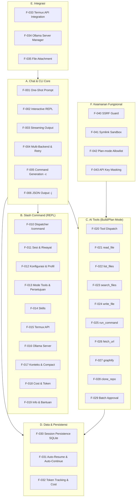
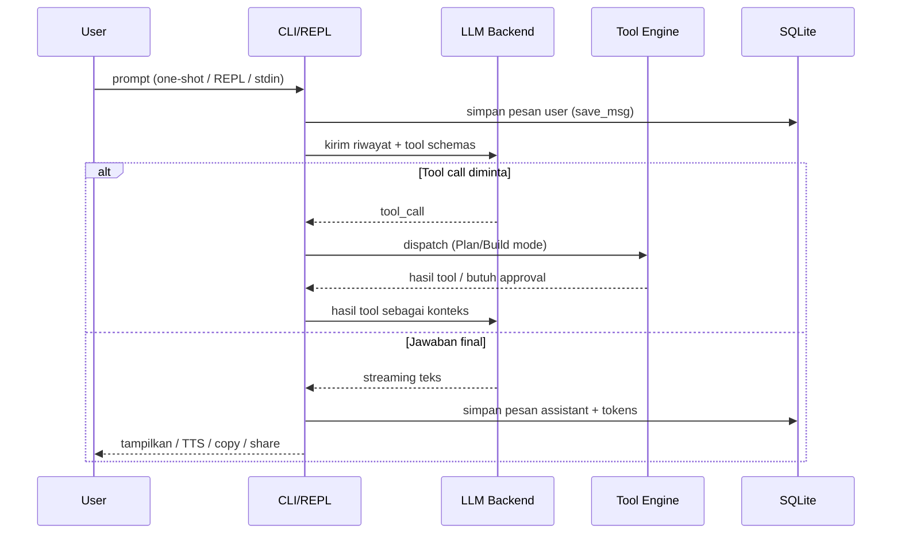
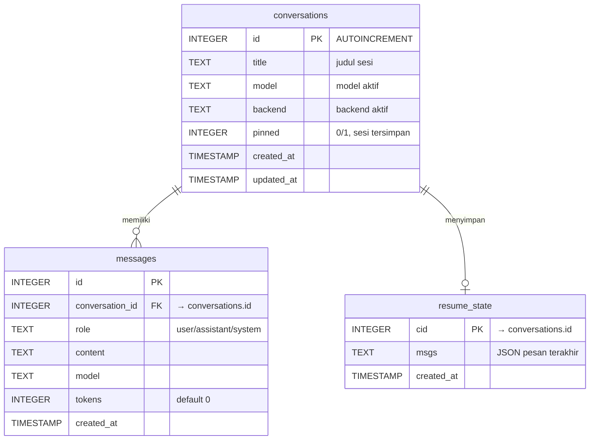

# Functional Specification Document (FSD)

**Project:** Termux AI — AI Pair-Programmer untuk Android/Termux
**Versi:** 1.0 · **Status:** Draft · **Tanggal:** 2025-08-05
**Sumber kebenaran:** kode sumber `src/*.py` (dimerge oleh `build.py` menjadi `ai`)
**Bahasa:** Indonesia · **Audience:** Developer, QA, Product Owner

---

## 1. Pendahuluan

### 1.1 Tujuan Dokumen

Dokumen ini menjabarkan **spesifikasi fungsional** sistem Termux AI (`termux-ai`): *apa* yang harus dilakukan sistem, aturan bisnis yang mengaturnya, data yang diproses, serta antarmuka yang disediakan — tanpa menjelaskan *bagaimana* implementasinya (hal tersebut dicakup di SAD & TSD).

FSD menjadi acuan kontrak antara Product Owner, Developer, dan QA: setiap fungsi (F-xxx) memiliki input, proses, output, business rules, dan penanganan error yang dapat diuji.

### 1.2 Ruang Lingkup

| In Scope | Out of Scope |
|----------|--------------|
| Chat interaktif & one-shot, streaming, multi-backend | GUI / aplikasi Android native |
| Slash command (REPL), CLI flags, JSON output | Multi-user / multi-tenant / autentikasi akun |
| AI tools (8 tool) + Plan/Build mode + batch approval | Plugin marketplace / katalog skill remote |
| Persistensi SQLite, sesi, resume, riwayat | CI/CD integration, push notification |
| Skills, Termux:API, Ollama server manager | Voice input (TTS output saja) |
| Konfigurasi, keamanan fungsional (SSRF, sandbox, allowlist) | Enkripsi at-rest untuk API key |

### 1.3 Referensi Dokumen

| Dokumen | Keterangan |
|---------|-----------|
| `docs/01-BRD.md` | Kebutuhan bisnis (BR-C01 … BR-C26) |
| `docs/02-PRD.md` | Kebutuhan produk (FR-1 … FR-18) |
| `docs/03-SAD.md` | Arsitektur software + ADR |
| `docs/04-TSD.md` | Spesifikasi teknis detail (API, data model, modul) |
| `MANUAL_TEST_CASES.md` | Test case manual (212 TC) |

### 1.4 Konvensi Notasi

- **F-xxx** = Fungsi; **BR-xxx** = Business Rule; **FR-x** = Functional Requirement (PRD); **BR-Cxx** = Business Requirement (BRD).
- Prioritas: **M** = Must, **S** = Should, **C** = Could (MoSCoW).
- `[verify]` = klaim yang perlu verifikasi lanjutan terhadap kode/lingkungan.

---

## 2. Ikhtisar Sistem & Dekomposisi Fungsional

**Alur fungsional utama** (satu siklus chat dengan tool):

---

## 3. Spesifikasi Fungsional Detail

> Setiap fungsi mencantumkan: deskripsi, input, proses, output, business rules, error handling, dependensi, prioritas, dan traceability (FR / BR-C).

## 3.1 Chat & CLI Core

### F-001: One-Shot Prompt

| Aspek | Detail |
|-------|--------|
| **Deskripsi** | Menjawab satu prompt yang diberikan sebagai argumen posisi (atau stdin) tanpa masuk REPL. |
| **Input** | `prompt` (string, opsional, nargs="?"); stdin (jika di-pipe, `cat error.log \| ai "explain"`); override model via `-m`. |
| **Proses** | 1) Baca stdin & gabungkan ke prompt jika ada. 2) Inisialisasi App + backend aktif. 3) Kirim ke LLM (streaming sesuai config). 4) Cetak respons ke stdout. |
| **Output** | Teks jawaban model ke stdout; exit code 0 (sukses) / 1 (error). |
| **Business Rules** | BR-004 (prioritas CLI), BR-010 (auto-resume tidak berlaku untuk one-shot [verify]). |
| **Error Handling** | Error backend → pesan error ke stderr, exit 1 (`app._errored`). |
| **Dependensi** | App, Backend, Config, Database |
| **Prioritas / Trace** | **M** · FR-1 · BR-C01, BR-C20 |

### F-002: Interactive REPL

| Aspek | Detail |
|-------|--------|
| **Deskripsi** | Mode interaktif multi-turn dengan prompt `→`; dimulai saat `ai` tanpa argumen dan stdin adalah TTY. |
| **Input** | Baris teks user; perintah `/...`; `Ctrl+C` / `/exit` untuk keluar. |
| **Proses** | 1) Tentukan mode resume (auto / continue / new / load). 2) Loop: baca input → jalankan slash command atau kirim ke LLM → stream jawaban → simpan ke DB. 3) Keluar bersih pada `/exit` atau `Ctrl+C`. |
| **Output** | Respons streaming + prompt berikutnya; riwayat tersimpan di DB. |
| **Business Rules** | BR-005 (exit bersih), BR-015 (attach file), BR-016 (skill session diterapkan ke prompt). |
| **Error Handling** | `Ctrl+C` saat streaming membatalkan generasi tanpa korupsi DB; input kosong diabaikan. |
| **Dependensi** | App.main_loop, Database, Backend, readline (opsional) |
| **Prioritas / Trace** | **M** · FR-2 · BR-C01, BR-C20 |
| **Catatan** | Jika bukan TTY dan tanpa argumen: cetak help, exit 0 (`src/cli.py`). |

### F-003: Streaming Output

| Aspek | Detail |
|-------|--------|
| **Deskripsi** | Respons model ditampilkan token-demi-token secara inkremental. |
| **Input** | Konfigurasi `stream` (default `true`); chunk dari provider (SSE/HTTP streaming). |
| **Proses** | 1) Kirim request dengan streaming. 2) Tampilkan tiap chunk saat diterima. 3) Akhiri dengan newline + simpan respons penuh. |
| **Output** | Teks bertahap di stdout; respons lengkap di DB. |
| **Business Rules** | BR-007 (show_tokens menampilkan info token di akhir). |
| **Error Handling** | Gagal di tengah stream → tampilkan partial output + error, simpan apa yang sudah diterima. |
| **Dependensi** | Backend (stream support), UI |
| **Prioritas / Trace** | **M** · FR-8 · BR-C02 |

### F-004: Multi-Backend & Auto-Retry

| Aspek | Detail |
|-------|--------|
| **Deskripsi** | Abstraksi backend: OpenAI-compatible (OpenAI, Groq, OpenRouter, Ollama `/v1`) dan Anthropic Messages API. |
| **Input** | Profile backend aktif (nama, base_url, model, api_key); override `-m`. |
| **Proses** | 1) Baca backend aktif dari config. 2) Format pesan sesuai protokol backend. 3) Kirim request; jika error transient (429/5xx) retry. 4) Konversi respons ke format internal. |
| **Output** | Respons teks (streaming/non-streaming) + metadata (model, token usage). |
| **Business Rules** | BR-002 (retry 3× exponential backoff, `retries: 3`, `retry_delay: 1.0`); BR-011 (API key tidak pernah dikirim ke stderr/stdout). |
| **Error Handling** | 4xx non-429 (auth, model tidak ada) → error langsung tanpa retry; retry habis → error ke user. |
| **Dependensi** | Config, API eksternal (OpenAI/Anthropic/Ollama) |
| **Prioritas / Trace** | **M** · FR-5 · BR-C03, BR-C04 |

### F-005: Command Generation `-c`

| Aspek | Detail |
|-------|--------|
| **Deskripsi** | Menghasilkan perintah shell untuk suatu tugas; di TTY minta konfirmasi lalu jalankan, saat piped hanya cetak. |
| **Input** | `-c "task"` + prompt opsional; stdin. |
| **Proses** | 1) Kirim task ke LLM dengan instruksi "return only the shell command". 2) Jika TTY: tampilkan command, minta `[y/N]`. 3) Setuju → jalankan; tolak/piped → cetak command saja. |
| **Output** | Perintah shell (dan hasil eksekusinya bila dikonfirmasi). |
| **Business Rules** | BR-004 (prioritas CLI: `-c` di atas `-j`/prompt); eksekusi command butuh konfirmasi eksplisit (BR-003). |
| **Error Handling** | Exit code 1 bila gagal; command kosong → pesan error. |
| **Dependensi** | App.command_gen, Backend |
| **Prioritas / Trace** | **S** · FR-3 · BR-C20 |

### F-006: JSON Output `-j`

| Aspek | Detail |
|-------|--------|
| **Deskripsi** | Meminta model menjawab hanya dengan JSON murni untuk integrasi programatik. |
| **Input** | `-j` + prompt; stdin. |
| **Proses** | 1) Tambahkan instruksi output-JSON ke prompt. 2) Kirim ke LLM. 3) Cetak hasil mentah (harus JSON valid). |
| **Output** | Teks JSON ke stdout; exit 0 / 1 sesuai `_errored`. |
| **Business Rules** | BR-004 (prioritas CLI: `-j` di atas prompt biasa, di bawah `-c`). |
| **Error Handling** | Model menghasilkan non-JSON → tetap dicetak + exit 1 (sesuai PRD AC: "atau dilaporkan error"). |
| **Dependensi** | App.json_oneshot, Backend |
| **Prioritas / Trace** | **S** · FR-4 · BR-C21 |

## 3.2 Sistem Slash Command (REPL)

> Semua command di bawah diawali `/` dan hanya aktif di dalam REPL. Command yang tidak dikenal menampilkan pesan error + hint `/help`. Daftar lengkap 45+ command beserta detail argumen tercatat di TSD §API; tabel berikut mendokumentasikan command yang terverifikasi langsung dari kode (`src/commands.py` [verify] sebagian).

### F-010: Slash Command Dispatcher

| Aspek | Detail |
|-------|--------|
| **Deskripsi** | Mendeteksi input berawalan `/`, mem-parsing nama + argumen, dan merutekan ke handler. |
| **Input** | Baris REPL: `/command arg1 arg2 ...`. |
| **Proses** | 1) Deteksi prefix `/`. 2) Pecah menjadi command + argumen. 3) Cocokkan ke handler. 4) Eksekusi / tampilkan hasil. |
| **Output** | Output handler (teks, tabel, konfirmasi) atau pesan error. |
| **Business Rules** | BR-005 (exit bersih); command tidak dikenal → error + `/help`. |
| **Error Handling** | Command tidak dikenal → `"Unknown command"` + petunjuk; argumen kurang → usage message. |
| **Dependensi** | App, semua modul handler |
| **Prioritas / Trace** | **M** · FR-10 · BR-C01 |

### F-011: Sesi & Riwayat

| Command | Fungsi & Input | Aturan Utama & Output | Error Handling |
|---------|----------------|----------------------|----------------|
| `/new` | Mulai sesi baru (kosong). | Sesi baru dibuat di DB (`new_conv`); riwayat lama tetap tersimpan. | — |
| `/continue` | Lanjutkan sesi terakhir. | Memuat `resume_state`/sesi terakhir sebelum REPL. | Tidak ada sesi → pesan info. |
| `/save [nama]` | Simpan & pin sesi saat ini dengan judul. | `rename_conv` + `set_pinned(1)`; sesi tersimpan muncul di `/sessions` (pinned first). | Tanpa sesi aktif → error. |
| `/load <id\|nama>` | Muat sesi berdasarkan ID atau judul. | `get_conv` + `get_msgs`; konteks diganti dengan isi sesi. | ID tidak ditemukan → pesan error. |
| `/sessions` | Daftar sesi tersimpan & terbaru. | `list_sessions(limit=50)`: pinned dulu, lalu updated_at DESC; menampilkan id, judul, model, jumlah pesan. | — |
| `/list` | Daftar percakapan terbaru. | `list_convs(limit=20)`. | — |
| `/search <query>` | Cari percakapan berisi teks. | `search_convs`: LIKE pada judul ATAU isi pesan (case-sensitive SQLite [verify]). | — |
| `/export [path]` | Ekspor chat ke Markdown. | Menulis file `.md`; path default di direktori kerja [verify]. | Gagal tulis → error + pesan. |
| `/import <path>` | Impor chat dari file. | Parsing file → buat sesi baru [verify]. | File tidak valid → error. |
| `/delete <id>` | Hapus sesi + pesannya. | `del_conv` (juga hapus resume_state). | ID tidak ada → error. |
| `/rename <judul>` | Ubah judul sesi aktif. | `rename_conv`. | — |
| `/pin` / `/unpin` | Pin / lepas pin sesi aktif. | `set_pinned(1/0)`; pinned disortir pertama. | — |
| `/undo` | Batalkan pasangan pesan terakhir. | `undo_last_msg_pair`: hapus jawaban assistant + prompt user sebelumnya (atau hanya prompt yang belum dijawab). | Tidak ada pesan → "nothing to undo". |
| `/prune <days>` | Hapus sesi unpinned yang tidak tersentuh > N hari. | `prune_old(days)`; sesi pinned tidak pernah dihapus; return jumlah sesi terhapus. | `days <= 0` → tidak melakukan apa-apa. |

### F-012: Konfigurasi & Profil

| Command | Fungsi & Input | Aturan Utama & Output | Error Handling |
|---------|----------------|----------------------|----------------|
| `/config` | Tampilkan konfigurasi aktif. | Menampilkan seluruh config dengan **API key termask** (`masked_dict`) — BR-011. | — |
| `/set <key> <value>` | Ubah nilai config. | `Config.set`; mendukung nested key via titik (`backends.ollama.model`). | Key tidak valid → error; config corrupt → fallback default + warning. |
| `/profile add <nama>` | Tambah profile backend. | Menyimpan profile ke `config["backends"]`; profile baru bisa diaktifkan via `/backend`. | Nama duplikat → timpa/error [verify]. |
| `/backend <nama>` | Aktifkan backend. | Set `config["backend"]`; valid: ollama, openai, anthropic, groq, openrouter (default: ollama). | Backend tidak dikenal → error. |
| `/model <nama>` | Ganti model aktif. | `_override_model`; set `backends.<backend>.model`. | Model tidak valid → error saat request. |
| `/system <teks>` | Ubah persona system prompt. | Menimpa `system_instruction`; TOOL_RULES tetap disisipkan (BR-013). | — |

### F-013: Mode Tools & Persetujuan

| Command | Fungsi & Input | Aturan Utama & Output | Error Handling |
|---------|----------------|----------------------|----------------|
| `/tools` | Toggle Plan ↔ Build mode. | Default **Plan** (read-only); toggle mengubah tool schemas yang dikirim ke LLM (BR-001). | — |
| `/plan` | Paksa Plan mode. | Hanya tool safe yang tersedia; `run_command` dibatasi allowlist (BR-008). | — |
| `/build` | Paksa Build mode. | Semua 8 tool tersedia; mutating tool tetap butuh approval (BR-002). | — |
| `/approve` | Setujui semua tool call yang menunggu (batch). | Batch approval: semua mutating tool call dieksekusi sekaligus (BR-002, F-029). | Tidak ada yang menunggu → pesan info. |

### F-014: Skills

| Command | Fungsi & Input | Aturan Utama & Output | Error Handling |
|---------|----------------|----------------------|----------------|
| `/skill list` | Daftar semua skill. | Menampilkan nama + deskripsi dari front-matter; skill aktif ditandai `*`. | — |
| `/skill <nama> [args]` | Jalankan skill. | Mode `once`: kirim body skill + args sebagai prompt (F-035). Mode `session`: toggle aktif (BR-016). | Skill tidak ada → "No skill 'nama'". |
| `/skill new <nama>` | Buat skill baru. | Membuka editor (EDITOR/$VISUAL) dengan template front-matter. | Editor gagal → error. |
| `/skill edit <nama>` | Edit skill. | Membuka file skill di editor. | Tidak ada → error. |
| `/skill delete <nama>` | Hapus skill. | Menghapus file `.md` skill. | Tidak ada → error. |
| `/skill seed` | Buat skill contoh bawaan. | Menulis 10 skill bundled (review, commit, python, reverse-engineer, dll.) ke direktori skills. | Sudah ada → skip/timpa [verify]. |

### F-015: Termux:API

| Command | Fungsi & Input | Aturan Utama & Output | Error Handling |
|---------|----------------|----------------------|----------------|
| `/speak` | Baca jawaban terakhir via TTS. | Menjalankan `termux-tts-speak` (BR-017, graceful degradation). | Termux:API tidak terpasang → pesan informatif. |
| `/copy` | Salin jawaban terakhir ke clipboard. | `termux-clipboard-set`. | Tidak terpasang → pesan informatif. |
| `/paste` | Tempel isi clipboard sebagai prompt. | `termux-clipboard-get` → masukkan ke input. | Clipboard kosong → info. |
| `/share` | Bagikan jawaban via Android share sheet. | `termux-share`. | Tidak terpasang → pesan informatif. |
| `/status` | Status integrasi Termux:API. | Mengecek ketersediaan binary `termux-*`; menampilkan tabel status. | — |

### F-016: Ollama Server Manager

| Command | Fungsi & Input | Aturan Utama & Output | Error Handling |
|---------|----------------|----------------------|----------------|
| `/server start` | Jalankan server Ollama di background. | `ollama serve` via Popen, `start_new_session=True`; tulis PID file `pid,engine` (BR-018). | Ollama tidak terpasang → hint `pkg install ollama`; PID file ada & hidup → warning "use /server stop first". |
| `/server stop` | Hentikan server background. | `os.killpg(pid, SIGTERM)`; hapus PID file. | Tidak ada PID file → "No running server process". |
| `/server status` | Status server. | Cek PID file + proses hidup; PID mati → bersihkan file. | — |
| `/server pull <model>` | Unduh model. | `ollama pull` foreground (progress bar); setelah sukses tampilkan `/server models`. | Gagal (exit ≠ 0) → pesan + cek nama model. |
| `/server models` | Daftar model terinstal. | `ollama list`. | Ollama tidak ada → hint install. |
| `/server search <q>` | Cari model di registry. | `ollama search`. | — |
| `/server show <model>` | Detail model. | `ollama show`. | — |
| `/server rm <model>` | Hapus model. | `ollama rm` + tampilkan daftar terbaru. | — |

### F-017: Konteks & Compact

| Command | Fungsi & Input | Aturan Utama & Output | Error Handling |
|---------|----------------|----------------------|----------------|
| `/compact` | Ringkas percakapan saat ini secara manual. | Kirim riwayat ke LLM untuk diringkas; ganti konteks lama dengan ringkasan (BR-019). | Percakapan terlalu pendek → info. |
| `/expand` | Tampilkan pesan panjang (folded). | Menggunakan pager `less` bila tersedia (BR-014). | `less` tidak ada → fallback print. |

### F-018: Cost & Token

| Command | Fungsi & Input | Aturan Utama & Output | Error Handling |
|---------|----------------|----------------------|----------------|
| `/cost` | Tampilkan total token & estimasi biaya. | `get_total_tokens` + `get_tokens_by_model`; estimasi USD per model (BR-020). | — |

### F-019: Info & Bantuan

| Command | Fungsi & Input | Aturan Utama & Output | Error Handling |
|---------|----------------|----------------------|----------------|
| `/help` | Bantuan semua command. | Daftar command + deskripsi singkat. | — |
| `/version` | Versi aplikasi. | Menampilkan `__version__` (v7.0.0). | — |
| `/exit` (alias `/quit`) | Keluar REPL. | Simpan state, tutup DB, exit 0 (BR-005). | — |

## 3.3 Sistem AI Tools (Plan / Build Mode)

> Delapan tool di bawah diumumkan ke LLM sebagai function-calling schema. **Safe tools** (read-only) auto-eksekusi; **mutating tools** butuh persetujuan batch user (F-029). Mode aktif (Plan/Build) menentukan schema yang dikirim: Build = 8 tool, Plan = 6 tool (tanpa `write_file`, `clone_repo`).

### F-020: Tool Dispatch

| Aspek | Detail |
|-------|--------|
| **Deskripsi** | Menerima `tool_call` dari LLM, memvalidasi nama tool vs mode aktif, mengeksekusi atau meminta approval, lalu mengembalikan hasil ke LLM sebagai pesan tool. |
| **Input** | Tool call: `{name, arguments}`; mode aktif; konteks riwayat. |
| **Proses** | 1) Validasi nama tool ada. 2) Jika safe → eksekusi langsung. 3) Jika mutating → kumpulkan dalam batch approval (F-029). 4) Hasil (sukses/error/penolakan) dikembalikan ke LLM. 5) Lanjut loop hingga LLM selesai atau `max_iterations` tercapai (BR-010). |
| **Output** | Pesan tool berisi hasil eksekusi (string). |
| **Business Rules** | BR-001 (default Plan), BR-002 (approval mutating), BR-010 (max 100 iterasi, `repeat_limit: 3`, `re_read_limit: 3`). |
| **Error Handling** | Tool tidak dikenal → kirim error ke LLM (bukan crash); loop melebihi limit → hentikan dengan pesan. |
| **Dependensi** | Tools, App, Database, UI approval |
| **Prioritas / Trace** | **M** · FR-6, FR-7 · BR-C05, BR-C06, BR-C07 |

### F-021: read_file (Safe)

| Aspek | Detail |
|-------|--------|
| **Deskripsi** | Membaca isi file; dukungan rentang baris 1-based untuk file besar. |
| **Input** | `path` (string, **required**), `start` (int, opsional, 1-based), `end` (int, opsional, inklusif). |
| **Proses** | Buka file → baca sesuai rentang → kembalikan teks (dengan nomor baris bila relevan). |
| **Output** | Isi file (string); terpotong pada `max_file_chars: 20000` [verify]. |
| **Business Rules** | Safe → auto-execute (BR-002). |
| **Error Handling** | File tidak ada / permission denied → pesan error ke LLM. |
| **Dependensi** | fileio |
| **Prioritas / Trace** | **M** · FR-6 · BR-C05 |

### F-022: list_files (Safe)

| Aspek | Detail |
|-------|--------|
| **Deskripsi** | Mendaftar file dalam direktori; `recursive=true` memetakan pohon penuh. |
| **Input** | `path` (string, opsional, default "."), `recursive` (bool, default false). |
| **Proses** | Scan direktori; saat recursive **lewati** direktori noise: `IGNORE_DIRS` (`.git`, `node_modules`, `__pycache__`, `dist`, `build`, `.venv`, dll. — 22 entry). |
| **Output** | Daftar path (string). |
| **Business Rules** | Safe → auto-execute; IGNORE_DIRS selalu dilewati agar konteks AI tidak banjir. |
| **Error Handling** | Path tidak ada → error. |
| **Dependensi** | fileio |
| **Prioritas / Trace** | **M** · FR-6 · BR-C05 |

### F-023: search_files (Safe)

| Aspek | Detail |
|-------|--------|
| **Deskripsi** | Mencari teks di dalam file (grep). |
| **Input** | `query` (string, **required**), `path` (string, opsional). |
| **Proses** | Jalankan pencarian teks (grep) dengan konteks baris; lewati IGNORE_DIRS. |
| **Output** | Baris yang cocok + path file. |
| **Business Rules** | Safe → auto-execute. |
| **Error Handling** | Tidak ada hasil → "no matches"; query kosong → error. |
| **Dependensi** | fileio |
| **Prioritas / Trace** | **M** · FR-6 · BR-C05 |

### F-024: write_file (Mutating — Build mode)

| Aspek | Detail |
|-------|--------|
| **Deskripsi** | Menulis konten ke file; `append=true` menambah ke file yang sudah ada. |
| **Input** | `path` (string, **required**), `content` (string, **required**), `append` (bool, default false). |
| **Proses** | 1) Validasi sandbox path (BR-006: `realpath` + `commonpath` harus di dalam direktori proyek). 2) Minta approval batch. 3) Tulis / tambah konten; buat direktori induk bila perlu. |
| **Output** | Konfirmasi sukses (path, ukuran) atau pesan penolakan. |
| **Business Rules** | BR-002 (butuh approval), BR-006 (sandbox anti-symlink-escape). |
| **Error Handling** | Path di luar sandbox / symlink escape → tolak + alasan; approval ditolak → kirim "user declined" ke LLM. |
| **Dependensi** | fileio, Approval (F-029) |
| **Prioritas / Trace** | **M** · FR-6 · BR-C05, BR-C07, BR-C24 |

### F-025: run_command (Mutating — Build mode / Allowlist — Plan mode)

| Aspek | Detail |
|-------|--------|
| **Deskripsi** | Menjalankan perintah shell dan mengembalikan stdout/stderr. Perilaku berbeda drastis per mode (lihat BR-008/BR-009). |
| **Input** | `command` (string, **required**). |
| **Proses (Build)** | Validasi minimal → approval batch → eksekusi via shell; timeout & cap output. |
| **Proses (Plan)** | 1) `_plan_check`: tolak karakter kontrol (`\x00\r\n`), konstruksi shell (`$(`, backtick, `;`, `&&`, `||`, `>>`, `>`, `{`), pipe segment kosong, quote tidak seimbang. 2) Setiap program harus ada di **allowlist** `PLAN_READONLY_CMDS` (60+ binary: ls, cat, grep, find, git, dll.). 3) Flag khusus diblokir: `sort -o/--output`, `date -s/--set`; `find` dengan `-delete/-exec/-execdir/-ok/...`; `git` hanya subcommand read-only (status, diff, log, show, branch, ls-files, ls-tree, rev-parse, tag, remote, blame, grep, help, version) dan tanpa argumen mutating (40+ entry: add, rm, reset, commit, push, `--hard`, dll.). 4) Eksekusi **tanpa shell** (argv langsung) dengan pipeline antar proses, timeout 30s, cap output 200 KB. |
| **Output** | stdout + stderr; tanda `[output capped]`, `[timed out]`, atau `[exit code]`. |
| **Business Rules** | BR-008 (allowlist read-only), BR-009 (no-shell execution), BR-002 (approval di Build). |
| **Error Handling** | Perintah tidak diizinkan → pesan "not on the Plan-mode read-only allowlist" + alasan spesifik; timeout → kill process group (SIGKILL). |
| **Dependensi** | subprocess, signal, select, tempfile |
| **Prioritas / Trace** | **M** · FR-6, FR-7 · BR-C25, BR-C26 |

### F-026: fetch_url (Safe — dengan SSRF guard)

| Aspek | Detail |
|-------|--------|
| **Deskripsi** | Mengambil konten halaman web via HTTP GET; HTML dikonversi ke teks; proteksi SSRF. |
| **Input** | `url` (string, **required**). |
| **Proses** | 1) Validasi skema `http://`/`https://` (regex). 2) Ekstrak host → cek `_is_private_host` (BR-021): localhost/`.localhost` → blokir; IP private/loopback/link-local/reserved/multicast → blokir; hostname DNS di-resolve dan IP hasilnya dicek (tutup celah DNS rebinding). 3) Fetch dengan timeout 10s, cap 500 KB, User-Agent `termux-ai/<versi>`. 4) Jika host `api.github.com` dan `GITHUB_TOKEN`/`GH_TOKEN` tersedia → tambah header Authorization. 5) Konversi HTML→teks (buang script/style, ubah `<li>`/`<h1-6>`/`
`/` ` menjadi baris). 6) Tandai jika terpotong. |
| **Output** | Teks halaman (+ catatan URL final / truncation). |
| **Business Rules** | BR-021 (SSRF guard; bypass via env `AI_FETCH_ALLOW_PRIVATE=1`). |
| **Error Handling** | URL non-http → "URL must start with http:// or https://"; private address → "refusing to fetch private/local address (SSRF guard)"; HTTP error → `HTTP <code> <reason>`; network error → pesan. |
| **Dependensi** | urllib, ipaddress, socket, html |
| **Prioritas / Trace** | **S** · FR-16 · BR-C23 |

### F-027: graphify (Safe)

| Aspek | Detail |
|-------|--------|
| **Deskripsi** | Scanner kode lokal (zero-dependency): menghasilkan code graph terstruktur — dependency graph (Mermaid), definisi fungsi/class, endpoint API, dan data model. |
| **Input** | `path` (string, opsional, default "."), `mode` (enum: `all`, `deps`, `calls`, `api`, `models`, default `all`). |
| **Proses** | Scan ekstensi didukung (`.py .js .jsx .ts .tsx .go .rs .java .kt .sql`) → ekstrak defs/imports/routes/models via regex per bahasa → format output. |
| **Output** | Laporan terstruktur (Mermaid + daftar). |
| **Business Rules** | Safe → auto-execute. |
| **Error Handling** | Path tidak ada → error; bahasa tidak didukung → lompati. |
| **Dependensi** | fileio, regex |
| **Prioritas / Trace** | **S** · BR-C05 (tool tambahan v7) |

### F-028: clone_repo (Mutating — Build mode)

| Aspek | Detail |
|-------|--------|
| **Deskripsi** | Klon repo git publik (HTTPS saja) ke direktori temp terisolasi; AI kemudian bisa membaca/mengedit di sana. |
| **Input** | `url` (string, **required**), `depth` (int, default 1; 0 = full history). |
| **Proses** | 1) Validasi HTTPS. 2) Approval batch. 3) `git clone` shallow ke temp dir. 4) Kembalikan path lokal. |
| **Output** | Path direktori klon (string). |
| **Business Rules** | BR-002 (approval); hanya publik (BR-022). |
| **Error Handling** | URL non-HTTPS / git gagal → pesan error. |
| **Dependensi** | git binary, Approval |
| **Prioritas / Trace** | **S** · FR-6 (v7) |

### F-029: Batch Approval

| Aspek | Detail |
|-------|--------|
| **Deskripsi** | Mengumpulkan SEMUA tool call mutating dari satu putaran LLM dan meminta satu persetujuan batch dari user (bukan per-tool). |
| **Input** | Daftar tool call menunggu: `write_file`, `run_command` (Build), `clone_repo`. |
| **Proses** | 1) Tampilkan ringkasan tiap tool call (tool, path/command, ringkasan aksi). 2) User memilih: setujui semua / tolak semua / pilih sebagian. 3) Hasil per-tool dikirim kembali ke LLM. |
| **Output** | Eksekusi (bila disetujui) atau pesan penolakan ke LLM. |
| **Business Rules** | BR-002: tidak ada mutating tool yang dieksekusi tanpa persetujuan; read-only auto-execute (BR-003). |
| **Error Handling** | Approval timeout / user interupsi → semua ditolak dengan aman. |
| **Dependensi** | UI, Tools |
| **Prioritas / Trace** | **M** · FR-6, FR-7 · BR-C07 |

## 3.4 Data & Persistensi

### F-030: Session Persistence (SQLite)

| Aspek | Detail |
|-------|--------|
| **Deskripsi** | Semua percakapan tersimpan di SQLite lokal (`conversations`, `messages`) dengan WAL mode, busy_timeout 10s, foreign_keys ON, file permission 0o600. |
| **Input** | Pesan user/assistant + metadata (role, content, model, tokens); sesi baru; rename; pin; hapus. |
| **Proses** | 1) `new_conv` saat sesi baru. 2) `save_msg` setiap pesan + update `updated_at`. 3) Query via `get_msgs` (limit 1000, urutan kronologis). 4) Migrasi skema inkremental via `_migrate_schema` (ALTER TABLE tambah kolom bila belum ada). |
| **Output** | Data persisten; daftar sesi (`list_convs` limit 20, `list_sessions` limit 50 pinned-first); hasil pencarian. |
| **Business Rules** | BR-023 (WAL + busy_timeout + foreign_keys); BR-024 (migrasi inkremental non-destruktif). |
| **Error Handling** | DB corrupt → error saat inisialisasi (bukan silent); operasi gagal → exception ditangani di handler command. |
| **Dependensi** | sqlite3, db.py |
| **Prioritas / Trace** | **M** · FR-9 · BR-C09 |

### F-031: Auto-Resume & Auto-Continue

| Aspek | Detail |
|-------|--------|
| **Deskripsi** | Resume otomatis sesi terakhir saat startup (`auto_resume: true` default); auto-continue percakapan panjang secara otomatis. |
| **Input** | Flag CLI: `--continue`, `--new`, `-l/--load <id>`; config `auto_resume`, `auto_continue`, `max_auto_continue`, `continue_every`. |
| **Proses** | 1) CLI set `_resume_mode` (continue/new/load). 2) App memuat `resume_state` (JSON pesan terakhir) atau sesi penuh. 3) Saat jumlah pesan mencapai kelipatan `continue_every` (10), tawarkan auto-continue (maks `max_auto_continue: 2`). |
| **Output** | Konteks sesi terakhir dipulihkan sebelum prompt REPL pertama. |
| **Business Rules** | BR-025 (default auto_resume true; `--new` memaksa sesi baru); BR-019 (auto_compact terpisah dari auto_continue). |
| **Error Handling** | resume_state corrupt → diabaikan (`get_resume_state` catch exception). |
| **Dependensi** | db.py, cli.py |
| **Prioritas / Trace** | **C** · FR-18 · BR-C10, BR-C11 |

### F-032: Token Tracking & Cost Estimation

| Aspek | Detail |
|-------|--------|
| **Deskripsi** | Mencatat jumlah token per pesan dan memperkirakan biaya per model. |
| **Input** | Token usage dari respons backend; model yang dipakai. |
| **Proses** | 1) Simpan `tokens` di setiap `save_msg`. 2) `/cost` menjumlahkan: total (`get_total_tokens`), per sesi (`get_conv_tokens`), per model (`get_tokens_by_model`). 3) Estimasi USD berdasarkan tarif per model (tabel internal [verify]). |
| **Output** | Tabel token + estimasi biaya di `/cost`; info token di akhir respons (`show_tokens: true`). |
| **Business Rules** | BR-020 (estimasi tarif per model). |
| **Error Handling** | Token tidak tersedia dari provider → catat 0. |
| **Dependensi** | db.py, backends.py |
| **Prioritas / Trace** | **S** · FR-15 |

## 3.5 Integrasi

### F-033: Termux:API Integration

| Aspek | Detail |
|-------|--------|
| **Deskripsi** | Integrasi opsional dengan Termux:API untuk TTS, clipboard, dan share. |
| **Input** | Perintah `/speak`, `/copy`, `/paste`, `/share`; config `tts_replies` (auto-speak jawaban). |
| **Proses** | 1) Deteksi binary `termux-tts-speak` / `termux-clipboard-*` / `termux-share` (via PATH). 2) Eksekusi dengan jawaban terakhir sebagai argumen/stdin. 3) Tidak terpasang → pesan informatif + petunjuk `pkg install termux-api` (BR-017). |
| **Output** | Aksi Android native (suara, clipboard, share sheet). |
| **Business Rules** | BR-017 (graceful degradation — fitur non-esensial tidak pernah memblokir chat). |
| **Error Handling** | Binary hilang / gagal → pesan error ringan, REPL tetap berjalan. |
| **Dependensi** | termux_api.py, Termux:API package |
| **Prioritas / Trace** | **S** · FR-12 · BR-C15, BR-C16, BR-C17 |

### F-034: Ollama Server Manager

| Aspek | Detail |
|-------|--------|
| **Deskripsi** | Mengelola proses server Ollama lokal: start (background), stop, status, pull, list, search, show, rm. |
| **Input** | Perintah `/server ...`; PID file (`pid,engine`). |
| **Proses** | 1) `start`: pastikan binary ada → `Popen(["ollama","serve"], start_new_session=True)` → tulis PID file 0o600. 2) `stop`: `killpg(SIGTERM)` → hapus PID file. 3) `status`: cek PID file + `os.kill(pid,0)`. 4) `pull/models/search/show/rm`: delegasi ke CLI `ollama` (foreground, inherits terminal). |
| **Output** | Status server, daftar model, hasil pull (progress bar). |
| **Business Rules** | BR-018 (PID file sebagai source of truth; stale PID file dibersihkan). |
| **Error Handling** | Ollama tidak terinstal → hint install `pkg install ollama`; PID file hidup → warning jangan start ganda. |
| **Dependensi** | server.py, ollama binary |
| **Prioritas / Trace** | **S** · FR-13 · BR-C18, BR-C19 |

### F-035: File Attachment

| Aspek | Detail |
|-------|--------|
| **Deskripsi** | Mendeteksi path file dalam prompt dan melampirkan isinya ke konteks AI secara otomatis. |
| **Input** | Prompt user; config `attach_files` (default true), `max_file_chars: 20000`. |
| **Proses** | 1) Scan prompt untuk token menyerupai path file. 2) File ada → baca konten (terpotong pada max_file_chars). 3) Sisipkan konten ke prompt sebelum dikirim. |
| **Output** | Prompt diperkaya dengan konten file. |
| **Business Rules** | BR-015 (aktif default; bisa dinonaktifkan). |
| **Error Handling** | Path tidak valid → biarkan sebagai teks biasa (bukan error). |
| **Dependensi** | fileio, App |
| **Prioritas / Trace** | **S** · FR-14 |

## 3.6 Keamanan Fungsional

### F-040: SSRF Guard

| Aspek | Detail |
|-------|--------|
| **Deskripsi** | Mencegah server-side request forgery pada `fetch_url` dengan memblokir alamat private/lokal. |
| **Input** | URL target `fetch_url`; env `AI_FETCH_ALLOW_PRIVATE`. |
| **Proses** | 1) Blokir host `localhost`/`*.localhost`. 2) IP literal: blokir bila private/loopback/link-local/reserved/multicast. 3) Hostname: resolve DNS (`getaddrinfo`) dan periksa SEMUA IP hasil — menutup celah DNS-rebinding. 4) Bypass hanya via env `AI_FETCH_ALLOW_PRIVATE=1|true|yes`. |
| **Output** | Penolakan dengan pesan alasan, atau eksekusi fetch. |
| **Business Rules** | BR-021. |
| **Error Handling** | Blokir → pesan error informatif ke LLM/user (bukan exception). |
| **Dependensi** | ipaddress, socket |
| **Prioritas / Trace** | **M** · FR-16 · BR-C23 |

### F-041: Symlink Sandbox

| Aspek | Detail |
|-------|--------|
| **Deskripsi** | Membatasi semua operasi tulis file ke dalam direktori proyek; mencegah path traversal via symlink. |
| **Input** | Path target `write_file` (dan operasi file lain yang mutating). |
| **Proses** | 1) `realpath` path target + direktori proyek. 2) `commonpath` harus sama dengan direktori proyek. 3) Di luar → tolak. |
| **Output** | Izin tulis atau penolakan dengan alasan. |
| **Business Rules** | BR-006. |
| **Error Handling** | Symlink escape / traversal → tolak + alasan. |
| **Dependensi** | fileio |
| **Prioritas / Trace** | **M** · BR-C24 |

### F-042: Plan-mode Allowlist

| Aspek | Detail |
|-------|--------|
| **Deskripsi** | Batas keamanan Plan mode: daftar program read-only yang diizinkan + larangan flag mutating + eksekusi tanpa shell. |
| **Input** | Perintah `run_command` di Plan mode; daftar statis: `PLAN_READONLY_CMDS` (60+), `PLAN_ARGS_BLOCKED`, `PLAN_GIT_RO`, `GIT_MUTATING_ARGS`, `PLAN_FIND_BLOCKED`. |
| **Proses** | 1) Tolak karakter kontrol & konstruksi shell (BR-008). 2) Parse per segment pipe (quote-aware). 3) Program harus di allowlist. 4) Flag spesifik diblokir. 5) Eksekusi argv-langsung tanpa shell (BR-009). |
| **Output** | Eksekusi aman atau penolakan + alasan spesifik. |
| **Business Rules** | BR-008, BR-009. |
| **Error Handling** | Setiap pelanggaran → pesan alasan (program, flag, atau argumen git). |
| **Dependensi** | tools.py |
| **Prioritas / Trace** | **M** · FR-7 · BR-C25, BR-C26 |

### F-043: API Key Masking

| Aspek | Detail |
|-------|--------|
| **Deskripsi** | API key tidak pernah ditampilkan plain-text di output `/config` atau log. |
| **Input** | Config object (berisi `api_key` di profile backend). |
| **Proses** | `masked_dict()` men-scan semua dict; kunci `api_key` bertipe string → diganti nilai termask (`****...`). |
| **Output** | Representasi config yang aman untuk ditampilkan. |
| **Business Rules** | BR-011. |
| **Error Handling** | — |
| **Dependensi** | config.py |
| **Prioritas / Trace** | **M** · BR-C04, BR-C22 |

---

## 4. Katalog Business Rules

| ID | Aturan | Asal (kode) |
|----|--------|-------------|
| BR-001 | Mode default adalah **Plan** (read-only); Build harus diaktifkan eksplisit (`/tools`, `/build`). | `config.py` (`tools_enabled: False`), PRD FR-6/7 |
| BR-002 | Semua tool **mutating** (`write_file`, `run_command` Build, `clone_repo`) wajib persetujuan batch user; tidak pernah auto-execute. | `tools.py` (`SAFE_TOOLS`), PRD FR-6 AC3 |
| BR-003 | Tool **safe** (`read_file`, `list_files`, `search_files`, `fetch_url`, `graphify`) auto-eksekusi tanpa konfirmasi. | `tools.py` `SAFE_TOOLS` |
| BR-004 | Prioritas mode CLI: `-c` > `-j` > prompt positional/stdin; `-m` override model; tanpa argumen + TTY → REPL. | `cli.py` |
| BR-005 | Keluar REPL (`/exit` atau Ctrl+C) harus bersih: simpan state, tutup DB, exit 0. | `db.close()`, PRD FR-2 AC3 |
| BR-006 | Semua tulis file harus lolos sandbox: `realpath(path)` di dalam `commonpath(project_dir)`. | `fileio.py` (lihat F-041) |
| BR-007 | `show_tokens: true` → info token ditampilkan di akhir respons. | `config.py` |
| BR-008 | Plan mode `run_command`: tolak karakter kontrol, konstruksi shell (`$(`, backtick, `;`, `&&`, `||`, `>>`, `>`, `{`), program di luar allowlist, flag mutating. | `tools.py._plan_check` |
| BR-009 | Plan mode dieksekusi **tanpa shell** (argv langsung); pipeline via subprocess chaining; timeout 30s; cap output 200 KB. | `tools.py._run_plan` |
| BR-010 | Tool loop dibatasi: `max_iterations: 100`, `repeat_limit: 3`, `re_read_limit: 3` — mencegah spiral tool call. | `config.py` |
| BR-011 | API key tidak pernah tampil plain-text (masking); file config/db permission 0o600, direktori 0o700. | `config.py.masked_dict`, `_secure_file/_secure_dir` |
| BR-012 | Konfigurasi corrupt → warning ke stderr + fallback ke DEFAULTS (tidak crash). | `config.py.__init__` |
| BR-013 | TOOL_RULES (disiplin tool-use) SELALU disisipkan ke system prompt, tidak bisa dihilangkan oleh persona user. | `config.py.system_prompt()` |
| BR-014 | `fold_long_blocks: true` → blok output panjang dilipat (head 8 baris) dengan opsi `/expand` (pager `less`). | `config.py` |
| BR-015 | `attach_files: true` (default) → path file dalam prompt dilampirkan otomatis, potong pada `max_file_chars: 20000`. | `config.py`, PRD FR-14 |
| BR-016 | Skill mode `session` → body skill diterapkan ke semua prompt berikutnya; toggle dengan `/skill <nama>`; skill `once` hanya sekali. | PRD FR-11, `skills.py` |
| BR-017 | Fitur Termux:API harus graceful degradation (tidak pernah memblokir chat). | `termux_api.py` |
| BR-018 | PID file (`pid,engine`) adalah source of truth server; stale PID file dibersihkan otomatis. | `server.py` |
| BR-019 | `auto_compact: true` + `compact_threshold: 4` → ringkas konteks otomatis mendekati limit; `/compact` manual. | `config.py`, PRD FR-17 |
| BR-020 | Token dicatat per pesan; estimasi biaya dihitung per model dari tabel tarif. | `db.py`, PRD FR-15 |
| BR-021 | `fetch_url` memblokir private/loopback/localhost (termasuk hasil DNS resolve); bypass via `AI_FETCH_ALLOW_PRIVATE=1`. | `tools.py._is_private_host/_fetch_url` |
| BR-022 | `clone_repo` hanya untuk repo publik HTTPS; butuh approval; klon ke temp dir. | `tools.py` |
| BR-023 | Database: WAL mode, `busy_timeout=10000`, `foreign_keys=ON`, file 0o600. | `db.py` |
| BR-024 | Migrasi skema DB inkremental (ALTER TABLE tambah kolom bila belum ada) — non-destruktif. | `db.py._migrate_schema` |
| BR-025 | `auto_resume: true` (default) pulihkan sesi terakhir; `--new` paksa sesi baru; `--continue` paksa resume; `-l/--load <id>` muat sesi tertentu. | `cli.py`, `config.py` |
| BR-026 | Mode CLI tanpa TTY + tanpa argumen → cetak help, exit 0. | `cli.py` |
| BR-027 | Tool loop & interupsi: Ctrl+C saat streaming membatalkan generasi tanpa merusak DB. | `app.py` [verify] |
| BR-028 | `_cap_v2` migrasi sekali jalan: `max_tokens` 4096→8192, `max_tool_result` 10000→30000 (kecuali user set nilai lain). | `config.py.__init__` |

## 5. Kebutuhan Data

### 5.1 Skema Database (SQLite — `db.py`)

| Tabel | Kolom | Tipe / Constraint | Keterangan |
|-------|-------|-------------------|------------|
| `conversations` | `id` | INTEGER PK AUTOINCREMENT | ID sesi |
| | `title` | TEXT | Judul (default "New Chat") |
| | `model` | TEXT | Model saat sesi dibuat |
| | `backend` | TEXT | Backend saat sesi dibuat |
| | `pinned` | INTEGER DEFAULT 0 | 1 = sesi disimpan/pinned |
| | `created_at` / `updated_at` | TIMESTAMP | Sortir `list_convs`/`list_sessions` |
| `messages` | `id` | INTEGER PK AUTOINCREMENT | |
| | `conversation_id` | INTEGER, FK → conversations.id | Relasi induk |
| | `role` | TEXT | `user` / `assistant` |
| | `content` | TEXT | Isi pesan |
| | `model` | TEXT | Model penghasil pesan |
| | `tokens` | INTEGER DEFAULT 0 | Untuk tracking cost (F-032) |
| | `created_at` | TIMESTAMP | |
| `resume_state` | `cid` | INTEGER PK | FK logis ke conversations.id |
| | `msgs` | TEXT (JSON) | Snapshot pesan untuk resume |
| | `created_at` | TIMESTAMP | |

**PRAGMA & kebijakan:** `journal_mode=WAL`, `busy_timeout=10000`, `foreign_keys=ON` (BR-023); file DB permission 0o600 (BR-011); migrasi inkremental ALTER TABLE (BR-024); `prune_old` hanya menyentuh sesi unpinned.

### 5.2 Konfigurasi (JSON — `config.py` DEFAULTS)

| Key | Tipe | Default | Keterangan |
|-----|------|---------|------------|
| `backend` | str | `ollama` | Backend aktif |
| `system_prompt` / `system_instruction` | str | persona default | System prompt (persona) |
| `temperature` | float | 0.7 | Suhu sampling |
| `max_tokens` | int | 8192 | Batas token respons |
| `context_window` | int | 32000 | Kapasitas konteks |
| `iteration_history_budget` | int | 30000 | Budget riwayat iterasi tool |
| `compact_process` / `compact_threshold` | str/int | `auto` / 4 | Kebijakan kompaksi |
| `stream` | bool | true | Streaming output |
| `show_tokens` | bool | true | Tampilkan info token |
| `tools_enabled` | bool | false | **false = Plan mode default** (BR-001) |
| `strategy_first` / `skill_autoload` | bool | false | Strategi/autoload skill |
| `extended_thinking` / `thinking_budget` | bool/int | false / 8000 | Extended thinking |
| `tts_replies` | bool | false | Auto-TTS jawaban |
| `multi_line` | bool | false | Input multi-baris |
| `auto_compact` | bool | true | Kompaksi otomatis (BR-019) |
| `max_file_chars` | int | 20000 | Cap isi file di-attach/read |
| `max_tool_result` | int | 30000 | Cap hasil tool ke LLM |
| `max_iterations` | int | 100 | Batas loop tool (BR-010) |
| `repeat_limit` / `re_read_limit` | int | 3 | Anti-spiral |
| `gather_first` / `gather_threshold` | bool/int | true / 5 | Baca dulu sebelum bertindak |
| `continue_every` | int | 10 | Auto-continue tiap N pesan |
| `auto_resume` | bool | true | Resume otomatis (BR-025) |
| `prune_days` | int | 0 | 0 = nonaktif |
| `auto_continue` / `max_auto_continue` | bool/int | true / 2 | Auto-continue |
| `retries` / `retry_delay` | int/float | 3 / 1.0 | Retry backoff (BR-002 FR-5) |
| `fold_long_blocks` / `fold_head` | bool/int | true / 8 | Lipat blok panjang (BR-014) |
| `attach_files` | bool | true | Attachment (BR-015) |
| `api_keys` | dict | `{"anthropic": ""}` | Key terpisah (termask) |
| `backends` | dict | `{"ollama": {...}}` | Profile backend |
| `_cap_v2` | bool | — | Penanda migrasi (BR-028) |

### 5.3 Environment Variables

| Env Var | Nilai | Fungsi |
|---------|-------|--------|
| `AI_DEBUG` | `1` | Mode debug: stack trace lengkap |
| `AI_FETCH_ALLOW_PRIVATE` | `1`/`true`/`yes` | Bypass SSRF guard (BR-021) |
| `GITHUB_TOKEN` / `GH_TOKEN` | token | Header Authorization untuk `api.github.com` di `fetch_url` |
| `EDITOR` / `VISUAL` | path editor | Editor untuk `/skill new|edit` [verify] |

## 6. Kebutuhan Antarmuka

### 6.1 CLI (argparse — `cli.py`)

| Flag | Argumen | Fungsi | Exit |
|------|---------|--------|------|
| `prompt` | str (opsional) | One-shot prompt | 0 / 1 |
| `-m, --model` | MODEL | Override model untuk run ini | — |
| `-c, --command` | TASK | Generate shell command (TTY: konfirmasi & jalankan; piped: cetak) | 0 / 1 |
| `-j, --json` | — | Minta jawaban JSON murni | 0 / 1 |
| `--continue` | — | Resume sesi terakhir sebelum REPL | 0 |
| `--new` | — | Sesi baru (tanpa resume) | 0 |
| `-l, --load` | ID | Muat sesi tersimpan by ID | 0 |
| `-h, --help` | — | Help + contoh | 0 |
| stdin | pipe | `cat x \| ai "prompt"` → stdin digabung ke prompt | 0 / 1 |
| (tanpa argumen, TTY) | — | Masuk REPL | — |
| (tanpa argumen, non-TTY) | — | Cetak help, exit 0 (BR-026) | 0 |

### 6.2 Antarmuka Backend LLM

| Backend | Protokol | Endpoint | Auth |
|---------|----------|----------|------|
| OpenAI / Groq / OpenRouter | OpenAI-compatible Chat Completions | `{base_url}/v1/chat/completions` | `Authorization: Bearer <key>` |
| Ollama | OpenAI-compatible | `http://localhost:11434/v1` (default) | api_key `ollama` (opsional) |
| Anthropic | Messages API | `/v1/messages` | `x-api-key` |

Format pesan internal: `[{role: user|assistant|system|tool, content}]`; tool calls diformat per protokol (`tools.py.to_anthropic_schema` untuk Anthropic).

### 6.3 Antarmuka Eksternal Lain

| Integrasi | Mekanisme |
|-----------|-----------|
| Termux:API | Binary `termux-tts-speak`, `termux-clipboard-set/get`, `termux-share` (F-033) |
| Ollama CLI | `ollama serve/pull/list/search/show/rm` (F-034) |
| GitHub API | `fetch_url` → `api.github.com` + token env (F-026) |
| Git | `git clone` untuk `clone_repo` (F-028) |

## 7. Kebutuhan Keamanan Fungsional

| # | Kontrol | Fungsi | BR | Keterangan |
|---|---------|--------|----|------------|
| S1 | SSRF guard (IP + DNS resolve) | F-040 | BR-021 | Private/loopback/link-local/reserved/multicast + localhost |
| S2 | Symlink sandbox (realpath+commonpath) | F-041 | BR-006 | Semua tulis file terkunci di direktori proyek |
| S3 | Plan-mode allowlist + no-shell | F-042 | BR-008/009 | 60+ binary read-only; tanpa shell; cap timeout/output |
| S4 | Batch approval mutating tools | F-029 | BR-002 | Tidak ada eksekusi tanpa persetujuan |
| S5 | API key masking | F-043 | BR-011 | `masked_dict` untuk `/config` |
| S6 | File permission 0o600/0o700 | F-030 | BR-011 | Config, DB, PID file, direktori |
| S7 | Tanpa secret hardcoded | — | BR-C04 | Zero pattern match pada audit |
| S8 | TOOL_RULES tidak bisa di-drop | F-004 | BR-013 | Disiplin tool-use selalu di system prompt |
| S9 | Control characters & shell construct diblokir | F-025 | BR-008 | `\x00\r\n`, `$(`, backtick, `;`, `&&`, `||`, `>>`, `>`, `{` |
| S10 | Flag mutating diblokir | F-025 | BR-008 | `sort -o`, `date -s`, `find -delete/-exec`, argumen git mutating |

## 8. Kebutuhan Kinerja & Kapasitas

| Parameter | Nilai | Asal |
|-----------|-------|------|
| Startup dingin | < 2 detik | PRD NFR |
| First-token latency (streaming) | < 3 detik dari provider | PRD NFR |
| Retry transient error | 3× exponential backoff (`retry_delay` 1.0) | config |
| Timeout `fetch_url` | 10 detik | tools.py |
| Cap `fetch_url` | 500 KB (+ tanda truncation) | tools.py |
| Timeout `run_command` (Plan) | 30 detik | tools.py |
| Cap output `run_command` (Plan) | 200 KB | tools.py |
| Cap isi file (`max_file_chars`) | 20.000 karakter | config |
| Cap hasil tool ke LLM (`max_tool_result`) | 30.000 karakter | config |
| Max iterasi tool loop | 100 | config (BR-010) |
| Batas riwayat `get_msgs` | 1000 pesan | db.py |
| Ukuran konteks (`context_window`) | 32.000 token | config |

## 9. Traceability Matrix

| Fungsi | FR (PRD) | BR-C (BRD) | Prioritas |
|--------|----------|------------|-----------|
| F-001 One-Shot | FR-1 | C01, C20 | M |
| F-002 REPL | FR-2 | C01, C20 | M |
| F-003 Streaming | FR-8 | C02 | M |
| F-004 Multi-Backend & Retry | FR-5 | C03, C04 | M |
| F-005 Command Gen `-c` | FR-3 | C20 | S |
| F-006 JSON `-j` | FR-4 | C21 | S |
| F-010 Dispatcher | FR-10 | C01 | M |
| F-011 Sesi & Riwayat | FR-9 | C09, C10, C11 | M |
| F-012 Konfigurasi & Profil | FR-5 | C04, C22 | M |
| F-013 Mode Tools & Approval | FR-6, FR-7 | C06, C07 | M |
| F-014 Skills | FR-11 | C12, C13, C14 | S |
| F-015 Termux:API | FR-12 | C15, C16, C17 | S |
| F-016 Ollama Server | FR-13 | C18, C19 | S |
| F-017 Konteks & Compact | FR-17 | — | S |
| F-018 Cost & Token | FR-15 | — | S |
| F-019 Info & Bantuan | FR-10 | — | M |
| F-020 Tool Dispatch | FR-6, FR-7 | C05, C06, C07 | M |
| F-021 read_file | FR-6 | C05 | M |
| F-022 list_files | FR-6 | C05 | M |
| F-023 search_files | FR-6 | C05 | M |
| F-024 write_file | FR-6 | C05, C07, C24 | M |
| F-025 run_command | FR-6, FR-7 | C25, C26 | M |
| F-026 fetch_url | FR-16 | C23 | S |
| F-027 graphify | FR-6 (v7) | C05 | S |
| F-028 clone_repo | FR-6 (v7) | C05, C07 | S |
| F-029 Batch Approval | FR-6, FR-7 | C07 | M |
| F-030 Session Persistence | FR-9 | C09 | M |
| F-031 Auto-Resume & Continue | FR-18 | C10, C11 | C |
| F-032 Token Tracking | FR-15 | — | S |
| F-033 Termux:API Integration | FR-12 | C15, C16, C17 | S |
| F-034 Ollama Server Manager | FR-13 | C18, C19 | S |
| F-035 File Attachment | FR-14 | — | S |
| F-040 SSRF Guard | FR-16 | C23 | M |
| F-041 Symlink Sandbox | — | C24 | M |
| F-042 Plan-mode Allowlist | FR-7 | C25, C26 | M |
| F-043 API Key Masking | FR-5 | C04, C22 | M |

## 10. Glosarium

| Istilah | Definisi |
|---------|----------|
| **Backend** | Penyedia LLM (Ollama, OpenAI, Anthropic, Groq, OpenRouter) |
| **Build mode** | Mode di mana AI dapat menulis file & menjalankan command (butuh approval) |
| **Plan mode** | Mode default read-only; run_command dibatasi allowlist, tanpa shell |
| **Mutating tool** | Tool yang mengubah state (write_file, run_command, clone_repo) |
| **Safe tool** | Tool read-only yang auto-eksekusi (read_file, list_files, search_files, fetch_url, graphify) |
| **Batch approval** | Persetujuan satu kali untuk semua tool call mutating dalam satu putaran |
| **Skill** | Template prompt reusable (file Markdown dengan front-matter); mode `once`/`session` |
| **Slash command** | Perintah `/...` di dalam REPL |
| **SSRF** | Server-Side Request Forgery — dicegah oleh F-040 |
| **resume_state** | Snapshot JSON pesan untuk auto-resume sesi |
| **TOOL_RULES** | Aturan disiplin tool-use yang selalu disisipkan ke system prompt |
| **Auto-compact** | Kompaksi konteks otomatis saat mendekati batas context window |

---

## Document Control

| Field | Value |
|-------|-------|
| Versi | 1.0 |
| Status | Draft |
| Author | Termux AI Dev Team |
| Approved By | — |
| Next Review | Setelah Phase 1 (core chat + backend) |
| Related Docs | `docs/01-BRD.md`, `docs/02-PRD.md`, `docs/03-SAD.md`, `docs/04-TSD.md`, `MANUAL_TEST_CASES.md` |

---

*Setiap klaim fungsional di dokumen ini dapat ditelusuri ke kode sumber `src/*.py` (db.py, tools.py, config.py, cli.py, server.py) dan dokumen BRD/PRD. Klaim yang memerlukan verifikasi lanjutan ditandai `[verify]`.*
