# ManuOS — Dynamic Workflow Engine Blueprint

**Dokumen**: Comprehensive design untuk dynamic workflow per Order Type
**Status**: Master blueprint (menggantikan `DYNAMIC_WORKFLOW_DESIGN.md`)
**Sumber**: Hasil interview proses manufaktur 10 divisi (Marketing → Delivered)

---

## Daftar Isi

1. [Ringkasan Eksekutif](#1-ringkasan-eksekutif)
2. [Proses Bisnis As-Is (Hasil Interview)](#2-proses-bisnis-as-is-hasil-interview)
3. [Pemilihan Pendekatan](#3-pemilihan-pendekatan)
4. [Arsitektur Keseluruhan](#4-arsitektur-keseluruhan)
5. [Metamodel & Konsep Inti](#5-metamodel--konsep-inti)
6. [Reference Workflow (DAG)](#6-reference-workflow-dag)
7. [Hierarki Artefak (Fan-out)](#7-hierarki-artefak-fan-out)
8. [State Machine](#8-state-machine)
9. [Katalog Node Components](#9-katalog-node-components)
10. [Action Components & Trigger](#10-action-components--trigger)
11. [Semantik Eksekusi Aksi](#11-semantik-eksekusi-aksi)
12. [Pemetaan Interview → Komponen](#12-pemetaan-interview--komponen)
13. [Skenario Kunci](#13-skenario-kunci)
14. [Data Model](#14-data-model)
15. [Pengalaman Builder untuk End User](#15-pengalaman-builder-untuk-end-user)
16. [Katalog Event](#16-katalog-event)
17. [Contoh Konfigurasi](#17-contoh-konfigurasi)
18. [Strategi Migrasi dari Sistem Saat Ini](#18-strategi-migrasi-dari-sistem-saat-ini)
19. [Roadmap Implementasi](#19-roadmap-implementasi)
20. [Risiko & Keputusan Desain Terbuka](#20-risiko--keputusan-desain-terbuka)

---

## 1. Ringkasan Eksekutif

ManuOS saat ini memakai pipeline hardcoded (enum `OrderStatus` tetap: DRAFT → … → DELIVERED). Interview 10 divisi menunjukkan proses nyata **bukan pipeline linear**:

- **Percabangan per part**: assy / machining / standard part punya jalur berbeda.
- **Penggandaan**: 1 project → 1 MO; 1 drawing → ≥2 operation; 1 operation → 2 jobsheet (produksi + QC pair).
- **Paralelisme**: Warehouse & Purchasing, Production & Assembly berjalan bersamaan.
- **Loop-back**: retur → tiket revisi Urgent ke Engineering Design; hasil subcon masuk kembali ke QC.
- **Integrasi eksternal**: sync Odoo, PR ke Procurement Odoo — jaringan tak selalu andal.
- **Rule numerik yang bisa berubah**: kapasitas mesin 22 jam/hari, margin material, MoQ.
- **Perbedaan per order type**: Regular vs Final Part (dan tipe yang akan dibuat user sendiri).

**Keputusan**: bangun **config-driven DAG workflow engine + registry komponen** (node components + action components), dengan **transactional outbox** untuk aksi eksternal. End user menyusun workflow per Order Type lewat builder visual — tanpa menyentuh kode.

> **Node itu wadah, bukan modul.** End user mengustomisasi 3 hal: (1) struktur DAG, (2) komponen di tiap node, (3) aksi di tiap routing/trigger.

---

## 2. Proses Bisnis As-Is (Hasil Interview)

### 2.1 Value stream overview

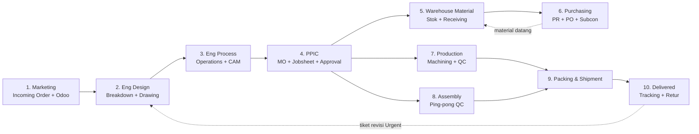

Perhatikan dua **loop** yang membuktikan ini bukan pipeline: `Purchasing → Warehouse` (material kembali) dan `Delivered → Eng Design` (retur).

### 2.2 Detail tiap tahap (ringkasan interview)

| # | Divisi | Input | Aktivitas kunci | Output |
|---|---|---|---|---|
| 1 | Marketing | PO customer | Incoming Order (project no auto, tipe Regular/Final Part) → sync Odoo; PO release → SO; Drawing Request | Drawing Request |
| 2 | Eng Design | Drawing Request | Breakdown Final Part List; klasifikasi assy / machining / standard part | Drawing release 2D + riwayat revisi |
| 3 | Eng Process | Detail drawing | Sequence, jenis mesin, durasi, operation type; margin material (20×150×5 → 25×175×8); CAM (machining only) | ≥2 operation per drawing |
| 4 | PPIC | Operations + material | 1 project = 1 MO; cek material; jobsheet = op × 2 (QC pair); routing assy/machining; assign mesin (≤22 jam/hari, pindah = approval); approval 4 tahap (boleh mulai sejak PREPARED/CHECKED) | Jobsheet siap + PR material |
| 5 | Warehouse Material | Kebutuhan material | Cek stok (ada → kurangi request; habis → PR); receiving → cek → Warehouse Done → *ready to machining*; partial incoming; cacat → ttd 4 divisi; standard part masuk stok, raw tidak | Material ready |
| 6 | Purchasing | PR | PO vendor (+MoQ), monitor vendor; subcon `SC-` (Preprocess dari Marketing / Process dari PPIC) | PO + material datang |
| 7 | Production | Jobsheet + material | Start/stop per operation; QC pair inspeksi (termasuk hasil subcon); breakdown → PAUSE atau alih subcon (flag + riwayat posisi) | Part selesai |
| 8 | Assembly | Jobsheet assy | Ping-pong operator ⇄ QC sampai selesai; durasi total dicatat, operator vs QC terpisah | Assy selesai |
| 9 | Packing & Shipment | Produk jadi | Packing; tunggu instruksi/approval Marketing; upload bukti (surat jalan/foto/resi) | Bukti kirim |
| 10 | Delivered | Bukti kirim | Status akhir; public order tracking; retur → replacement; salah gambar/produksi → tiket Urgent ke Eng Design | Order closed |

---

## 3. Pemilihan Pendekatan

### 3.1 Kriteria dari interview

| # | Temuan interview | Implikasi teknis |
|---|---|---|
| K1 | Klasifikasi part menentukan jalur | Conditional routing di edge |
| K2 | Jobsheet = operation × 2 (QC pair) | Fan-out dengan multiplier + pairing |
| K3 | Warehouse & Purchasing, Production & Assembly paralel | DAG, bukan state list linear |
| K4 | Retur & subcon kembali ke alur | Loop-back edge (graph bersiklus) |
| K5 | Regular vs Final Part berbeda; user bisa buat tipe baru | Template per Order Type, versioned |
| K6 | Odoo bisa down | Aksi eksternal async + retry + idempotent |
| K7 | 22 jam/hari, margin, MoQ berubah-ubah | Rule numerik = config, bukan kode |
| K8 | End user (bukan developer) menyusun workflow | Builder visual sederhana, bukan XML/BPMN |

### 3.2 Perbandingan opsi

| Aspek | A. Pipeline hardcoded | B. BPMN engine (Camunda/Flowable) | C. Embed n8n/Zapier | **D. Config-driven DAG + component registry** ✅ |
|---|---|---|---|---|
| Percabangan K1 | ❌ hardcode if-else | ✅ | ⚠️ lemah untuk struktur order | ✅ kondisi di edge |
| Fan-out artefak K2 | ❌ | ⚠️ perlu kustom juga | ❌ tidak kenal artefak manufaktur | ✅ `ARTIFACT_CREATE` + pairing |
| Paralel K3 | ⚠️ susah | ✅ | ⚠️ | ✅ DAG native |
| Loop-back K4 | ❌ | ✅ | ⚠️ | ✅ edge type LOOP_BACK |
| Per order type K5 | ❌ kode baru tiap tipe | ✅ | ⚠️ | ✅ template versioned |
| Integrasi K6 | manual | ✅ job worker | ✅ | ✅ outbox + retry + idempotency |
| Rule numerik K7 | ❌ recompile | ⚠️ | ⚠️ | ✅ semua di config JSON |
| End-user builder K8 | — | ❌ BPMN XML, developer-oriented | ⚠️ terlalu generik | ✅ palet komponen domain (form, approval, jobsheet…) |
| Infra | ringan | ❌ Zeebe/engine terpisah | ❌ service terpisah | ✅ in-app (Next.js + Prisma + worker) |
| Artefak domain (MO, Jobsheet, QC pair) | ✅ native | ❌ harus dipetakan | ❌ | ✅ tetap native manuos |

**Kesimpulan**: Opsi D — hybrid. Kita adopsi *ide bagus* dari BPMN engine (definisi berversi, token/token-per-instance, job worker + retry ala Zeebe/outbox) dan dari n8n/Zapier (trigger → actions berurutan dengan shared context), tapi **tanpa** infrastruktur eksternal dan **tanpa** memaksa user belajar notasi BPMN. Domain artefak manufaktur (MO, Jobsheet, QC pair, Drawing) tetap first-class.

---

## 4. Arsitektur Keseluruhan

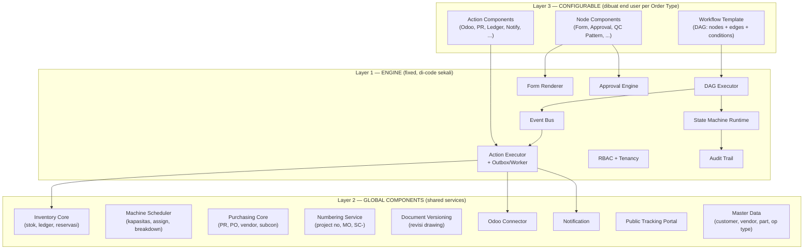

**Aturan praktis**: perilaku yang dibutuhkan ≥ 2 node → global component. Perilaku khas satu jenis tahap → node/action component.

---

## 5. Metamodel & Konsep Inti

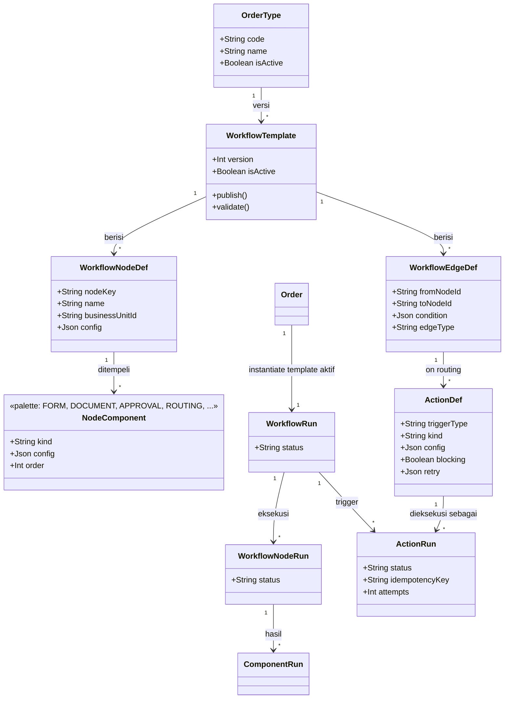

Konsep kunci:

- **Definisi vs Eksekusi** terpisah total. Template di-edit bebas; run yang sedang jalan **terkunci pada versi template** saat order dibuat.
- **Node bisa di-instantiate berulang** dalam satu workflow dengan konfigurasi berbeda (terbukti dari interview: "Warehouse" muncul 2× — Material dan Packing/Shipment).
- **Artifak domain tetap first-class**: MO, Jobsheet, Drawing, PR, PO dibuat *oleh* komponen workflow (FANOUT / DOC_GENERATE), bukan digantikan JSON.

---

## 6. Reference Workflow (DAG)

DAG lengkap hasil interview — inilah "workflow default" untuk Order Type pertama:

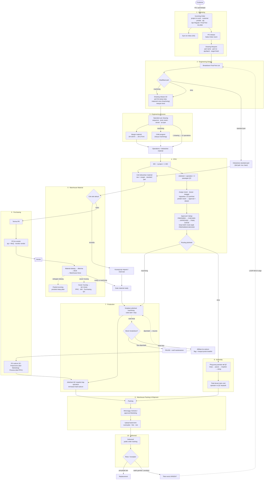

Elemen DAG yang **wajib** didukung engine (semua muncul di interview):

| Kemampuan | Contoh di diagram |
|---|---|
| Edge bersyarat | `KLAS → machining/assy/standard` |
| Edge paralel (fan-in) | `QCP + TAT → PCK` |
| Fan-out multiplier | `JS = operation × 2` |
| Gate (tunggu event) | `GATE material ready`, `WAI approval Marketing` |
| Loop-back | `URG -.-> ENG` |
| Sub-proses per node berulang | S1 vs S9 (Warehouse ×2) |

---

## 7. Hierarki Artefak (Fan-out)

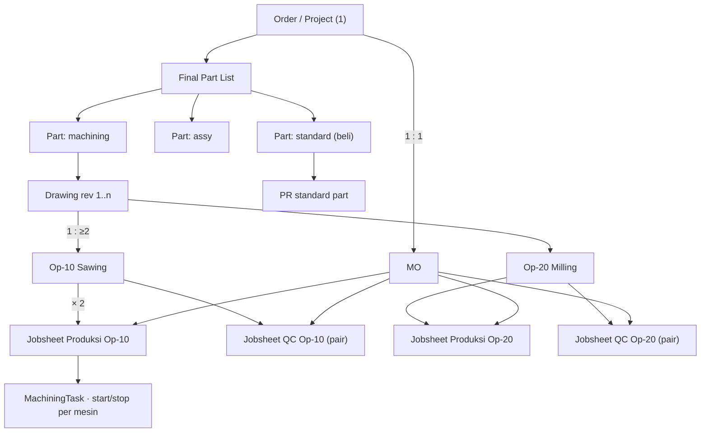

Poin desain: fan-out menghasilkan **artefak nyata di tabel domain** (MO, Jobsheet, Task), bukan hanya JSON. `WorkflowNodeRun`/`ComponentRun` merekam *siapa membuat apa*, artefak tetap bisa di-query dengan performa tinggi untuk kanban/gantt/report yang sudah ada.

---

## 8. State Machine

### 8.1 Siklus hidup WorkflowNodeRun (generik, untuk semua node)

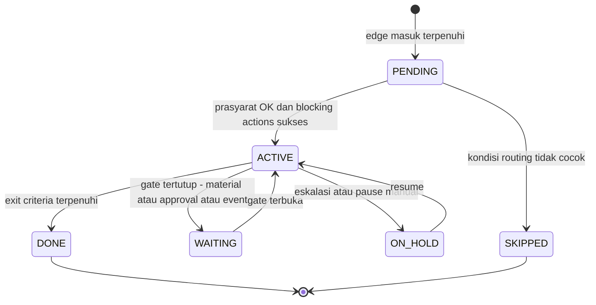

### 8.2 Rantai approval jobsheet (dari interview PPIC)

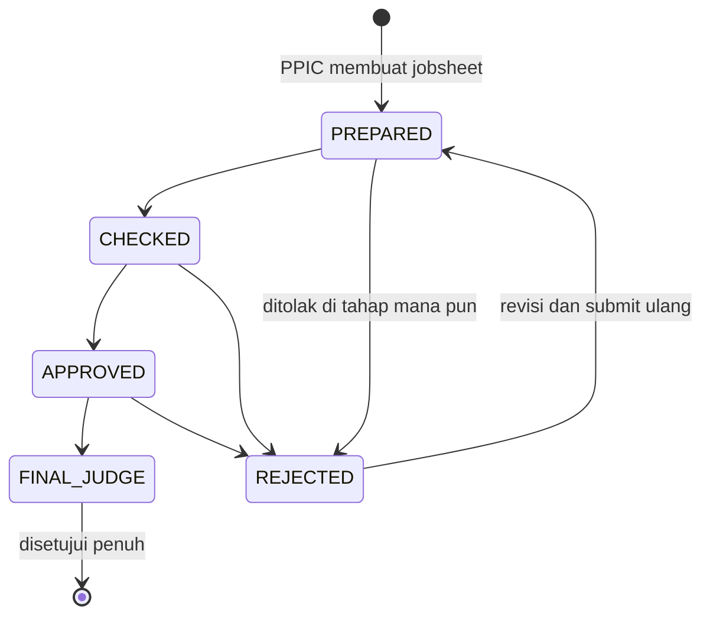

> Pembeda penting: **status approval** dan **status pekerjaan** dua sumbu berbeda. Interview menyebut kerja boleh mulai sejak PREPARED/CHECKED — artinya `WORK_STARTED` tidak menunggu approval selesai.

### 8.3 Siklus kerja jobsheet produksi

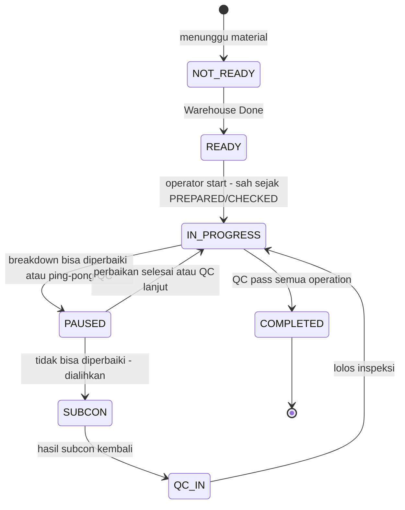

---

## 9. Katalog Node Components

Komponen yang ditempel ke node — "apa yang dikerjakan DI DALAM node". Setiap kind punya config schema tervalidasi.

| Kind | Deskripsi | Contoh dari interview |
|---|---|---|
| `FORM` | Form dinamis (lanjutan form-templates) | Incoming Order: customer, produk, qty, tipe Regular/Final Part, req date |
| `DOCUMENT` | Template dokumen + field | Drawing Request; Drawing 2D; surat jalan |
| `APPROVAL` | Rantai tahap + role + aturan mulai kerja + kebijakan reject | PREPARED → CHECKED → APPROVED → FINAL JUDGE; mulai sejak PREPARED |
| `ROUTING` | Taksonomi klasifikasi + routing table | assy → Assembly; machining → Production; standard → Purchasing |
| `CALC` | Formula pada data context | Margin material 20×150×5 → 25×175×8 |
| `FANOUT` | Multiplier / agregasi / pairing artefak | 1 project = 1 MO; jobsheet = op × 2 QC pair |
| `QC_PATTERN` | Checklist per operation · ping-pong loop · multi-party signature | Inspeksi tiap op + hasil subcon; ttd 4 divisi |
| `TIMER` | Mode pencatatan waktu + atribusi | Start/stop machining; operator vs QC terpisah |
| `EVIDENCE` | Upload wajib (foto, ttd, dokumen) | Surat jalan, foto, resi saat shipment |
| `INVENTORY_POLICY` | Kebijakan stok & receiving | Standard part masuk stok, raw tidak; partial incoming |
| `SCHEDULING` | Constraint penjadwalan | Kapasitas ≤ 22 jam/hari; pindah mesin = approval + alasan |
| `GATE` | Kondisi node boleh dieksekusi | *Ready to machining*; tunggu approval Marketing |
| `ESCALATION` | Penanganan kejadian luar biasa | Breakdown → PAUSE / subcon; retur → tiket Urgent |

---

## 10. Action Components & Trigger

Aksi = efek samping **saat routing/transisi** — pola *when trigger fires → do a₁, a₂, … → lanjut*.

### 10.1 Empat titik pemicu

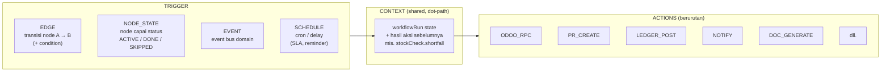

### 10.2 Katalog action

| Kind | Blocking default | Contoh pemakaian |
|---|---|---|
| `ODOO_RPC` | ❌ | Upsert Sales Order saat Incoming Order; update status delivered |
| `HTTP_REQUEST` | ❌ | Webhook pihak ketiga |
| `STOCK_CHECK` | ✅ | Warehouse cek kebutuhan → hasil `shortfall` di context |
| `LEDGER_POST` | ✅ | Material diterima → `IN`; issue → `OUT`; reservasi |
| `STOCK_RESERVE` | ✅ | Standard part tersedia → reserved |
| `PR_CREATE` | ✅ | Stok habis → PR ke Purchasing / Odoo Procurement |
| `PO_CREATE` | ❌ | PO vendor; subcon `SC-` Process/Preprocess |
| `DOC_GENERATE` | ✅ | Drawing Request, jobsheet, surat jalan |
| `NUMBER_ALLOCATE` | ✅ | Project number auto; MO-01; prefix `SC-` |
| `ARTIFACT_CREATE` | ✅ | MO, jobsheet pair, task |
| `MACHINE_ASSIGN` | ✅ | Assign + validasi kapasitas 22 jam/hari |
| `APPROVAL_START` | ✅ | Mulai rantai approval jobsheet |
| `NOTIFY` | ❌ | Material ready → operator; breakdown → maintenance |
| `CALC_APPLY` | ✅ | Terapkan margin material |
| `FIELD_SET` | ✅ | Set `readyToMachining = true` |
| `GATE_OPEN` / `GATE_WAIT` | ✅ | Buka/pasang gate shipment approval |
| `TRACKING_UPDATE` | ❌ | Update progres public tracking |
| `AUDIT_LOG` | ❌ | Audit eksplisit (semua aksi sudah otomatis ter-audit) |

> Menambah action baru = daftarkan executor (kontrak: config schema + context in/out). Engine tidak berubah.

---

## 11. Semantik Eksekusi Aksi

### 11.1 Transisi edge: aksi sync (in-transaction) + async (outbox)

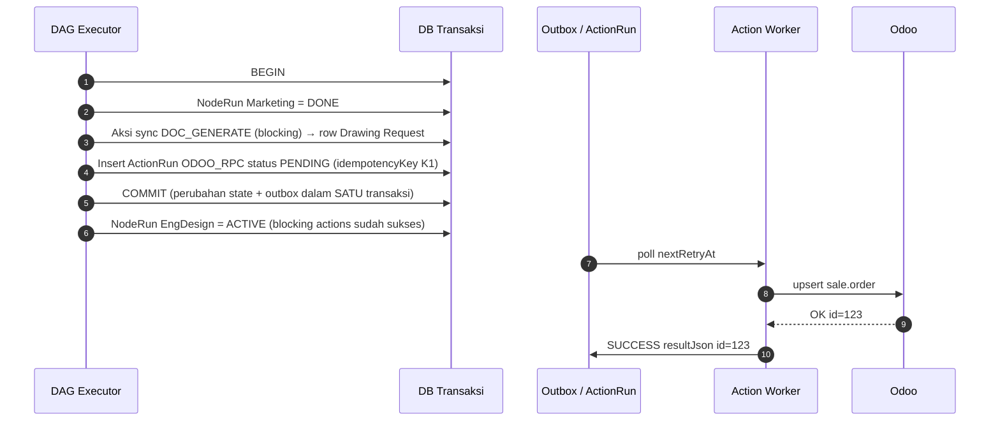

### 11.2 Retry dan dead-letter (Odoo down)

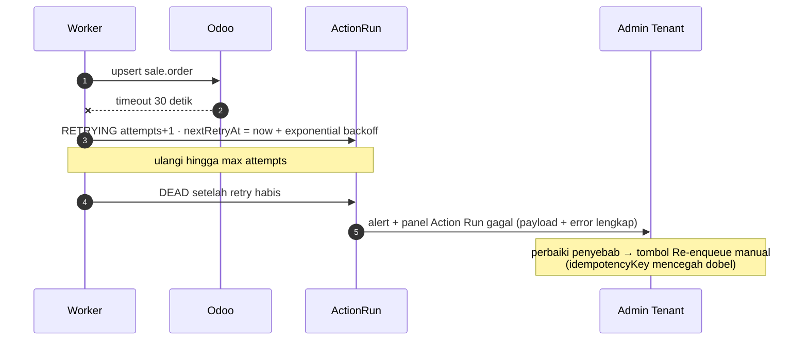

### 11.3 Prinsip yang tidak bisa dinegosiasi

| Prinsip | Mekanisme |
|---|---|
| **Atomicity** | Perubahan state node + outbox aksi async dalam satu transaksi DB |
| **Idempotency** | `idempotencyKey = (workflowRunId, actionDefId, triggerContext)` — retry tidak membuat PR/ledger ganda |
| **Blocking vs fire-and-forget** | `blocking: true` → node tujuan menunggu aksi sukses; `onFailure: BLOCK \| CONTINUE` |
| **Durability** | Aksi tidak hilang saat app restart (persist di ActionRun, diproses worker) |
| **Observability** | Setiap eksekusi tercatat: payload, hasil, attempts, error, durasi |

---

## 12. Pemetaan Interview → Komponen

Legenda: 🎛️ dikonfigurasi user · 🌐 global component

| Node | Perilaku interview | Komponen | 
|---|---|---|
| Marketing | Form incoming order + project no auto | 🎛️ FORM + NUMBER_ALLOCATE (🌐 numbering) |
| Marketing | Sync Odoo | 🎛️ ODOO_RPC (🌐 connector + outbox) |
| Marketing | Drawing Request | 🎛️ DOCUMENT |
| Eng Design | Breakdown Final Part List | 🎛️ FANOUT |
| Eng Design | Klasifikasi assy/machining/standard | 🎛️ ROUTING |
| Eng Design | Riwayat revisi drawing | 🌐 document versioning |
| Eng Process | Sequence, mesin, durasi, op type | 🎛️ FORM (🌐 master op type) |
| Eng Process | Margin material | 🎛️ CALC |
| Eng Process | CAM hanya machining | 🎛️ ROUTING (conditional) |
| PPIC | 1 project = 1 MO | 🎛️ FANOUT |
| PPIC | Cek material | 🎛️ STOCK_CHECK (🌐 inventory) |
| PPIC | Jobsheet ×2 QC pair | 🎛️ FANOUT pairing |
| PPIC | Routing tujuan jobsheet | 🎛️ ROUTING |
| PPIC | Assign mesin, 22 jam/hari, pindah = approval | 🎛️ SCHEDULING + APPROVAL (🌐 scheduler) |
| PPIC | Approval 4 tahap, mulai sejak PREPARED | 🎛️ APPROVAL (🌐 approval engine) |
| Warehouse | Stok ada/habis → PR | 🎛️ STOCK_CHECK + PR_CREATE |
| Warehouse | Receiving → Warehouse Done → ready | 🎛️ GATE + LEDGER_POST |
| Warehouse | Partial incoming | 🎛️ INVENTORY_POLICY |
| Warehouse | Cacat → ttd 4 divisi | 🎛️ QC_PATTERN multi-party |
| Purchasing | PR → PO + MoQ | 🎛️ CALC qty + DOCUMENT (🌐 purchasing) |
| Purchasing | Subcon SC- 2 jenis | 🎛️ NUMBER_ALLOCATE prefix + ROUTING sumber |
| Production | Start/stop | 🎛️ TIMER |
| Production | QC inspeksi per op + subcon | 🎛️ QC_PATTERN |
| Production | Breakdown → PAUSE/subcon | 🎛️ ESCALATION (🌐 machine events) |
| Assembly | Ping-pong | 🎛️ QC_PATTERN loop |
| Assembly | Waktu operator vs QC terpisah | 🎛️ TIMER attribution |
| Packing | Tunggu approval Marketing | 🎛️ GATE + APPROVAL |
| Packing | Upload bukti | 🎛️ EVIDENCE (🌐 storage) |
| Delivered | Public tracking | 🌐 portal |
| Delivered | Retur → tiket Urgent | 🎛️ LOOP_BACK edge + ESCALATION |

---

## 13. Skenario Kunci

### 13.1 Material shortage → PR → receiving → ready

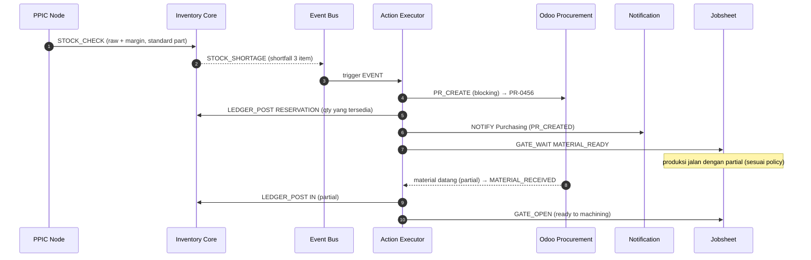

### 13.2 Mesin breakdown → PAUSE atau subcon

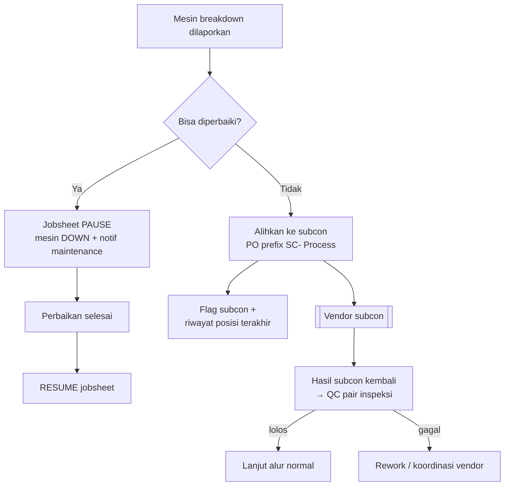

### 13.3 Assembly ping-pong

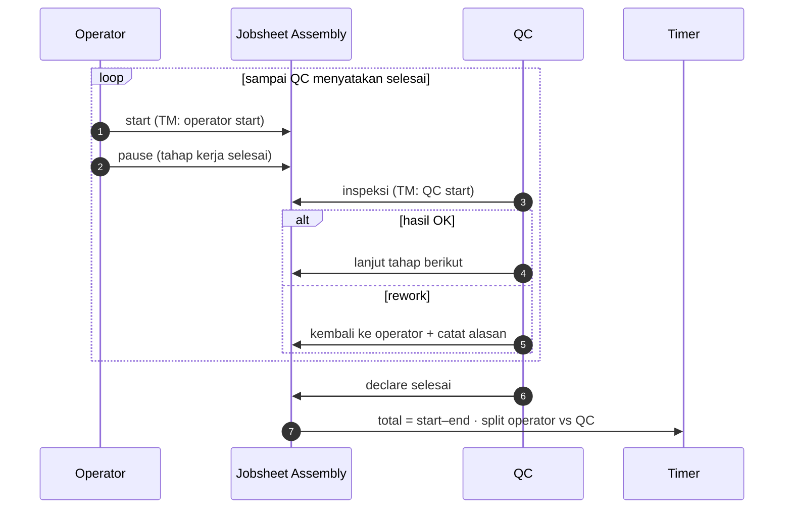

### 13.4 Retur → tiket revisi Urgent (loop-back)

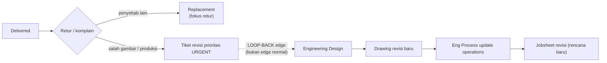

> Loop-back **tidak mengubah** run historis (jobsheet lama tetap tercatat); ia membuat iterasi baru di node tujuan dengan referensi ke tiket retur — pola yang sama dipakai untuk revisi drawing normal.

---

## 14. Data Model

Model inti (ringkas — kolom metadata standar dihilangkan):

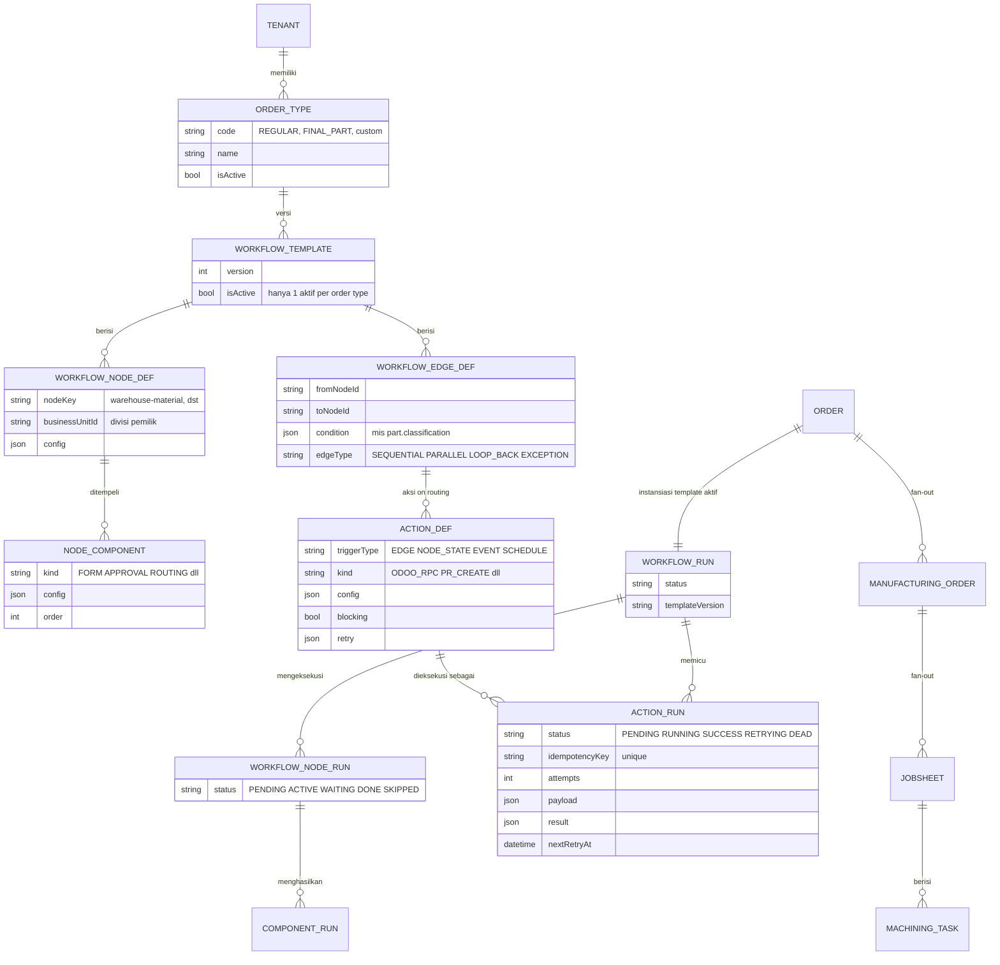

Perubahan dari schema saat ini:

1. `Order.status` (enum) → status turunan dari posisi `WorkflowRun` (tetap dipetakan ke label ringkas untuk dashboard/portal).
2. `Jobsheet.preparedBy/checkedBy/approvedBy` → data `ComponentRun` dari komponen APPROVAL (rantai panjangnya bebas).
3. MO/Jobsheet/Task **tetap ada** — dibuat oleh komponen, bukan dihapus.

---

## 15. Pengalaman Builder untuk End User

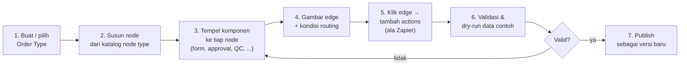

Validasi yang dijalankan sebelum publish:

- **Struktur**: semua node terhubung (tidak ada orphan kecuali terminal), ada minimal 1 node start & end, loop-back hanya pada tipe edge yang diizinkan.
- **Kontrak**: config tiap komponen lolos JSON Schema; referensi dot-path antar aksi (`itemsFrom: "stockCheck.shortfall"`) valid.
- **Semantik**: tidak ada cycle tanpa exit; aksi blocking tidak saling menunggu (deadlock); setiap `GATE_WAIT` punya minimal satu event pembuka.
- **Dry-run**: jalankan dengan data contoh → tampilkan DAG yang dilalui + aksi yang terpicu, sebelum template dipakai order nyata.

---

## 16. Katalog Event

| Domain | Event |
|---|---|
| Order | `ORDER_CREATED` · `ORDER_RELEASED` · `ORDER_CANCELLED` · `ORDER_DELIVERED` |
| Engineering | `DRAWING_REQUEST_CREATED` · `DRAWING_RELEASED` · `DRAWING_REVISED` · `OPERATIONS_DEFINED` · `CAM_CREATED` |
| PPIC | `MO_CREATED` · `JOBSHEET_CREATED` · `JOBSHEET_ROUTED` · `MACHINE_ASSIGNED` · `MACHINE_REASSIGN_REQUESTED` |
| Approval | `APPROVAL_STAGE_PASSED` · `APPROVAL_REJECTED` · `APPROVAL_COMPLETED` |
| Material | `STOCK_CHECKED` · `STOCK_SHORTAGE` · `MATERIAL_RESERVED` · `PR_CREATED` · `PO_ISSUED` · `MATERIAL_PARTIAL_RECEIVED` · `MATERIAL_READY` · `MATERIAL_DEFECT_VERIFIED` |
| Shopfloor | `WORK_STARTED` · `WORK_PAUSED` · `WORK_RESUMED` · `QC_PASSED` · `QC_REJECTED` · `MACHINE_DOWN` · `SUBCON_REDIRECTED` · `SUBCON_RETURNED` |
| Shipment | `PACKING_DONE` · `SHIPMENT_APPROVED` · `DELIVERY_PROOF_UPLOADED` |
| Retur | `RETURN_FILED` · `URGENT_REVISION_TICKET` |

Event adalah **bahasa bersama** antara node components, action triggers, dan SLA/schedule triggers.

---

## 17. Contoh Konfigurasi

### 17.1 Node PPIC

```jsonc
{
  "nodeKey": "ppic",
  "businessUnitId": "bu-ppic",
  "components": [
    { "kind": "FANOUT", "config": { "rule": "ONE_PER_ORDER", "artifact": "MANUFACTURING_ORDER" } },
    { "kind": "FANOUT", "config": { "rule": "PER_OPERATION_X2_QC_PAIR", "artifact": "JOBSHEET", "pairType": "PRODUCTION_QC" } },
    { "kind": "ROUTING", "config": { "mapping": { "machining": "production", "assy": "assembly" } } },
    { "kind": "SCHEDULING", "config": {
        "machineCapacityHoursPerDay": 22,
        "reassignRequiresApproval": true,
        "reassignReasonRequired": true } },
    { "kind": "APPROVAL", "config": {
        "stages": [
          { "name": "PREPARED", "role": "PPIC" },
          { "name": "CHECKED", "role": "PPIC_LEAD" },
          { "name": "APPROVED", "role": "PRODUCTION_MANAGER" },
          { "name": "FINAL JUDGE", "role": "PLANT_MANAGER" } ],
        "workMayStartAtStage": "PREPARED",
        "onReject": "RETURN_TO_STAGE" } }
  ]
}
```

### 17.2 Edge Marketing → Eng Design (dengan actions)

```jsonc
{
  "from": "marketing", "to": "eng-design",
  "condition": { "event": "ORDER_RELEASED" },
  "actions": [
    { "kind": "ODOO_RPC", "order": 1, "blocking": false,
      "config": { "model": "sale.order", "op": "upsert", "fieldMapping": "odoo.so" },
      "retry": { "max": 5, "backoff": "exponential", "timeoutMs": 30000 } },
    { "kind": "DOC_GENERATE", "order": 2, "blocking": true,
      "config": { "template": "drawing-request" } },
    { "kind": "TRACKING_UPDATE", "order": 3,
      "config": { "progressLabel": "Masuk Engineering Design" } }
  ]
}
```

### 17.3 Trigger event: stok kurang

```jsonc
{
  "on": { "event": "STOCK_SHORTAGE", "scope": "warehouse-material" },
  "actions": [
    { "kind": "STOCK_CHECK", "order": 1, "blocking": true,
      "config": { "itemsFrom": "material.requirements",
                  "stockPolicy": { "STANDARD_PART": "STOCKED", "RAW_MATERIAL": "NOT_STOCKED" } } },
    { "kind": "PR_CREATE", "order": 2, "blocking": true,
      "config": { "target": "odoo-procurement", "itemsFrom": "stockCheck.shortfall" } },
    { "kind": "LEDGER_POST", "order": 3,
      "config": { "type": "RESERVATION", "itemsFrom": "stockCheck.available" } },
    { "kind": "NOTIFY", "order": 4,
      "config": { "to": ["ROLE_PURCHASING"], "template": "PR_CREATED" } }
  ]
}
```

---

## 18. Strategi Migrasi dari Sistem Saat Ini

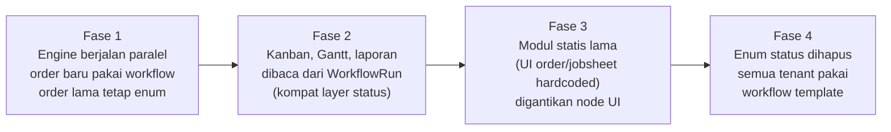

- **Kompat layer**: `Order.status` tetap terisi (dipetakan dari posisi WorkflowRun) supaya dashboard, portal, dan laporan yang ada tidak rusak di fase transisi.
- **Modul yang tetap dipakai apa adanya**: machine management, inventory, audit, auth — tinggal dibungkus jadi global components.

---

## 19. Roadmap Implementasi

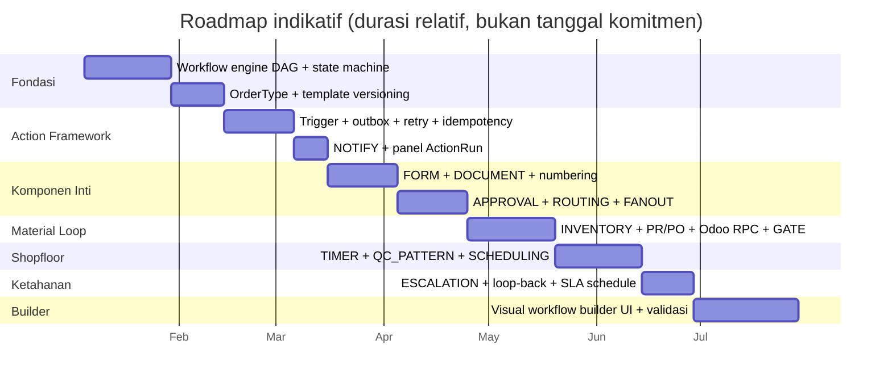

| Fase | Deliverable | Gerbang keluar (definition of done) |
|---|---|---|
| Fondasi | Engine + versioning | 1 order type end-to-end 2 node sederhana di production |
| Action framework | Trigger + outbox | Aksi Odoo gagal → auto-retry → panel admin → re-enqueue manual, tanpa data ganda |
| Komponen inti | FORM/DOCUMENT/APPROVAL/ROUTING/FANOUT | Node PPIC penuh (jobsheet ×2 + approval 4 tahap) berjalan dari config |
| Material loop | INVENTORY + PR/PO + Odoo + GATE | Skenario 13.1 (shortage → ready) lulus uji |
| Shopfloor | TIMER + QC + SCHEDULING | Skenario 13.2 & 13.3 lulus uji |
| Ketahanan | ESCALATION + loop-back | Skenario 13.4 (retur → revisi Urgent) lulus uji |
| Builder | UI visual | Admin tenant non-teknis membuat order type baru tanpa bantuan developer |

> Urutan ini disengaja: **builder UI paling akhir**. Kontrak komponen dan engine harus stabil dulu; kalau tidak, UI builder akan dirombak berulang kali.

---

## 20. Risiko & Keputusan Desain Terbuka

### 20.1 Risiko

| Risiko | Mitigasi |
|---|---|
| Workflow misconfigured membuat order macet | Validasi publish + dry-run + deteksi deadlock + alert node WAITING terlalu lama |
| Aksi ganda (double-PR, ledger dobel) | IdempotencyKey unik + eksekusi single-worker per key |
| Performa (run table membesar) | Indeks per tenant/run; arsip run selesai; artefak domain tetap tabel normal |
| Kompleksitas builder mengagetkan user | Mulai dari template siap-pakai (reference workflow §6) yang bisa di-copy lalu dimodifikasi |
| Perubahan template vs order berjalan | Run terkunci versi; template baru berlaku untuk order berikutnya |

### 20.2 Pertanyaan untuk dikonfirmasi ke user/bisnis

1. **Odoo**: semua tenant pakai Odoo, atau perlu mode tanpa ERP (PR/PO internal penuh)?
2. **Siapa workflow designer**: role baru `WORKFLOW_DESIGNER`? Per-tenant atau global?
3. **Standard part**: cukup routing langsung ke Purchasing (tanpa node tersendiri), atau perlu node proses tersendiri?
4. **CAM**: perlu approval tersendiri sebelum release ke shopfloor?
5. **Retensi ActionRun** berapa lama (audit vs storage)?
6. **Batas ukuran template**: max node/komponen per workflow (guardrail performa)?
7. **SLA numeric per node** (jam) — apakah dibutuhkan di rilis pertama, atau cukup trigger SCHEDULE?

---

*Dokumen ini menjadi single source of truth desain dynamic workflow ManuOS. `DYNAMIC_WORKFLOW_DESIGN.md` (versi awal) dapat diarsipkan.*
