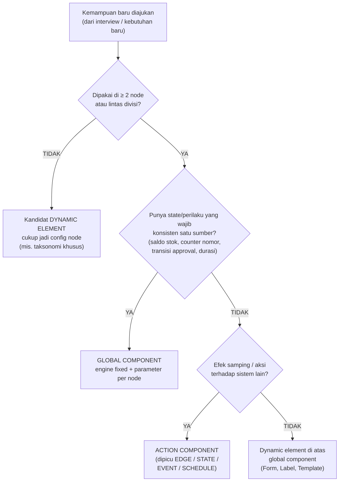
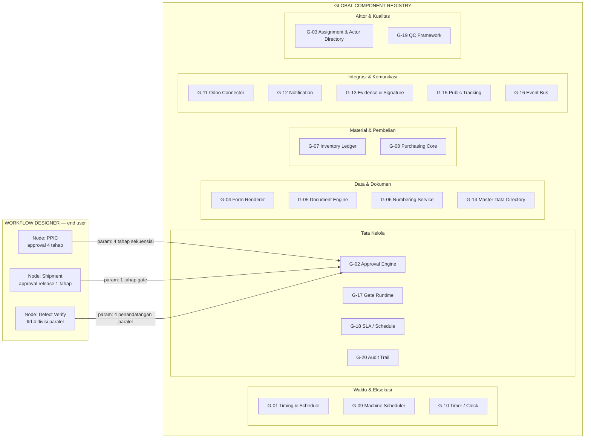

# ManuOS — Dynamic Workflow: Component Registry & Mapping

**Dokumen**: Pemetaan komponen global vs dynamic/customizable per node
**Status**: Pendamping `DYNAMIC_WORKFLOW_BLUEPRINT.md` (section 9–10 diperinci di sini)
**Cara baca**: Setiap kemampuan sistem diklasifikasikan menjadi (a) **Global Component** — dibangun sekali, dipakai lintas node, perilaku intinya fixed, hanya *parameternya* yang diatur per node; atau (b) **Dynamic Element** — murni konfigurasi end user, tidak punya logika engine sendiri, berdiri di atas global component.

---

## Daftar Isi

1. [Prinsip Klasifikasi](#1-prinsip-klasifikasi)
2. [Peta Registry Sekilas](#2-peta-registry-sekilas)
3. [Global Components Registry (G-01 … G-20)](#3-global-components-registry)
4. [Dynamic Elements (D-01 … D-13)](#4-dynamic-elements)
5. [Matriks Pemakaian per Node (hasil interview)](#5-matriks-pemakaian-per-node)
6. [Anatomi Konfigurasi Node (contoh utuh)](#6-anatomi-konfigurasi-node)
7. [Konfigurasi Minimal Komponen Kunci](#7-konfigurasi-minimal-komponen-kunci)
8. [Status Implementasi & Backlog](#8-status-implementasi--backlog)

---

## 1. Prinsip Klasifikasi



Tiga uji tersebut menjawab pertanyaan yang sama: **"kalau logika ini ditulis dua kali di dua node, apa yang bisa rusak?"** Kalau jawabannya ada (saldo dobel, nomor ganda, status approval tidak konsisten) → global.

---

## 2. Peta Registry Sekilas



**Satu engine, banyak konfigurasi.** Approval di PPIC (4 tahap sekuensial), release shipment (1 tahap), dan verifikasi cacat material (4 divisi paralel) adalah **komponen yang sama** — yang berbeda hanya parameternya. Begitu pula Timing: field tanggal & estimasi di Marketing, PPIC, dan Assembly dijalankan komponen yang sama.

---

## 3. Global Components Registry

Legenda status: ✅ sudah ada di manuos · ⚠️ sebagian ada · ❌ belum ada

### G-01 — Timing & Schedule (tanggal & durasi)

| Aspek | Isi |
|---|---|
| **Yang FIXED (engine)** | Semantik field: `plannedStart/End`, `actualStart/End`, `estimatedDuration`, `actualDuration`, `requiredDate`; perhitungan durasi & progress; konsumsi oleh Gantt/Kanban/report yang sudah ada |
| **Yang DIPARAMETERISASI per node** | Field mana yang diaktifkan; satuan (jam / hari / pcs-jam); basis estimasi (manual, formula, rata-rata historis); kalender kerja (jam kerja/hari); apakah `actual` otomatis dari G-10 Timer |
| **Contoh dari interview** | Marketing: *required date*; Eng Process: *durasi per operation*; PPIC: *estimasi durasi + tanggal* + kapasitas 22 jam/hari; Assembly: *durasi start–end* |
| **Data model** | Digenralisasi dari `Order/MO/Jobsheet/Task` (sekarang kolom timing tersebar & hardcoded per tabel) |
| **Status** | ⚠️ field ada di tiap entitas, belum jadi komponen seragam |

### G-02 — Approval Engine

| Aspek | Isi |
|---|---|
| **FIXED** | Eksekusi rantai tahap; catatan sign-off (siapa–kapan–komentar); transisi PASS/REJECT; delegasi; antrean "menunggu persetujuan saya"; notifikasi pending |
| **DIPARAMETERISASI** | Jumlah & nama tahap; aktor per tahap (role/user/unit); mode `sequential` vs `parallel`; `workMayStartAtStage` (kerja boleh mulai sejak mana); `onReject` (kembali ke tahap / ke node / buat tiket); SLA per tahap; keharusan alasan (mis. pindah mesin) |
| **Contoh interview** | PPIC: `PREPARED→CHECKED→APPROVED→FINAL JUDGE`, kerja sah sejak PREPARED/CHECKED · Pindah mesin: 1 tahap + alasan wajib · Shipment: release oleh Marketing · Cacat material: 4 penandatangan paralel |
| **Status** | ⚠️ `preparedBy/checkedBy/approvedBy` hardcoded di Jobsheet |

### G-03 — Assignment & Actor Directory

| Aspek | Isi |
|---|---|
| **FIXED** | Direktori user/role/unit/tenant; mekanisme assign, claim, reassign (dengan jejak); resolusi izin (RBAC) |
| **DIPARAMETERISASI** | Siapa bermain di node ini → lihat **D-02 Actor Binding** |
| **Contoh interview** | Sales Supervisor + Marketing Admin (Marketing); Eng Design Lead; operator mesin; QC pair |
| **Status** | ✅ Role/User ada; mekanisme assign ⚠️ tersebar per modul |

### G-04 — Form Renderer & Schema Registry

| Aspek | Isi |
|---|---|
| **FIXED** | Render & validasi semua tipe field (text, number, date, dropdown, checkbox, signature, file/image upload, textarea); conditional visibility; draft/submit |
| **DIPARAMETERISASI** | Schema per node → lihat **D-01** |
| **Contoh interview** | Incoming Order; set operation; form receiving; form retur |
| **Status** | ⚠️ API `form-templates` ada (belum dipakai penuh), page masih mock |

### G-05 — Document Engine & Versioning

| Aspek | Isi |
|---|---|
| **FIXED** | Generate dokumen dari template; menyimpan artefak; **riwayat revisi** (rev 1..n, siapa–kapan–apa yang berubah); notifikasi revisi; tautan dokumen ↔ node ↔ artefak |
| **DIPARAMETERISASI** | Template dokumen (field, layout, tipe file) per node → **D-05** |
| **Contoh interview** | Drawing Request; Drawing 2D dengan riwayat revisi; surat jalan |
| **Status** | ❌ (baru `drawingUrl: String`) |

### G-06 — Numbering Service

| Aspek | Isi |
|---|---|
| **FIXED** | Counter atomik per pattern (tidak ada nomor ganda walau concurrency); parse & format nomor; per-tenant |
| **DIPARAMETERISASI** | Pattern per dokumen: prefix, suffix, padding, reset (per tahun/bulan/tanpa reset) |
| **Contoh interview** | Project number auto-generate; `MO-`; jobsheet; PR; PO; **prefix `SC-`** subcon |
| **Status** | ❌ |

### G-07 — Inventory Ledger & Stock Policy

| Aspek | Isi |
|---|---|
| **FIXED** | Cek stok aktual; reservasi; mutasi `IN/OUT/RESERVATION/ADJUSTMENT` dengan balance berjalan & log tak terhapus; kebijakan konsumsi partial |
| **DIPARAMETERISASI** | `stockPolicy` per kategori item (STOCKED / NOT_STOCKED); partial incoming on/off; threshold reorder; aksi saat shortage (auto-PR / manual) |
| **Contoh interview** | Stok ada → kurangi request; habis → PR; partial incoming dipersilakan; **standard part masuk stok, raw material tidak** |
| **Status** | ⚠️ `Inventory`+`InventoryLog` ada; policy & auto-PR belum |

### G-08 — Purchasing Core (PR/PO/Vendor)

| Aspek | Isi |
|---|---|
| **FIXED** | Siklus PR → PO → monitor vendor → receiving link; status vendor; relasi PR ↔ PO ↔ material masuk |
| **DIPARAMETERISASI** | Aturan MoQ (kenaikan qty); approval PO; jenis subcon (Preprocess/Process); dokumen & prefix via G-05/G-06 |
| **Contoh interview** | PR → PO dengan qty ditambah MoQ; PO subcon `SC-` dua jenis |
| **Status** | ❌ |

### G-09 — Machine Scheduler & Capacity

| Aspek | Isi |
|---|---|
| **FIXED** | Validasi kapasitas harian saat assignment; deteksi konflik jadwal; riwayat reassignment; kaitan ke breakdown & maintenance (machine lifecycle yang sudah ada) |
| **DIPARAMETERISASI** | Batas kapasitas per mesin per hari (interview: **22 jam**); kebijakan reassign (butuh approval + alasan → G-02); auto-assign vs manual |
| **Contoh interview** | PPIC assign mesin; perpindahan mesin butuh approval + alasan |
| **Status** | ✅ Machine/Breakdown/Maintenance ada; validasi kapasitas ⚠️ belum dipakai |

### G-10 — Timer / Clock & Attribution

| Aspek | Isi |
|---|---|
| **FIXED** | Start/stop/pause/resume; durasi kumulatif; korelasi ke task/artefak; sumber data `actualHours` |
| **DIPARAMETERISASI** | Mode (per task / per node / per ronde QC); **attribution split** (operator vs QC dicatat terpisah); auto-pause saat breakdown |
| **Contoh interview** | Production catat start/stop; Assembly total start–end + split operator/QC |
| **Status** | ⚠️ `clockedIn/Out` di MachiningTask |

### G-11 — Odoo / ERP Connector

| Aspek | Isi |
|---|---|
| **FIXED** | RPC client; registry field-mapping; retry + idempotency (via action framework/outbox); karantina data gagal sync (bisa re-enqueue) |
| **DIPARAMETERISASI** | Entity yang disinkronkan (Sales Order, PR Procurement, status delivered, dll.); arah; trigger event; mapping field |
| **Contoh interview** | Sync Incoming Order → Odoo; PR ke Procurement Odoo |
| **Status** | ❌ |

### G-12 — Notification

| Aspek | Isi |
|---|---|
| **FIXED** | Channel in-app/email; render template; antrean & retry kirim; digest |
| **DIPARAMETERISASI** | Penerima (role/user/unit/customer); template pesan; event pemicu |
| **Contoh interview** | Notif material ready; notif PR ke Purchasing; notif breakdown ke maintenance |
| **Status** | ✅ model `Notification` ada |

### G-13 — Evidence & Signature

| Aspek | Isi |
|---|---|
| **FIXED** | Upload & penyimpanan berkas/foto; tipe & ukuran valid; jejak versi bukti; tanda tangan digital single/multi |
| **DIPARAMETERISASI** | Bukti wajib per momen (foto material, surat jalan, foto, resi); jumlah minimal; siapa yang menandatangani (→ juga bisa via G-02 paralel) |
| **Contoh interview** | Bukti kirim (surat jalan/foto/resi); ttd 4 divisi |
| **Status** | ⚠️ upload ada |

### G-14 — Master Data Directory

| Aspek | Isi |
|---|---|
| **FIXED** | CRUD + versi master: customer, vendor, **part & part number**, operation type (milling, sawing, drilling, lathe…), mesin, divisi/unit |
| **DIPARAMETERISASI** | Taksonomi & atribut custom per master (mis. atribut part) |
| **Contoh interview** | Final Part List; daftar operation type; vendor subcon |
| **Status** | ⚠️ Machine/Role/User ada; Part/Vendor/OperationType ❌ |

### G-15 — Public Order Tracking

| Aspek | Isi |
|---|---|
| **FIXED** | Portal read-only customer; progres agregat dari WorkflowRun |
| **DIPARAMETERISASI** | Milestone apa yang tampil ke customer + labelnya (per order type bisa beda) |
| **Contoh interview** | Customer memantau progres order |
| **Status** | ✅ portal ada |

### G-16 — Event Bus & Trigger Runtime

| Aspek | Isi |
|---|---|
| **FIXED** | Publish/subscribe event domain; dispatch ke trigger (EDGE/NODE_STATE/EVENT/SCHEDULE); menjamin delivery ke outbox |
| **DIPARAMETERISASI** | Subscription (event apa → aksi apa) via **D-12** |
| **Contoh interview** | Implisit di semua alur (STOCK_SHORTAGE, MATERIAL_READY, MACHINE_DOWN, …) |
| **Status** | ❌ |

### G-17 — Gate Runtime

| Aspek | Isi |
|---|---|
| **FIXED** | Evaluasi kondisi tunggu; membuka gate oleh event; banyak node boleh menunggu gate yang sama |
| **DIPARAMETERISASI** | Definisi gate (kunci, event pembuka, mode: SEMUA lengkap vs PARTIAL cukup) → **D-09** |
| **Contoh interview** | *Ready to machining* (partial boleh); shipment menunggu instruksi Marketing |
| **Status** | ❌ |

### G-18 — SLA / Schedule Runtime

| Aspek | Isi |
|---|---|
| **FIXED** | Evaluasi cron/delay; deteksi pelanggaran SLA; eskalasi |
| **DIPARAMETERISASI** | Nilai SLA per node/tahap; aksi saat telat (notif/eskalasi) → **D-11** |
| **Contoh interview** | *Target finish design* di Drawing Request (kandidat SLA); approval yang menggantung |
| **Status** | ❌ |

### G-19 — QC Framework

| Aspek | Isi |
|---|---|
| **FIXED** | Runtime checklist item; ronde inspeksi; hasil pass/rework per item; **ping-pong loop** (kerja→pause→inspeksi→ulang) dengan batas ronde; multi-party sign; pencatatan siapa-QC-apa-kapan |
| **DIPARAMETERISASI** | Pola per node → **D-08**; daftar item inspeksi; kriteria selesai |
| **Contoh interview** | QC pair inspeksi tiap operation + hasil subcon; ping-pong Assembly; ttd 4 divisi |
| **Status** | ❌ |

### G-20 — Audit Trail

| Aspek | Isi |
|---|---|
| **FIXED** | Pencatatan semua aksi (siapa–kapan–apa–old/new value) — otomatis untuk semua komponen |
| **DIPARAMETERISASI** | Severity mapping (default sudah cukup) |
| **Status** | ✅ |

---

## 4. Dynamic Elements

Elemen yang **murni konfigurasi** — tidak punya engine sendiri; berdiri di atas global component. Inilah "permukaan kustomisasi" end user.

| ID | Element | End user mengatur apa | Bertumpu pada | Contoh interview |
|---|---|---|---|---|
| **D-01** | **Form Schema** | Field, tipe, validasi, default, conditional visibility, urutan/group | G-04 | Form Incoming Order (customer, produk, qty, tipe Regular/Final Part, req date) |
| **D-02** | **Actor Binding** | Peran di node: `initiator` (boleh memulai), `owner` (penanggung jawab), `executor` (pengerja), `approver`, `observer`; resolver: role statis / user / unit / **dinamis** ("operator mesin yang di-assign", "QC pair dari jobsheet X") | G-03 | Sales Supervisor & Marketing Admin mencatat; Eng Design Lead breakdown; QC pair |
| **D-03** | **Business Status & Exit Criteria** | Label status bisnis per node ("Warehouse Done", "Ready to Machining") + kriteria node dianggap selesai (semua form submitted? QC pass? gate terbuka?) | Engine state (PENDING/ACTIVE/WAITING/DONE) | "Warehouse Done" → ready to machining |
| **D-04** | **Routing & Classification** | Taksonomi klasifikasi + routing table tujuan | Engine edge condition | assy→Assembly, machining→Production, standard→Purchasing; subcon Preprocess/Process |
| **D-05** | **Document Template** | Field, layout, tipe keluaran dokumen | G-05, G-06 | Drawing Request; Drawing 2D; surat jalan |
| **D-06** | **Formula / Calculation** | Ekspresi hitung pada context | Engine expression evaluator | Margin material 20×150×5→25×175×8; penambahan qty MoQ |
| **D-07** | **Fan-out / Pairing Rule** | Multiplier, rasio agregasi, pola pairing artefak | Engine + G-14 | 1 project = 1 MO; jobsheet = op × 2 (QC pair) |
| **D-08** | **QC Pattern** | Pilihan pola: per-op checklist / ping-pong / multi-party sign; item inspeksi; kriteria lolos; batas ronde | G-19 | Inspeksi tiap operation; ping-pong Assembly; ttd 4 divisi |
| **D-09** | **Gate Definition** | Kunci gate; event pembuka; mode SEMUA vs PARTIAL | G-17 | MATERIAL_READY (partial ok); SHIPMENT_APPROVED |
| **D-10** | **Escalation / Exception Rule** | Pemicu kejadian (breakdown, defect, retur) → aksi (pause, subcon, tiket urgent, loop-back) | Engine + G-16 | Breakdown→PAUSE/subcon; retur salah gambar→tiket Urgent ke Eng Design |
| **D-11** | **SLA / Reminder** | Durasi SLA per node/tahap + aksi saat telat | G-18 | Target finish design; approval menggantung |
| **D-12** | **Action Binding** | Trigger (EDGE/NODE_STATE/EVENT/SCHEDULE) → urutan action + blocking + retry | Semua G yang punya aksi (G-07, G-08, G-11, G-12, …) | Edge Marketing→EngDesign: ODOO_RPC + DOC_GENERATE + TRACKING_UPDATE |
| **D-13** | **UI Presentation Hints** | Ikon, warna, urutan tampil di board/dashboard per node | Renderer | Opsional — murni kosmetik |

> **Hubungan penting**: dynamic element tidak pernah punya *state sendiri*. State selalu milik global component atau engine. Ini yang menjaga konsistensi (mis. dua node tidak bisa menulis saldo stok dengan dua cara berbeda).

---

## 5. Matriks Pemakaian per Node

Singkatan node: **MKT** Marketing · **ED** Eng Design · **EP** Eng Process · **PP** PPIC · **WM** Warehouse Material · **PU** Purchasing · **PR** Production · **AS** Assembly · **PK** Packing & Shipment · **DL** Delivered

### 5.1 Global components × node

| Global Component | MKT | ED | EP | PP | WM | PU | PR | AS | PK | DL |
|---|---|---|---|---|---|---|---|---|---|---|
| G-01 Timing | req date | target finish | durasi/op | est + tanggal | tgl terima | lead time | actual jam | start–end + split | tgl kirim | tgl delivered |
| G-02 Approval | — | — | — | **4 tahap** + reassign mesin | 4 divisi (paralel) | approval PO | — | QC declare | **release Marketing** | — |
| G-03 Actor | ✅ | ✅ | ✅ | ✅ | ✅ | ✅ | ✅ | ✅ | ✅ | ✅ |
| G-04 Form | incoming order | breakdown | set operation | — | receiving | — | — | — | packing | retur |
| G-05 Document | Drawing Request | Drawing + rev | — | jobsheet | — | PO/SC- | — | — | surat jalan | — |
| G-06 Numbering | project no | drawing no | op no | MO/JS | — | PR/PO/SC- | — | — | SJ no | tiket retur |
| G-07 Ledger | — | — | — | reservasi | **cek+IN+partial** | — | konsumsi | — | FG (opsional) | — |
| G-08 Purchasing | Preprocess PR | — | — | PR + subcon Process | PR trigger | **inti** | subcon redirect | — | — | — |
| G-09 Scheduler | — | — | jenis mesin | **assign 22h** | — | — | eksekusi | — | — | — |
| G-10 Timer | — | — | — | — | — | — | **start/stop** | **ping-pong time** | — | — |
| G-11 Odoo | **SO sync** | — | — | — | PR→procurement | PO sync (ops) | — | — | — | status delivered |
| G-12 Notification | ✅ | ✅ | ✅ | ✅ | ✅ | ✅ | ✅ | ✅ | ✅ | ✅ |
| G-13 Evidence | PO customer | file drawing | CAM file | — | foto material | — | — | — | **surat jalan/resi** | bukti kirim |
| G-14 Master | customer | part list | op type | mesin | item | vendor | mesin | — | — | customer |
| G-15 Tracking | ✅ | ✅ | ✅ | ✅ | ✅ | — | ✅ | ✅ | ✅ | **inti** |
| G-16 Event bus | ✅ | ✅ | ✅ | ✅ | ✅ | ✅ | ✅ | ✅ | ✅ | ✅ |
| G-17 Gate | — | — | — | tunggu approval | **MATERIAL_READY** | — | tunggu ready | tunggu QC | **SHIPMENT_APPROVED** | — |
| G-18 SLA | opsional | target finish | opsional | approval pending | opsional | lead vendor | opsional | opsional | opsional | opsional |
| G-19 QC | — | — | — | — | inspect receive | inspect vendor | **per-op + subcon** | **ping-pong** | — | verify bukti |
| G-20 Audit | ✅ | ✅ | ✅ | ✅ | ✅ | ✅ | ✅ | ✅ | ✅ | ✅ |

### 5.2 Dynamic elements × node

| Dynamic Element | MKT | ED | EP | PP | WM | PU | PR | AS | PK | DL |
|---|---|---|---|---|---|---|---|---|---|---|
| D-01 Form schema | ● | ● | ● | ○ | ● | ○ | ○ | ○ | ● | ● |
| D-02 Actor binding | ● Sales Sup+Admin | ● ED Lead | ● | ● PPIC | ● WH | ● Purch | ● operator | ● operator+QC | ● WH | ● CS |
| D-03 Status & exit | PO release | drawing released | ops defined | JS approved | Warehouse Done | PO issued | ops done | QC done | proof uploaded | delivered |
| D-04 Routing | →ED | klasifikasi part | CAM yes/no | **JS destination** | — | **subcon source** | — | — | — | **retur cause** |
| D-05 Doc template | Drawing Req | Drawing | — | JS | — | PO/SC | — | — | SJ | — |
| D-06 Formula | — | — | **margin** | — | — | **MoQ** | — | — | — | — |
| D-07 Fan-out | 1:1 project | per part | **≥2 op** | **1 MO, JS×2** | — | — | per op | — | — | — |
| D-08 QC pattern | — | — | — | — | multi-sign | vendor check | per-op | **ping-pong** | — | — |
| D-09 Gate | — | — | — | mulai sejak PREPARED | material ready | — | ready2mach | QC turn | ship approval | — |
| D-10 Escalation | — | revisi urgent | — | — | cacat→4div | vendor telat | **breakdown** | — | — | **retur→urgent** |
| D-11 SLA | ○ | ● target finish | ○ | ○ | ○ | ● | ○ | ○ | ○ | ○ |
| D-12 Action binding | ● Odoo+doc | ● | ○ | ● | ● PR+ledger | ● | ○ | ○ | ● | ● tracking |
| D-13 UI hints | ○ | ○ | ○ | ○ | ○ | ○ | ○ | ○ | ○ | ○ |

Legenda: ● dipakai (contoh di sel) · ○ opsional/tergantung order type · — tidak relevan

---

## 6. Anatomi Konfigurasi Node

Contoh utuh — node **Warehouse (Material)** dari interview, menunjukkan bagaimana dynamic elements dan parameter global components menyatu:

```jsonc
{
  "nodeKey": "warehouse-material",
  "unit": "WAREHOUSE",

  // D-02 → G-03
  "actors": {
    "owner":      { "unit": "WAREHOUSE" },
    "verifiers":  [ { "role": "PPIC" }, { "role": "WAREHOUSE" },
                    { "role": "PURCHASING" }, { "role": "QC" } ]   // 4 divisi
  },

  // G-01 parameter
  "timing": { "fields": ["plannedReceiveDate", "actualReceiveDate"], "unit": "days" },

  // D-01 → G-04
  "form": { "schemaRef": "frm-receiving-v2" },

  // parameter G-07
  "inventory": {
    "stockPolicy":   { "STANDARD_PART": "STOCKED", "RAW_MATERIAL": "NOT_STOCKED" },
    "partialIncoming": true,
    "onShortage":    "PR_CREATE"
  },

  // D-08 → G-19 (cacat/kurang)
  "qc": { "pattern": "MULTI_PARTY_SIGN",
          "signers": ["PPIC", "WAREHOUSE", "PURCHASING", "QC"], "mode": "parallel" },

  // D-09 → G-17
  "gates": [{ "key": "MATERIAL_READY", "opensOn": ["MATERIAL_RECEIVED"],
              "mode": "PARTIAL_OK", "unblocks": ["production", "assembly"] }],

  // D-03
  "exitCriteria": "allItemsReceivedOrPartialApproved AND qcPassed",

  // D-12 (sebagian)
  "actions": {
    "onEvent:STOCK_SHORTAGE": [
      { "kind": "PR_CREATE",   "blocking": true,  "config": { "target": "odoo-procurement" } },
      { "kind": "NOTIFY",      "blocking": false, "config": { "to": ["ROLE_PURCHASING"] } }
    ],
    "onEvent:MATERIAL_RECEIVED": [
      { "kind": "LEDGER_POST", "blocking": true,  "config": { "type": "IN", "partial": true } },
      { "kind": "FIELD_SET",   "blocking": true,  "config": { "path": "jobsheet.readyToMachining", "value": true } },
      { "kind": "GATE_OPEN",   "blocking": true,  "config": { "gate": "MATERIAL_READY" } }
    ]
  }
}
```

---

## 7. Konfigurasi Minimal Komponen Kunci

Empat komponen yang disebut langsung sebagai contoh global — bentuk parameternya:

**G-01 Timing** — dipakai semua node:

```jsonc
{ "component": "TIMING",
  "fields": ["plannedStart", "plannedEnd", "estimatedDuration", "actualStart", "actualEnd"],
  "unit": "hours",                       // atau "days"
  "estimationBasis": "manual",           // manual | formula | historical-avg
  "sourceOfActual": "timer",             // timer (G-10) | manual | event
  "calendar": { "hoursPerDay": 22 } }    // sinkron dgn G-09 di PPIC
```

**G-02 Approval** — tiga konfigurasi berbeda, satu engine:

```jsonc
// PPIC jobsheet
{ "mode": "sequential", "stages": [
    { "name": "PREPARED",    "actor": { "role": "PPIC" } },
    { "name": "CHECKED",     "actor": { "role": "PPIC_LEAD" } },
    { "name": "APPROVED",    "actor": { "role": "PRODUCTION_MANAGER" } },
    { "name": "FINAL JUDGE", "actor": { "role": "PLANT_MANAGER" } } ],
  "workMayStartAtStage": "PREPARED", "onReject": "RETURN_TO_STAGE" }

// Release shipment
{ "mode": "sequential", "stages": [ { "name": "RELEASE", "actor": { "unit": "MARKETING" } } ] }

// Verifikasi material cacat
{ "mode": "parallel", "signers": [ { "role": "PPIC" }, { "role": "WAREHOUSE" },
                                   { "role": "PURCHASING" }, { "role": "QC" } ],
  "requireReason": true }
```

**G-11 Odoo Sync** (dipakai sebagai action, D-12):

```jsonc
{ "kind": "ODOO_RPC", "blocking": false,
  "config": { "model": "sale.order", "op": "upsert",
              "mapping": "odoo.so.v1", "keys": ["tenantId", "orderNumber"] },
  "retry": { "max": 5, "backoff": "exponential", "timeoutMs": 30000 },
  "onFailure": "CONTINUE" }              // sync gagal tidak memblokir produksi
```

**G-07 Ledger Update** (dipakai sebagai action, D-12):

```jsonc
{ "kind": "LEDGER_POST", "blocking": true,
  "config": { "type": "IN",              // IN | OUT | RESERVATION | ADJUSTMENT
              "itemsFrom": "receipt.items",
              "stockPolicy": { "STANDARD_PART": "STOCKED", "RAW_MATERIAL": "NOT_STOCKED" },
              "partial": true,
              "referenceFrom": "po.number" } }
```

---

## 8. Status Implementasi & Backlog

| Kelompok | Komponen | Status | Upaya bangun |
|---|---|---|---|
| **Sudah ada, tinggal dibungkus jadi global** | G-03 Actor, G-12 Notification, G-15 Tracking, G-20 Audit | ✅ | Kecil — expose sebagai komponen + parameter |
| **Ada sebagian, perlu digeneralkan** | G-01 Timing (kolom tersebar), G-02 Approval (3 field fixed), G-04 Form (API ada), G-07 Ledger (policy belum), G-09 Scheduler (validasi kapasitas belum), G-10 Timer (1 entitas saja), G-13 Evidence, G-14 Master (part/vendor/op-type belum) | ⚠️ | Sedang — refactor ke registry + config |
| **Bangun baru** | G-05 Document+Versioning, G-06 Numbering, G-08 Purchasing, G-11 Odoo, G-16 Event Bus, G-17 Gate, G-18 SLA, G-19 QC | ❌ | Besar — tapi berurutan sesuai roadmap blueprint (fase 2–7) |

Urutan pengerjaan mengikuti blueprint §19; tabel ini adalah **backlog engineering per komponen** — setiap global component dikerjakan sekali, lalu langsung tersedia untuk semua node dan semua order type.
