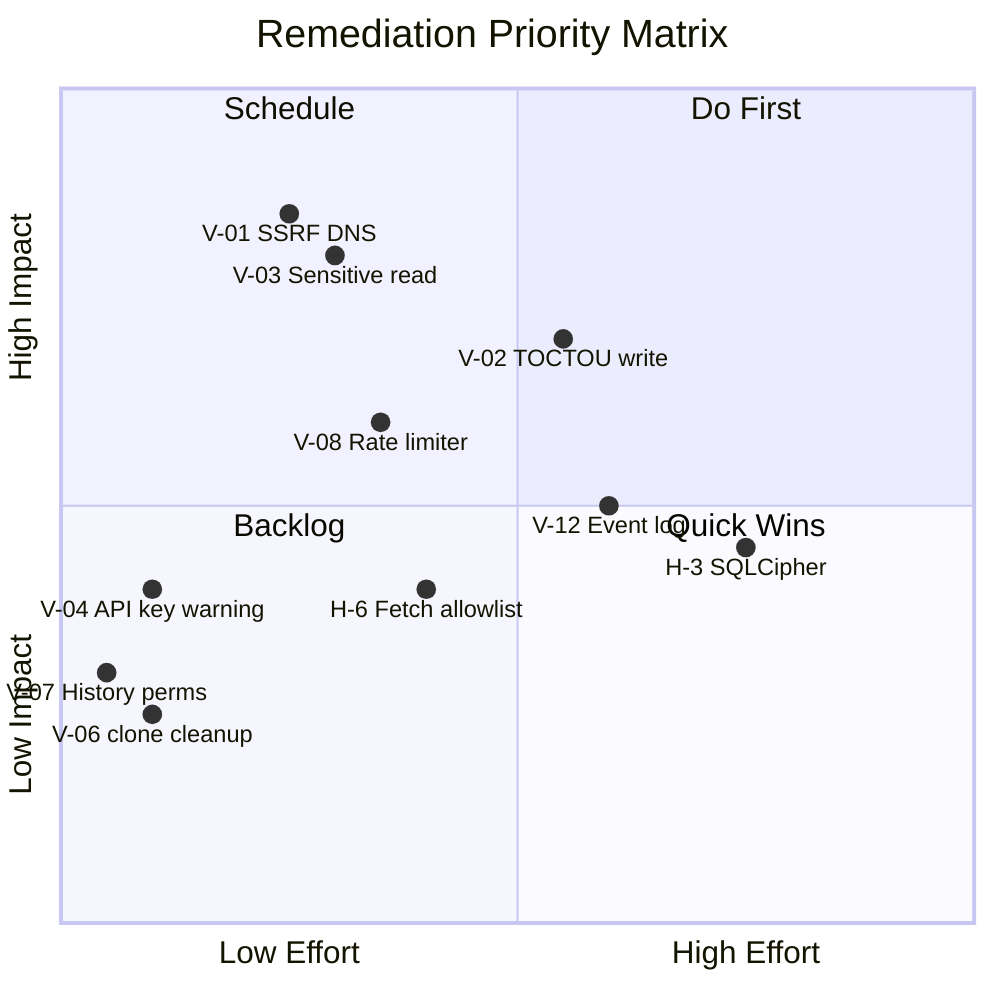
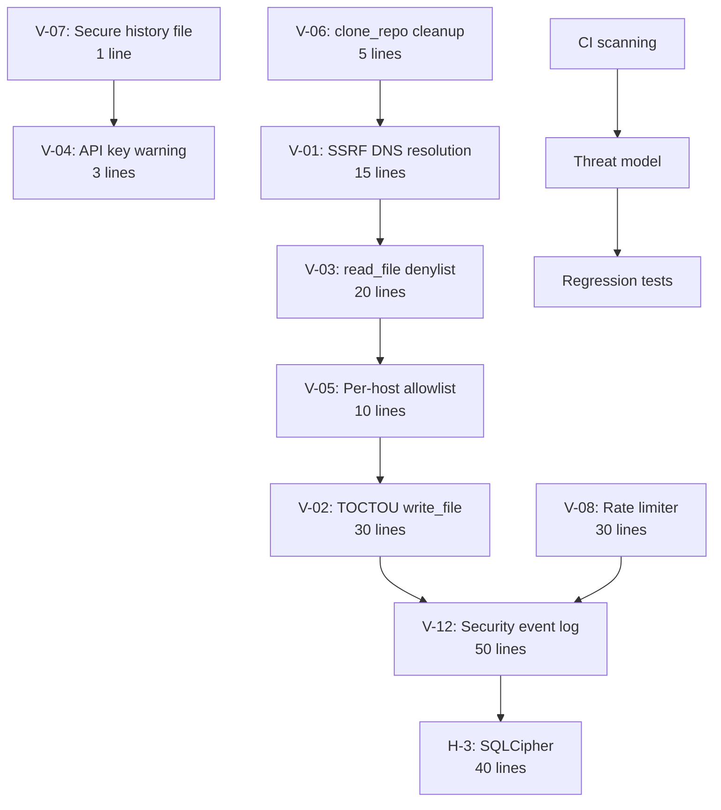

# Remediation Plan — Termux AI CLI

**Target:** Termux AI v7.0.0  
**Date:** 2025-01-XX  
**Strategy:** Quick wins first (low effort, high value), then strategic improvements.

**Update (v7.1.0):** ✅ V-01, V-03, V-06, V-07 have been remediated. See status column below.

---

## 1. Remediation Roadmap Overview

```mermaid
flowchart LR
    subgraph P1["Phase 1 — Quick Wins (< 1 day)"]
        H1[H-1: Secure history file]
        V4[V-04: Warn on plaintext API key]
        H5[H-5: Prefer env vars in /setup]
        V6[V-06: clone_repo cleanup]
    end

    subgraph P2["Phase 2 — Targeted Fixes (1-3 days)"]
        V1[V-01: SSRF DNS resolution]
        V3[V-03: read_file sensitive-path denylist]
        V7[V-07: History file permissions]
        V8[V-08: Rate limiter]
    end

    subgraph P3["Phase 3 — Strategic Hardening (1-2 weeks)"]
        V2[V-02: TOCTOU-safe write_file]
        H3[H-3: Optional SQLCipher]
        V12[V-12: Security event log]
        H6[H-6: Fetch egress allowlist]
    end

    subgraph P4["Phase 4 — Monitoring & Process"]
        CI[CI: pip-audit + bandit + semgrep]
        DEPS[Formalize requirements.txt]
        THREAT[Document threat model]
    end

    P1 --> P2 --> P3 --> P4

    style P1 fill:#4a9,color:#fff
    style P2 fill:#fa3,color:#fff
    style P3 fill:#f55,color:#fff
    style P4 fill:#888,color:#fff
```

---

## 2. Prioritized Action Items

### Phase 1 — Quick Wins (< 1 day, low risk)

These are trivial code changes that immediately reduce risk with no behavioral change for users.

| # | Finding | Action | File | Effort | Impact |
|---|---------|--------|------|--------|--------|
| 1 | V-07 | Add `_secure_file(HISTORY_FILE)` after `readline.write_history_file()` | `src/app.py` | 1 line | Eliminates residual file permission gap | **✅ DONE** |
| 2 | V-04 | Add warning in `/setup` when storing API key in config.json | `src/app.py` (`_cmd_setup`) | 3 lines | Encourages env var usage |
| 3 | V-06 | Register clone_repo temp dirs with `atexit` for cleanup | `src/tools.py` | 5 lines | Prevents disk accumulation | **✅ DONE** |
| 4 | V-09 | Document that `GITHUB_TOKEN` is auto-attached to api.github.com requests | `docs/` | Documentation only | User awareness |

**Total Phase 1 effort:** ~10 lines of code + docs. No behavioral changes.

---

### Phase 2 — Targeted Fixes (1-3 days)

These address the three Medium findings and add proactive controls.

| # | Finding | Action | File | Effort | Impact |
|---|---------|--------|------|--------|--------|
| 5 | V-01 | Resolve DNS hostnames in `_is_private_host` and validate resolved IPs | `src/tools.py:265-275` | 10-15 lines | Closes SSRF DNS rebinding gap | **✅ DONE** |
| 6 | V-03 | Add sensitive-path denylist for `read_file` (SSH keys, environ, config) | `src/tools.py`, `src/fileio.py` | 15-20 lines | Prevents credential exfiltration via prompt injection | **✅ DONE** |
| 7 | V-08 | Add rate limiter for tool calls / API calls per session | `src/app.py` | 20-30 lines | Prevents runaway cost / resource exhaustion |
| 8 | V-05 | Replace global `AI_FETCH_ALLOW_PRIVATE` with per-host allowlist | `src/tools.py` | 5-10 lines | Reduces SSRF bypass surface |

**Total Phase 2 effort:** ~60-75 lines of code. Minimal behavioral change (new protections, no breaking changes).

---

### Phase 3 — Strategic Hardening (1-2 weeks)

These are deeper changes that require testing and careful design.

| # | Finding | Action | File | Effort | Impact |
|---|---------|--------|------|--------|--------|
| 9 | V-02 | Replace `write_file` open with `O_NOFOLLOW` + post-open verification | `src/tools.py:~520-535` | 20-30 lines | Eliminates TOCTOU symlink race |
| 10 | V-12 | Add structured security event log (tool execs, approvals, SSRF blocks) | New module or `src/app.py` | 30-50 lines + tests | Enables forensic trail |
| 11 | H-3 | Add optional SQLCipher encryption with passphrase | `src/db.py` | Feature flag + 20-40 lines | Encrypts conversation data at rest |
| 12 | H-6 | Add configurable `fetch_allowlist` for high-security environments | `src/tools.py`, `src/config.py` | 10-15 lines | Network egress control |

**Total Phase 3 effort:** ~100-135 lines + testing.

---

### Phase 4 — Monitoring & Process (Ongoing)

| # | Action | Details | Effort |
|---|--------|---------|--------|
| 13 | Add `requirements.txt` | Even if minimal (`tiktoken` optional), formalizes the dependency contract | Trivial |
| 14 | CI security scanning | Add to CI: `pip-audit` (CVEs), `bandit` (SAST), `semgrep --config=auto` | Half-day setup |
| 15 | Threat model document | Document the trust boundary (single-user, prompt-injection via fetched content) | 2-4 hours |
| 16 | Add regression tests | Extend `tests/test_security.py` to cover V-01 (DNS SSRF), V-03 (sensitive paths), V-08 (rate limit) | 1-2 days |

---

## 3. Effort vs. Impact Matrix

---

## 4. Risk Reduction Summary

| Phase | Findings Addressed | Severity Eliminated | Cumulative Risk Reduction |
|-------|--------------------|---------------------|---------------------------|
| Baseline | — | — | 0% |
| Phase 1 | V-04, V-06, V-07, V-09 | 2 Low + 2 Info | ~15% |
| Phase 2 | V-01, V-03, V-05, V-08 | 3 Medium + 1 Low | ~55% |
| Phase 3 | V-02, V-12, H-3, H-6 | 1 Medium + 1 Info + 2 hardening | ~80% |
| Phase 4 | Process improvements | Preventive | ~90%+ (future vulns) |

---

## 5. Implementation Order (Dependency-Aware)

---

## 6. Acceptance Criteria

Each remediation item is considered complete when:

1. **Code change merged** to the source module with inline comment referencing the finding ID.
2. **Regression test added** to `tests/test_security.py` where applicable.
3. **Built artifact** (`ai`) regenerated via `python build.py`.
4. **Security test suite passes**: `python -m pytest tests/test_security.py -v`.
5. **Manual smoke test** confirms no behavioral regression (basic chat, tool exec, session resume).

---

## 7. Risk Acceptance

The following findings may be **accepted without remediation** based on the single-user Termux threat model:

| Finding | Rationale for Acceptance |
|---------|--------------------------|
| V-10 (No TLS pinning) | Standard TLS validation is adequate; pinning adds disproportionate complexity |
| V-11 (Session resume unencrypted) | Android FDE covers data-at-rest; DB is 0o600 |
| V-13 (Error path leakage) | User has full shell access; paths are not secret |
| V-14 (Python cp314 deps) | Not imported by termux-ai; stdlib-only runtime |

---

## 8. Conclusion

Termux AI has a **strong security baseline**. Phase 1 quick wins can be implemented in under a day with zero behavioral risk. Phase 2 closes the three Medium findings that represent the highest residual risk (SSRF DNS rebinding, sensitive file read, rate limiting). The overall remediation effort is modest (~200 lines of code across all phases) for meaningful risk reduction.

**Recommended immediate action:** Implement Phase 1 (items 1-4) in the next development sprint.
