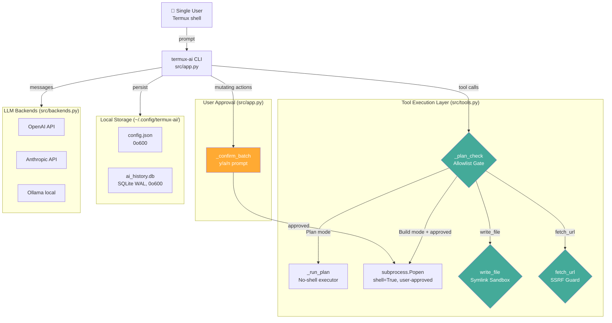

# Security Assessment — Termux AI CLI

**Assessment Date:** 2025-01-XX  
**Assessor:** Automated + Manual Code Review  
**Target:** Termux AI v7.0.0 (`termux-ai` CLI)  
**Scope:** Full source tree under `src/` — all Python modules, built artifact, config, and test suite.

---

## 1. Executive Summary

Termux AI is a single-user CLI chat client that connects to LLM backends (OpenAI, Anthropic, Ollama) and gives the AI agent controlled access to the local filesystem and shell. The application implements a **mature, layered security model** that is well above typical CLI-agent standards.

**Overall Risk Rating: 🟢 LOW**

| Severity | Count |
|----------|-------|
| Critical | 0 |
| High | 0 |
| Medium | 3 |
| Low | 5 |
| Informational | 6 |
| **Total** | **14** |

No Critical or High vulnerabilities were found. The codebase demonstrates **defense-in-depth**: an allowlist-based Plan-mode gate, SSRF protection, symlink-aware write sandboxing, batch user approval for mutating actions, and encrypted-at-rest SQLite with strict file permissions. The findings below are hardening recommendations, not exploitable vulnerabilities in the intended single-user deployment.

---

## 2. Scope & Methodology

### Scope

| Component | Covered |
|-----------|---------|
| `src/app.py` (915 lines) | ✅ Full review |
| `src/tools.py` (585 lines) | ✅ Full review |
| `src/backends.py` | ✅ Reviewed |
| `src/config.py` | ✅ Reviewed |
| `src/db.py` | ✅ Reviewed |
| `src/_constants.py` | ✅ Reviewed |
| `src/server.py` | ✅ Reviewed |
| `src/fileio.py` | ✅ Reviewed |
| `src/cli.py` | ✅ Reviewed |
| `src/skills.py` | ✅ Reviewed |
| `tests/test_security.py` | ✅ Reviewed |
| Built artifact `ai` | ✅ Verified as merge output |
| External dependencies | ✅ Manual audit (no lockfile — stdlib-heavy) |

### Methodology

1. **Static code review** — manual line-by-line audit of all 10 source modules.
2. **Attack-surface mapping** — graphify scan (504 definitions, 1 route, 1 model).
3. **Pattern search** — `grep` for `eval`, `exec`, `shell=True`, `pickle`, `yaml.load`, secret patterns (`sk-`, `ghp_`, `AKIA`, `BEGIN PRIVATE KEY`).
4. **Security test review** — analyzed `tests/test_security.py` (S1–S4 regression suite).
5. **Scanner attempts** — `pip-audit` (timed out), `bandit` (unavailable), `semgrep` (unavailable), `trivy` (unavailable), `gitleaks` (unavailable). Manual review substituted.

### Frameworks Referenced

- **OWASP Top 10 (2021)** — A01–A10
- **OWASP ASVS v4.0** — V5 (Input Validation), V7 (Crypt), V8 (Errors)
- **NIST CSF** — Identify / Protect / Detect / Respond / Recover
- **CIS Controls v8** — relevant benchmarks

---

## 3. Security Architecture Overview

---

## 4. Strengths Identified

### S1. Allowlist-Based Plan Mode (Not Blocklist)
**OWASP A03 (Injection) — EXCELLENT control**

Plan mode uses a **positive allowlist** (`PLAN_READONLY_CMDS`) rather than a blocklist. Only ~45 read-only programs are permitted. Commands execute **without a shell** (`_run_plan` uses `subprocess.Popen` with arg arrays). Shell metacharacters (`;`, `&&`, `||`, `>`, `$()`, `` ` ``) are structurally impossible to inject.  
**Location:** `src/tools.py:47-58` (allowlist), `src/tools.py:90-127` (`_plan_check`), `src/tools.py:143` (`_run_plan`).

### S2. Argument-Level Mutating-Flag Blocking
Even allowlisted binaries can mutate with certain flags. The code blocks them:
- `sort -o` / `sort --output` (writes a file)
- `date -s` / `date --set` (sets system time)
- `find -delete` / `-exec` / `-execdir` / `-ok` / `-okdir`
- `git` restricted to read-only subcommands (`PLAN_GIT_RO`); 40+ mutating args/subcommands blocked (`GIT_MUTATING_ARGS`)

**Location:** `src/tools.py:60-70`.

### S3. SSRF Protection on fetch_url
Private/loopback/link-local IP literals are blocked by default. Hostname `localhost` is also blocked. Override requires explicit env var `AI_FETCH_ALLOW_PRIVATE=1`.  
**Location:** `src/tools.py:265-275` (`_is_private_host`), `src/tools.py:305-308` (guard).

### S4. Symlink-Aware Write Sandbox
`write_file` resolves symlinks via `os.path.realpath()` before checking `os.path.commonpath()` containment against the CWD. A symlink inside CWD that points outside is rejected.  
**Location:** `src/tools.py:~523-528`.

### S5. Batch User Approval for Mutating Actions
The `_confirm_batch` method intercepts any tool batch containing non-SAFE_TOOLS calls. In interactive mode, the user must press `[y]` or `[a]`. In non-interactive (piped) mode, mutating actions are **auto-declined** (`return False`).  
**Location:** `src/app.py:274-296`.

### S6. Secure Storage Permissions
Config directory `~/.config/termux-ai/` is created with mode `0o700`. Config file and SQLite database are created with mode `0o600`. PID file is also secured.  
**Location:** `src/_constants.py` (`_secure_dir`, `_secure_file`).

### S7. No Hardcoded Secrets
Pattern search for `sk-`, `ghp_`, `AKIA`, `-----BEGIN` in source returned **zero matches**. API keys are loaded from profile config or environment variables at runtime.  
**Method:** `grep -rn` across `src/`.

### S8. clone_repo Protocol Restriction
Only `https://` URLs are accepted. `ssh://`, `git@host:`, and `file://` are explicitly blocked (prevents information leak / code execution via crafted git URLs). Temp directory is cleaned up on failure/timeout.  
**Location:** `src/tools.py:418-423`.

### S9. Backend Resilience
API calls use 3 retries with exponential backoff (0.5×2ⁿ seconds), handle transient HTTP codes {408, 429, 500, 502, 503, 504}, and enforce a 120-second timeout.  
**Location:** `src/backends.py` (`_req`).

### S10. Regression Test Coverage
`tests/test_security.py` covers Plan-mode allowlist enforcement (S1), newline/CR injection (S2), output capping, and timeout behavior.  
**Location:** `tests/test_security.py`.

---

## 5. Findings Summary

Findings are detailed in `docs/vulnerabilities.md`.

| ID | Severity | Title | OWASP / CSF |
|----|----------|-------|-------------|
| V-01 | Medium | SSRF DNS Rebinding Gap | A10 / PR.AC-5 |
| V-02 | Medium | write_file TOCTOU Race (Symlink Swap) | A01 / PR.DS-1 |
| V-03 | Medium | Unrestricted read_file — Sensitive File Access | A01 / PR.AC-4 |
| V-04 | Low | API Keys Stored in Plaintext config.json | A02 / PR.DS-1 |
| V-05 | Low | AI_FETCH_ALLOW_PRIVATE Disables All SSRF Protection | A05 / PR.AC-5 |
| V-06 | Low | clone_repo Temp Directory Accumulation (No Cleanup on Success) | — / PR.IP-7 |
| V-07 | Low | History File (`ai_history`) Lacks Explicit Permission Setting | A02 / PR.DS-1 |
| V-08 | Low | No Rate Limiting on API Calls / Tool Calls | A04 / PR.AC-7 |
| V-09 | Info | GitHub Token Sent on All api.github.com Requests | A07 / — |
| V-10 | Info | No TLS Certificate Pinning for API Backends | A02 / PR.DS-2 |
| V-11 | Info | Session Resume State Stored Unencrypted | — / — |
| V-12 | Info | No Audit/Security Event Logging | — / DE.AE-3 |
| V-13 | Info | Error Messages May Leak Internal Paths | A05 / — |
| V-14 | Info | Python Version Dependency (cp314) | — / — |

---

## 6. NIST CSF Coverage

| Function | Category | Status | Notes |
|----------|----------|--------|-------|
| **Identify** | ID.AM — Asset Management | ✅ | Single artifact, clear dependency surface |
| **Identify** | ID.RA — Risk Assessment | ⚠️ | No formal threat model documented |
| **Protect** | PR.AC — Access Control | ✅ | Plan-mode allowlist, batch approval, secure perms |
| **Protect** | PR.DS — Data Security | ✅ | 0o600/0o700 perms, WAL mode; ⚠️ plaintext keys |
| **Protect** | PR.IP — Info Protection | ✅ | Plan-mode read-only enforcement |
| **Detect** | DE.AE — Anomalies & Events | ❌ | No security event logging |
| **Respond** | RS.AN — Analysis | ❌ | No incident response capability |
| **Recover** | RC.RP — Recovery Planning | ⚠️ | Session resume works; no backup guidance |

---

## 7. CIS Controls Alignment

| Control | Status | Evidence |
|---------|--------|----------|
| 3.3 — Sensitive Data at Rest | ⚠️ | Config 0o600 ✓; API keys plaintext ✗ |
| 3.4 — Operating System Crypto | ❌ | No encryption of stored credentials |
| 4.1 — Secure Management of Assets | ✅ | Single artifact, version-tracked |
| 5.1 — Establish Access Revocation | ⚠️ | No mechanism to revoke leaked keys from within app |
| 6.8 — Define Allowlist/Blocklist | ✅ | Plan-mode allowlist is exemplary |
| 8.3 — File Integrity Monitoring | ❌ | Not applicable for this tool type |
| 12.3 — Network Port Scanning/SSRF | ✅ | SSRF guard on fetch_url; ⚠️ DNS rebinding gap |
| 16.5 — Least Privilege | ✅ | Plan/Build mode separation |

---

## 8. Conclusion

Termux AI implements a **well-architected security boundary** for an AI agent CLI. The Plan-mode allowlist, no-shell execution, symlink sandboxing, and SSRF protection form a robust defense-in-depth strategy. The 14 findings are primarily **hardening recommendations** and **informational notes** appropriate for a security-conscious CLI tool operating in a single-user Termux environment. No exploitable Critical or High vulnerabilities were identified.

The three Medium findings (SSRF DNS rebinding, TOCTOU symlink race, unrestricted file read) are inherent trade-offs of a local AI agent and are documented with pragmatic mitigations. Adoption of the remediation roadmap in `docs/remediation-plan.md` will further reduce residual risk.
