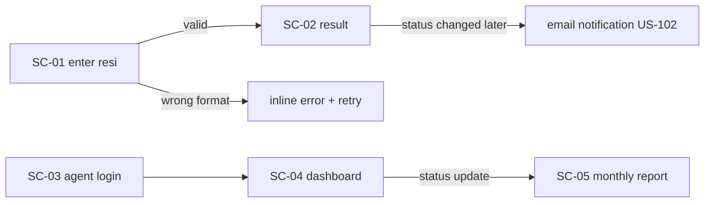

<!-- DOC: ux-spec | feature=v1 tracking core | version=v1 | sources=[prd.md v1 §2] -->
# UX Spec — Tracking Core
Language: EN

## 1. Scope & Assumptions
Built from PRD v1 §2 (public tracking + agent update flow). Mode: **CUSTOM / Enterprise Light** — a public tool and an internal agent app; modern, professional, Flat 2.0 with a single accent and warm-neutral surfaces. Assumed: the status enum (IN_TRANSIT / OUT_FOR_DELIVERY / DELIVERED) shown verbatim; resi format `KK-XXXXXX` validated client-side.

## 2. User Flows

## 3. Screen Inventory
| SC | Screen | US-IDs | Key components | Priority |
|----|--------|--------|----------------|----------|
| SC-01 | Track landing (input) | US-101 | Topbar, form panel, caption, empty state | must |
| SC-02 | Result detail | US-101 | Data table, status timeline, toast, skeleton | must |
| SC-03 | Agent login | US-103 | Form panel, primary CTA, inline error | must |
| SC-04 | Agent dashboard (status update) | US-103 | Slicer/filter bar, KPI scorecards, data table, drawer | must |
| SC-05 | Monthly report | US-104 | Data table, SVG bar chart, pagination | should |

## 4. Per-Screen Wireframe Description
- **SC-01**: Topbar (brand left, "Track →" link right). Form panel centered: label + one resi input + primary CTA "Track". Below, empty state ("No tracking yet") with ghost CTA to SC-03. Error state: inline red text under input on bad format; input keeps focus.
- **SC-02**: Topbar + back link. Data table: status, timestamp, location; numbers/locations tabular. Loading = skeleton rows. Success banner toast "Status found". Timeline (3 steps) on desktop, stacked on mobile.
- **SC-03**: Centered card, form panel (agent code), primary CTA "Sign in", inline error on wrong code.
- **SC-04**: Topbar + sidebar (links). Slicer bar: date range + status chips. 3 KPI scorecards (delivered today / in transit / exceptions), deltas with trend arrows. Data table with sortable headers, right-aligned numbers, row actions opening a drawer (update status → confirm in dialog → toast).
- **SC-05**: Report table + one SVG bar chart (color palette index 0–1 only); "Export" ghost CTA.

States matrix: loading = skeleton everywhere there's a fetch; empty = guidance + next action; error = inline text or toast with retry; success = confirmation toast routed per flow.

## 5. Visual System
- **Type**: page title = display (clamp), card titles = h2, table headers = label, body/copy = body; KPI values = display with tabular-nums; no size below caption.
- **Color**: neutrals carry chrome; accent #2563eb for primary CTA + active nav only; fail #dc2626 reserved for errors; chart bars from palette[0].
- **Rhythm**: everything on 4/8 scale; page gutter 24px (16px mobile); card padding 20px.
- **Elevation**: cards flat + hairline border; shadows md for drawer/dialog; focus = 2px offset ring.
- **Components**: every button/input has hover, focus ring, active, disabled; icons inline SVG 1.5px stroke (lucide-style); transitions 150–200ms.
- **Responsive**: topbar → drawer <768px; tables → scroll wrapper <640px; filter chips wrap; dashboard single column on phone. Desktop AND mobile both first-class.

## 6. Design Tokens
Uses existing `design-tokens.json` (Enterprise-Light recipe v1, accent restyled to client blue). No deviations this round.

## 7. Assumptions & Decisions
1. **Direction = Enterprise Light** — public/agent tool pairs best with a clean flat light system; rationale: professional, accessible, fast to build.
2. **Status enum mirrored from PRD** unless a later email/SMS stage changes it.
3. **Solid tokens existed** so no backfill was needed this round.
4. **Mobile = first-class** — SC-02 timeline and tables reflow; no separate mobile build.
5. **Auth faked in prototype** — agent code accepted client-side (prototype stage).
6. **Slicer bar reused** from SC-04 on SC-05 for filtering continuity.