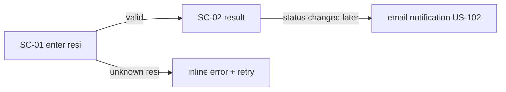

<!-- DOC: ux-spec | feature=v1 tracking core | version=v1 | sources=[prd.md v1 §2] -->
# UX Spec — Tracking Core
## 1. Screen Inventory
| SC | Screen | US-IDs | States complete |
|----|--------|-------|-----------------|
| SC-01 | Track landing (input) | US-101 | ✓ |
| SC-02 | Result detail | US-101 | ✓ |
| SC-03 | Agent login | US-103 | ✓ |
| SC-04 | Agent dashboard (status update) | US-103 | ✓ |
| SC-05 | Monthly report | US-104 | ✓ |
## 2. Flow — customer tracking

## 3. States Matrix
| SC | Loading | Empty | Error | Success | No-perm |
|----|---------|-------|-------|---------|---------|
| SC-01 | — (no fetch) | — | — | — | — |
| SC-02 | skeleton list | n/a (result or error) | inline "Resi tidak ditemukan" | status + history + ts | n/a (public) |
| SC-03 | button spinner | — | wrong-creds inline | → SC-04 route | n/a |
| SC-04 | table skeleton | "Belum ada paket hari ini" + guidance | toast, retry | list + <30s update flow | wrong-role → SC-03 |
## 4. Component mapping
SC-01/02: `TrackingLookup`, `StatusTimeline` · SC-04: `AgentTable`, `StatusUpdater`
(new: all four registered here first)
