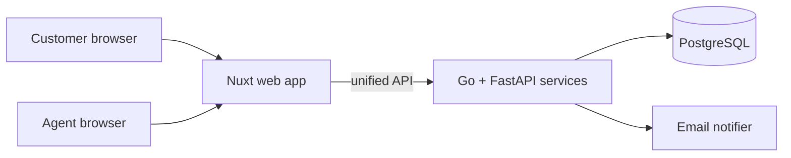

<!-- DOC: proposal | version=v1 | sources=[SRC-1,SRC-2, prd v1.1, prototype] -->
# Proposal — KirimKilat Parcel Portal
## 1. Executive summary
KirimKilat loses hours daily to status phone calls and Excel ops [SRC-1]. We deliver a customer tracking portal + agent dashboard, live before Lebaran, phased to protect the deadline: tracking first (your P0), notifications and reporting next — exactly as Budi prioritized ("yang penting fitur 1 dulu jalan" [SRC-1]).
## 3. Solution overview

## 4. RFP compliance matrix
| Client ask [SRC] | Proposal § | Coverage |
|---|---|---|
| Tracking by resi | 3 / Phase 1 | full |
| Notifications | 3 / Phase 2 | email full · WA = deferred (CR-001, ADR-002) |
| Agent dashboard | 3 / Phase 1 | full |
| Monthly report | 3 / Phase 2 | CSV (CR-002) |
## 6. Delivery phases
P1 (wks 1-5): tracking + agent dashboard — demoable per US-101/103 · P2 (wks 6-8): notifications + CSV report. Estimates assume Q1/Q2 resolved (discovery) and ≤2 review rounds/PR.
## 8. Risks
R1 Lebaran crunch (trigger: P1 slip >1wk → cut P2 scope, per CR-003 resolution) · R2 WA provider budget (mitigated: email-first ADR-002) · R3 data quality from Excel migration (mitigated: import tool in P1).
## 10. Budget & Effort Estimate (before-tax — IDR + USD)

### 10.1 Effort (phase × role)
| Phase | Role | Mandays | Rate (IDR/day) | Cost (IDR) | Cost (USD) |
|---|---|---|---|---|---|
| P1 | Frontend (×2) | 24 | 1,400,000 | 33,600,000 | 2,100 |
| P1 | Backend (×2) | 22 | 1,600,000 | 35,200,000 | 2,200 |
| P1 | QA | 8 | 1,200,000 | 9,600,000 | 600 |
| P1 | PM | 5 | 1,800,000 | 9,000,000 | 563 |
| P2 | Backend | 8 | 1,600,000 | 12,800,000 | 800 |
| P2 | Frontend | 6 | 1,400,000 | 8,400,000 | 525 |
| P2 | QA | 4 | 1,200,000 | 4,800,000 | 300 |
| P2 | DevOps | 3 | 1,600,000 | 4,800,000 | 300 |
| **Total** | **8 roles** | **80** | — | **118,200,000** | **7,388** |

Manday basis: requirement sizing on PRD reqs (S ≈ 1d, M ≈ 2–3d, L ≈ 4–5d) +
prototype complexity; no backlog exists yet. FX assumed IDR 16,000/USD.

### 10.2 Non-labor costs
| Item | Basis | Cost (IDR) | Cost (USD) |
|---|---|---|---|
| Hosting (5 mo) | 2× small VPS | 2,000,000 | 125 |
| Transactional email | free tier (300/mo) | 0 | 0 |

### 10.3 Contingency & totals
- Labor subtotal: IDR 118,200,000 / USD 7,388
- Non-labor: IDR 2,000,000 / USD 125
- Contingency (15% of labor): IDR 17,730,000 / USD 1,108
- **Grand total (before-tax): IDR 137,930,000 / USD 8,621** · PPN 11% (+IDR ~15,172,300) on invoice
- vs. stated budget ("terbatas, fitur 1 dulu" [SRC-1]): **over** → proposed cut = defer P2 CSV report (saves ~IDR 8M) or run P2 with a single FE/BE.

### 10.4 Assumptions & Decisions
- Rates = Jakarta blended mid-market day-rates, same per role throughout; PM at 1.8M reflects sponsor-facing delivery.
- FX 16,000/USD assumed; re-checked at agreement.
- Mandays sized from PRD complexity, not task counts; P2 DevOps is deployment-only.
