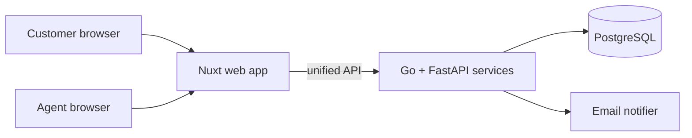

<!-- DOC: proposal | version=v1 | date=2025-11-28 | sources=[SRC-1,SRC-2, prd v1.1, prototype] | upstream=prd.md v1.1 + prototype -->
# Proposal: KirimKilat Parcel Portal — Phase 0

**Date:** 2025-11-28
**Prepared by:** KabarBaik
**For:** KirimKilat Management

## 1. Executive Summary
KirimKilat loses hours daily to status phone calls and Excel-based operations [SRC-1]. We deliver a customer tracking portal plus an agent dashboard as a two-phase program, live before Lebaran to protect the operational deadline: tracking first (the client's P0), then notifications and reporting — exactly as prioritized by Budi ("yang penting fitur 1 dulu jalan" [SRC-1]).

The solution is a self-hosted web portal (Nuxt + FastAPI/Go on a private cloud + NAS), with per-workshop data isolation built into the foundation so regional agents see only their own parcels. The program is estimated at **Rp 53,250,000 (~USD 3,330)** across two payment termins, sized to the staffed work in each period.

### 1.1 Project Summary
| Aspect | Detail |
| :---- | :---- |
| **Project Type** | Web portal — parcel tracking + agent dashboard |
| **Deployment Model** | Self-hosted (private cloud + NAS) |
| **Phase Duration** | ~2 months (~8 weeks) |
| **Investment** | Rp 53,250,000 (~USD 3,330) — Σ of §6: HR + one-time + subscriptions |

## 2. Background & Problem Statement
Pain points from discovery, each as a *risk → consequence*:
- Status inquiries arrive by phone, interrupting agents — *agents are continuously pulled off sorting work* [SRC-1].
- Parcel status lives in per-branch Excel files — *no single source of truth; the weekly report is hand-assembled* [SRC-1][SRC-2].
- No tracking number exposed to the customer — *customers cannot self-serve; every check is a call* [SRC-1].
- No structured logging of scanned events — *disputes ("paket belum sampai") cannot be resolved from records* [SRC-2].

## 3. Proposed Solution
A customer-facing tracking portal and an agent dashboard on one unified API, releasing in two phases pegged to the Lebaran deadline. Administering parcels, scans and users happens through a foundation built for multi-branch operation.

### 3.1. Foundation: multi-branch identity & data isolation
- **Organization structure:** offices and agents managed centrally; every record is scoped to an office.
- **Data isolation:** agents see only their own office's parcels — enforced on the data layer, not just the UI.
- **User management:** role-based access (customer / agent / admin) with per-role menus.

### 3.2. Pillar 1: Parcel tracking
- **Track by resi:** the customer enters a tracking number and sees the event timeline.
- **Scan events:** agents log received / in-transit / delivered scans against a parcel.
- **Status enrichment:** each event adds the office, timestamp and operator.

### 3.3. Pillar 2: Agent dashboard
- **Today's queue:** parcels due for pickup or delivery at the agent's office.
- **Quick scan:** barcode-style resi input that logs an event in two clicks.
- **Office report:** CSV export of the office's parcels for the weekly report.

## 4. Project Scope (Phase 0)
This proposal covers the tracking portal + agent dashboard program (Phases 1–2, ~8 weeks).

### In-Scope
- **Tracking:** track-by-resi with a scanned-event timeline; public tracking page.
- **Agent dashboard:** office-scoped queue, quick scan, and CSV report export.
- **Foundation:** multi-branch identity, data isolation, role-based access.
- **Data migration:** Excel import tool so existing branch data lands cleanly.
- **Notification:** transactional email on status changes (email-first per ADR-002).
- **Testing:** unit + end-to-end tests; acceptance walk-through at each phase close.

### Out-of-Scope
- WhatsApp/WA-gateway notifications (deferred; see Next-Phase).
- Native Android / iOS apps (responsive web only).
- A customer-facing status URL per parcel (blocking) — not required for Phase 0.
- Third-party subscription costs (cloud host, SQL, email, monitoring), borne directly by the client.

### Next-Phase Scope
High-value items deliberately later, **NOT in this budget or schedule**: WhatsApp notifications (CR-001, ADR-002), the postal-rate estimator, and an analytics dashboard on aggregated delivery times.

## 5. Project Plan & Phases
* **Phase 1: Tracking + agent dashboard (Weeks 1–5)**
  * **Deliverables:** foundation (offices, agents, RBAC), track-by-resi API + page, scan-event logging, agent dashboard queue + quick scan, Excel import tool; unit + e2e tests; demoable per US-101/US-103 at week 5.
* **Phase 2: Notifications + reports (Weeks 6–8)**
  * **Deliverables:** transactional email on status change, CSV office report, deployment to the NAS/cloud target; integration testing and a fixed bug-fix window last.

## 6. Budget ***
Components, kept separate, for the ~2-month program per the scope in section 5.

### Human Resources
| Role | Duration | Amount (IDR) |
| :---- | :---- | :---- |
| Project Manager | 2 months | 15,000,000 |
| Backend Engineer | 1.5 months | 9,000,000 |
| Frontend Engineer | 1.5 months | 9,000,000 |
| QA Engineer | 1 month | 4,500,000 |
| DevOps Engineer | 0.5 months | 2,750,000 |
| **Subtotal** |  | **40,250,000** |

### One-Time Costs
| Item | Amount (IDR) |
| :---- | :---- |
| Dev / staging environment setup | 2,500,000 |
| NAS server (deployment target) | 8,000,000 |
| **Subtotal** | **10,500,000** |

### Subscriptions
| Item | Period | Duration | Amount (IDR) |
| :---- | :---- | :---- | :---- |
| Cloud hosting (2× small VPS) | Monthly | 2 months | 1,500,000 |
| Managed PostgreSQL | Monthly | 2 months | 500,000 |
| Transactional email | Monthly | 2 months | 200,000 |
| Monitoring (Sentry) | Monthly | 2 months | 300,000 |
| **Subtotal** |  |  | **2,500,000** |

### 6.1 Payment Terms
* **Frequency:** monthly termin payments for the program duration.
* **Schedule (Termin):** Termin 1 — **Rp 19,500,000** (Nett, Excl. PPN) at end of Phase 1; Termin 2 (final) — **Rp 20,750,000** (Nett, Excl. PPN) at project close. Termins cover the Human Resources component only.
* **Mechanism:** a progress update every 2 weeks; payment due within 3 calendar days of each update.
* **Note:** termin amounts equal the HR staffed in each period (month 1: PM + Backend + Frontend; month 2: PM + Backend + Frontend + QA + DevOps). One-time and subscription amounts are excluded and borne by the client, per the disclaimer.

*** Budget is an estimate and may change with scope finalization. Recurring costs are borne directly by the client.

## 7. Architecture & Technology
* **Frontend:** Nuxt 3 web app (responsive, customer + agent routes).
* **Backend:** FastAPI (portal API) + Go (scan/event ingest).
* **Package manager:** pnpm.
* **Database:** PostgreSQL (event log enforced at the data layer).
* **Auth:** session-based RBAC backed by the foundation's organization tree.
* **Cloud infrastructure:** 2× small VPS behind the NAS deployment target.
* **File storage:** NAS volumes for backup snapshots.
* **Version control / CI-CD:** Git repos with lint + test gates before deploy.

## 8. Assumptions & Decisions
1. **Role rates (Jakarta blended mid-market, monthly, same rate per role throughout):** PM 7,500,000 (sponsor-facing delivery across both phases); Backend 6,000,000; Frontend 6,000,000; QA 4,500,000; DevOps 5,500,000. Partial months pro-rated.
2. **FX:** single rate of IDR 16,000/USD assumed (re-checked at agreement), used for the ~USD Investment figure only.
3. **Staffing:** PM spans the full program; Backend/Frontend at 1.5 months (month 1 full + month 2 half) sized to Phase 2 scope; QA joins month 2; DevOps is deployment-only at Phase 2 close.
4. **Tax basis:** termin amounts are Nett, Excl. PPN (11% added on invoice).
5. **Component inclusions:** One-Time = dev/staging setup + NAS deployment target; Subscriptions (2-month term) = cloud host, managed SQL, transactional email, monitoring — client-borne per the disclaimer; WA-gateway cost is budget 0 (email-first, ADR-002); Android/iOS store fees excluded.
6. **Budget conformance:** total Rp 53,250,000 vs. the stated limited budget ("terbatas, fitur 1 dulu" [SRC-1]) — within scope; uncertainties are absorbed by the Phase-2 staffing plan rather than a contingency line.

---

Thank you for the opportunity, KirimKilat. This program is deliberately front-loaded — tracking and the agent dashboard land before Lebaran, with notifications and reporting to follow — and we are confident the phased delivery keeps your peak season uninterrupted.