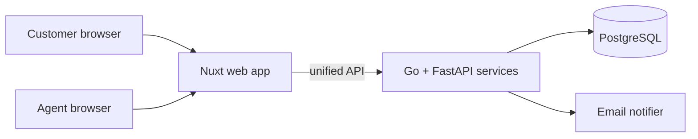

<!-- DOC: proposal | version=v1 | sources=[SRC-1,SRC-2, prd v1.1, prototype] -->
# Proposal — KirimKilat Parcel Portal
## 1. Executive summary
KirimKilat loses hours daily to status phone calls and Excel ops [SRC-1]. We deliver a customer tracking portal + agent dashboard, live before Lebaran, phased to protect the deadline: tracking first (your P0), notifications and reporting next — exactly as Budi prioritized ("yang penting fitur 1 dulu jalan" [SRC-1]).
## 3. Solution overview

## 4. RFP compliance matrix
| Client ask [SRC] | Proposal § | Coverage |
|---|---|---|
| Tracking by resi | 3 / Phase 1 | full |
| Notifications | 3 / Phase 2 | email full · WA = deferred (CR-001, ADR-002) |
| Agent dashboard | 3 / Phase 1 | full |
| Monthly report | 3 / Phase 2 | CSV (CR-002) |
## 6. Delivery phases
P1 (wks 1-5): tracking + agent dashboard — demoable per US-101/103 · P2 (wks 6-8): notifications + CSV report. Estimates assume Q1/Q2 resolved (discovery) and ≤2 review rounds/PR.
## 8. Risks
R1 Lebaran crunch (trigger: P1 slip >1wk → cut P2 scope, per CR-003 resolution) · R2 WA provider budget (mitigated: email-first ADR-002) · R3 data quality from Excel migration (mitigated: import tool in P1).
## 10. [PRICING — HUMAN OWNED]
