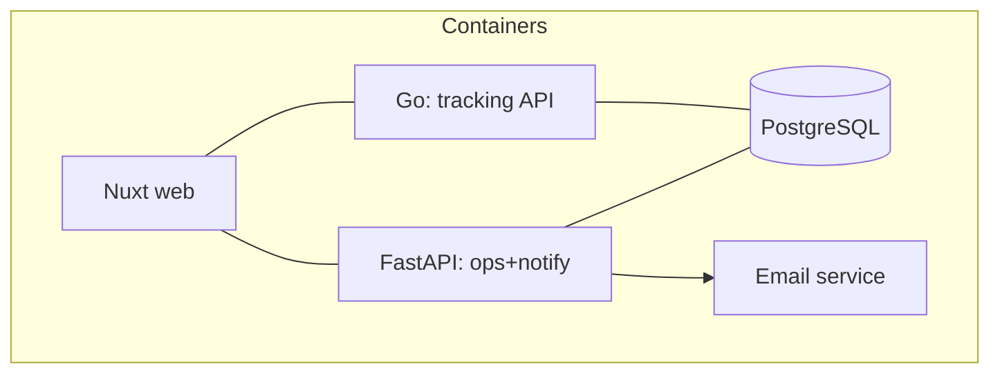

<!-- DOC: tsd+sad excerpt | version=v1 | upstream=proposal v1 (agreed), prd v1.1 -->
# TSD (excerpt) — KirimKilat
## Unified API envelope (Go & Python identical — conformance-tested)
{"data": …, "error": {"code": "NOT_FOUND", "message": "Resi tidak ditemukan"}, "meta": {"request_id": "…"}}
## Endpoints
| ID | Method Path | Auth | Summary | Errors |
|----|-------------|------|---------|--------|
| API-001 | GET /api/v1/track/{resi} | public | status+history (US-101) | NOT_FOUND, VALIDATION |
| API-002 | POST /api/v1/agent/login | public | agent session (US-103) | AUTH_INVALID |
| API-003 | PATCH /api/v1/parcel/{id}/status | agent | update status (US-103) | AUTH_INVALID, VALIDATION |
## Data model (excerpt)
Parcel(resi PK, status, updated_at) 1—* StatusHistory · Agent(code PK, role)
# SAD (excerpt)

## ADR-001 — Modular monolith (not microservices)
Context: 20 agents, tight deadline [SRC-1]. Options: microservices / modular monolith. Decision: two services (tracking-Go, ops-FastAPI) sharing one DB; split along team skills, not domains-for-its-own-sake. Reversal trigger: >10x load or team split.
## ADR-002 — Notifications: email-first
Context: WA desired but "ribet" + budget [SRC-1], CR-001 confirmed. Decision: email v1, notifier behind an interface so WA provider drops in v2. Reversal: client approves provider budget.
## doc-sync
PRD §US-102 changes → TSD API-004(notify), ADR-002, SC-— · PRD §US-104 → SC-05, E-03
