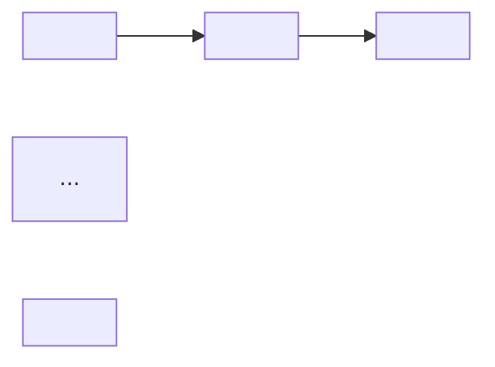

<!-- DOC: modules-preview | version=v__ | date=__ | upstream=curriculum.md v__ + modules -->
# Modules Preview: <Field / Subject>

**Total hours:** <N h> · **Format mix:** <e.g. 5 drills, 4 reflections, 2 role-plays>

## Module Index
| Module | Lessons | Types | Duration | Quiz count | Outcome refs |
| :----- | :------ | :---- | :------- | :--------- | :----------- |
| module-<NN>-<slug> | lesson-<NN>-a, lesson-<NN>-b | reading, drill | <mins> | <n> | OU-<n> |

## Learning Path

## Curriculum Summary
One paragraph: the identity shift the training makes and how the modules
sequence it (mindset first).

## Assumptions
1. **Assumed:** <…> **Decision:** <…>

## Sources
- `docs/training/curriculum/curriculum.md` v__
- `docs/training/modules/module-<NN>-<slug>/…`